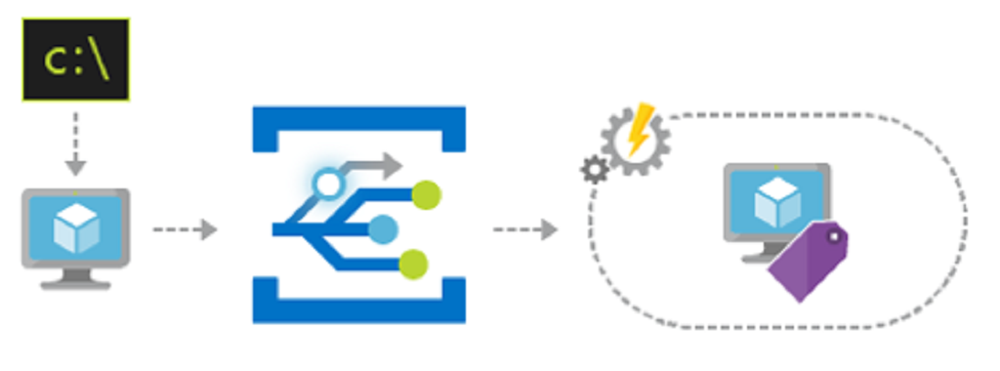
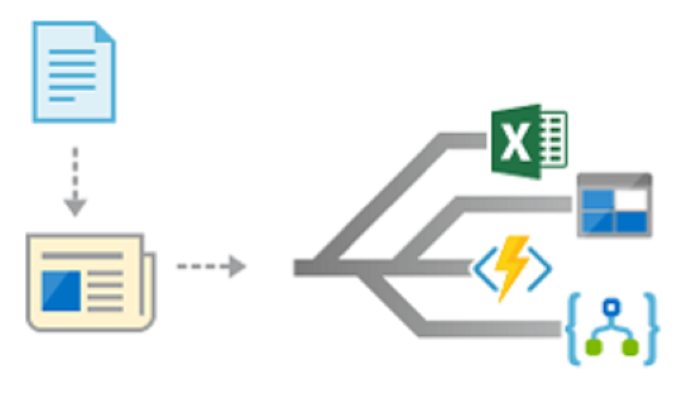
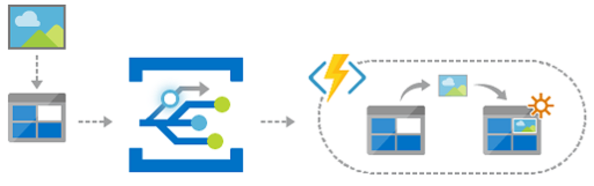
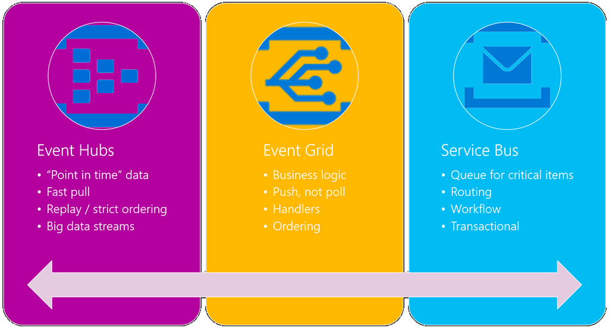

# Event Grid

[Azure Event Grid](/azure/event-grid/overview) provides serverless infrastructure for event-based applications. You can publish to Event Grid from any source and consume messages from any platform. Event Grid also has built-in support for events from Azure resources to streamline integration with your applications. For example, you can subscribe to blob storage events to notify your app when a file is uploaded. Your application can then publish a custom event grid message that is consumed by other cloud or on-premises applications. Event Grid was built to reliably handle massive scale. You get the benefits of publishing and subscribing to messages without the overhead of setting up the necessary infrastructure.


The major features of event grid include:

- Fully managed event routing.
- Near real-time event delivery at scale.
- Broad coverage both inside and outside of Azure.

## Scenarios

Event Grid addresses several different scenarios. This section covers three of the most common ones.

### Ops automation



Event Grid can help speed automation and simplify policy enforcement by notifying [Azure Automation](/azure/automation) when infrastructure is provisioned.

### Application integration



You can use Event Grid to connect your app to other services. Using standard HTTP protocols, even legacy apps can be easily modified to publish Event Grid messages. Web hooks are available for other services and platforms to consume Event Grid messages.

### Serverless apps



Event Grid can trigger Azure Functions, Logic Apps, or your own custom code. A major benefit of using Event Grid is that it uses a *push* mechanism to send messages when events occur. The push architecture consumes fewer resources and scales better than *polling* mechanisms. Polling must check for updates on a regular interval.

## Event Grid vs. other Azure messaging services

Azure provides several messaging services, including [Event Hubs](/azure/event-hubs) and [Service Bus](/azure/service-bus-messaging). Each is designed to address a specific set of use cases. The following diagram provides a high-level overview of the differences between the services.



For a more in-depth comparison, see [Compare messaging services](/azure/event-grid/compare-messaging-services).

## Performance targets

Using Event Grid you can take advantage of the following performance guarantees:

- Subsecond end-to-end latency in the 99th percentile.
- 99.99% availability.
- 10 million events per second per region.
- 100 million subscriptions per region.
- 50-ms publisher latency.
- 24-hour retry with exponential back-off for guaranteed delivery in the 1-day window.
- Transparent regional failover.

## Event Grid schema

Event Grid uses a standard schema to wrap custom events. The schema is like an envelope that wraps your custom data element. Here is an example Event Grid message:

```json
[{
    "id": "03e24f21-a955-43cc-8921-1f61a6081ce0",
    "eventType": "myCustomEvent",
    "subject": "foo/bar/12",
    "eventTime": "2018-09-22T10:36:01+00:00",
    "data": {
        "favoriteColor": "blue",
        "favoriteAnimal": "panther",
        "favoritePlanet": "Jupiter"
    },
    "dataVersion": "1.0"
}]
```

Everything about the message is standard except the `data` property. You can inspect the message and use the `eventType` and `dataVersion` to de-serialize the custom portion of the payload.

## Azure resources

A major benefit of using Event Grid is the automatic messages produced by Azure. In Azure, resources automatically publish to a *topic* that allows you to subscribe for various events. The following table lists the resource types, message types, and events that are available automatically.

| Azure resource | Event type | Description |
| -------------- | ---------- | ----------- |
| Azure subscription | Microsoft.Resources.ResourceWriteSuccess | Raised when a resource create or update operation succeeds. |
| | Microsoft.Resources.ResourceWriteFailure | Raised when a resource create or update operation fails. |
| | Microsoft.Resources.ResourceWriteCancel | Raised when a resource create or update operation is canceled. |
|  | Microsoft.Resources.ResourceDeleteSuccess | Raised when a resource delete operation succeeds. |
|  | Microsoft.Resources.ResourceDeleteFailure | Raised when a resource delete operation fails. |
| | Microsoft.Resources.ResourceDeleteCancel | Raised when a resource delete operation is canceled. This event happens when a template deployment is canceled. |
| Blob storage | Microsoft.Storage.BlobCreated | Raised when a blob is created. |
| | Microsoft.Storage.BlobDeleted | Raised when a blob is deleted. |
| Event hubs | Microsoft.EventHub.CaptureFileCreated | Raised when a capture file is created.
| IoT Hub | Microsoft.Devices.DeviceCreated | Published when a device is registered to an IoT hub. |
| | Microsoft.Devices.DeviceDeleted | Published when a device is deleted from an IoT hub. |
| Resource groups | Microsoft.Resources.ResourceWriteSuccess | Raised when a resource create or update operation succeeds. |
| | Microsoft.Resources.ResourceWriteFailure | Raised when a resource create or update operation fails. |
| | Microsoft.Resources.ResourceWriteCancel | Raised when a resource create or update operation is canceled. |
| | Microsoft.Resources.ResourceDeleteSuccess | Raised when a resource delete operation succeeds. |
| | Microsoft.Resources.ResourceDeleteFailure | Raised when a resource delete operation fails. |
| | Microsoft.Resources.ResourceDeleteCancel | Raised when a resource delete operation is canceled. This event happens when a template deployment is canceled. |

For more information, see [Azure Event Grid event schema](/azure/event-grid/event-schema).

You can access Event Grid from any type of application, even one that runs on-premises.

## Conclusion

In this chapter you learned about the Azure serverless platform that is composed of Azure Functions, Logic Apps, and Event Grid. You can use these resources to build an entirely serverless app architecture, or create a hybrid solution that interacts with other cloud resources and on-premises servers. Combined with a serverless data platform such as [Azure SQL](/azure/sql-database) or [CosmosDB](/azure/cosmos-db/introduction), you can build fully managed cloud native applications.

## Recommended resources

- [App service plans](/azure/app-service/azure-web-sites-web-hosting-plans-in-depth-overview)
- [Application Insights](/azure/application-insights)
- [Application Insights Analytics](/azure/application-insights/app-insights-analytics)
- [Azure: Bring your app to the cloud with serverless Azure Functions](/events/Connect/2017/E102)
- [Azure Event Grid](/azure/event-grid/overview)
- [Azure Event Grid event schema](/azure/event-grid/event-schema)
- [Azure Event Hubs](/azure/event-hubs)
- [Azure Functions documentation](/azure/azure-functions)
- [Azure Functions triggers and bindings concepts](/azure/azure-functions/functions-triggers-bindings)
- [Azure Logic Apps](/azure/logic-apps)
- [Azure Service Bus](/azure/service-bus-messaging)
- [Azure Table Storage](/azure/cosmos-db/table-storage-overview)
- [Connecting to on-premises data sources with Azure On-premises Data Gateway](/azure/analysis-services/analysis-services-gateway)
- [Create your first function in the Azure portal](/azure/azure-functions/functions-create-first-azure-function)
- [Create your first function using the Azure CLI](/azure/azure-functions/functions-create-first-azure-function-azure-cli)
- [Create your first function using Visual Studio](/azure/azure-functions/functions-create-your-first-function-visual-studio)
- [Functions supported languages](/azure/azure-functions/supported-languages)
- [Monitor Azure Functions](/azure/azure-functions/functions-monitoring)

>[!div class="step-by-step"]
>[Previous](logic-apps.md)
>[Next](durable-azure-functions.md)
