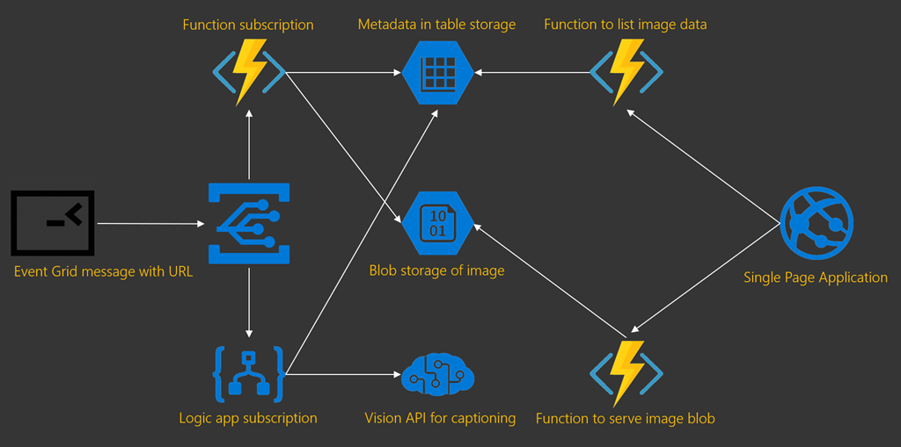
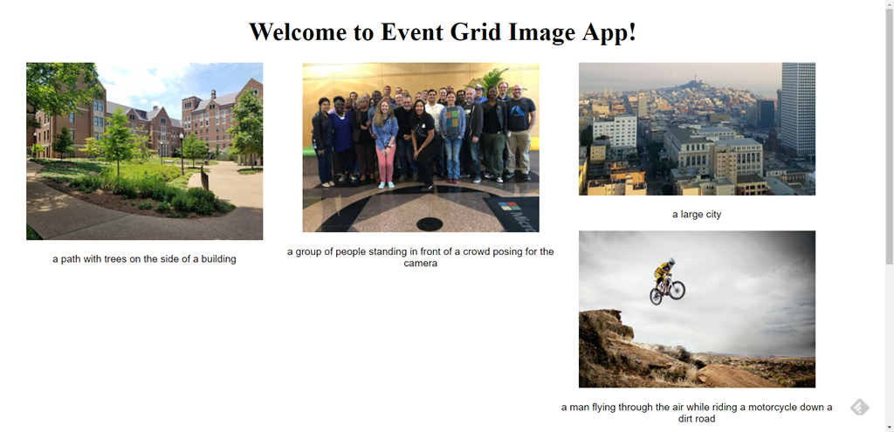
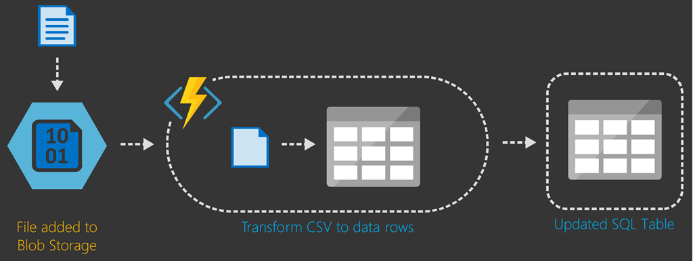
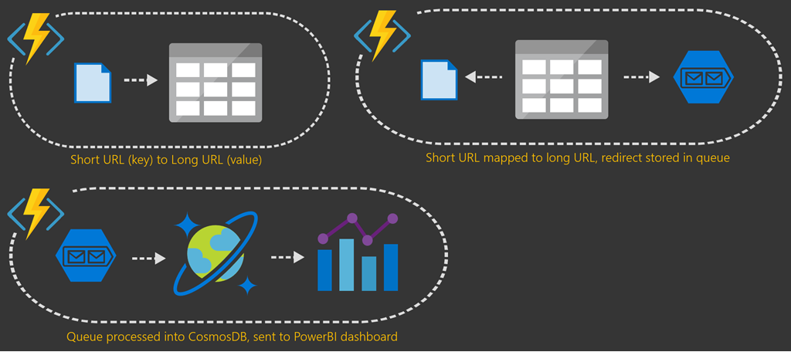

# Serverless business scenarios and use cases

There are many use cases and scenarios for serverless applications. This chapter includes samples that illustrate the different scenarios. The scenarios include links to related documentation and public source code repositories. The samples in this chapter enable you to get started on your own building and implementing serverless solutions.

## Analyze and archive images

This sample demonstrates serverless events (Event Grid), workflows (Logic App), and code (Azure Functions). It also shows how to integrate with another resource, in this case Cognitive Services for image analysis.

A console application allows you to pass a link to a URL on the web. The app publishes the URL as an event grid message. In parallel, a serverless function app and a logic app subscribe to the message. The serverless function app serializes the image to blob storage. It also stores information in Azure Table Storage. The metadata stores the original image URL and the name of the blob image. The logic app interacts with the Custom Vision API to analyze the image and create a machine-generated caption. The caption is stored in the metadata table.

A separate single page application (SPA) calls a serverless function to get a list of images and metadata. For each image, it calls another function that delivers the image data from the archive. The final result is a gallery with automatic captions.

The full repository and instructions to build the logic app are available here: [Event grid glue](https://github.com/JeremyLikness/Event-Grid-Glue).

## Cross-platform mobile client using Xamarin.Forms and functions

See how to implement a simple serverless Azure Function in the Azure Web Portal or in Visual Studio. Build a client with Xamarin.Forms that runs on Android, iOS, and Windows. The application is then refined to use JavaScript Object Notation (JSON) as a communication medium between the server and the mobile clients with a serverless back end.

For more information, see [Implementing a simple Azure Function with a Xamarin.Forms client](https://azure.microsoft.com/resources/samples/functions-xamarin-getting-started/).

## Generate a photo mosaic with serverless image recognition

The sample uses Azure Functions and Microsoft Cognitive Services Custom Vision Service to generate a photo mosaic from an input image. The model is trained to recognize images. When an image is uploaded, it recognizes the image and searches with Bing. The original image is recomposed using the search results.

For example, you can train your model with Orlando landmarks, such as the Orlando Eye. Custom Vision will recognize an image of the Orlando Eye, and the function will create a photo mosaic composed of Bing image search results for "Orlando Eye."

For more information, see [Azure Functions photo mosaic generator](https://azure.microsoft.com/resources/samples/functions-dotnet-photo-mosaic/).

## Migrate an existing application to the cloud

As discussed in previous chapters, it's common to embrace an N-Tier architecture to host your application on-premises. Although migrating resources "as is" using virtual machines is the least risky path to the cloud, many companies choose to use the opportunity to refactor their applications. Fortunately, refactoring doesn't have to be an "all-or-nothing" effort. In fact, it's possible to migrate your app then piecemeal replace components with cloud native counterparts.

The application uses the proxies feature of Azure Functions to enable refactoring an endpoint from legacy on-premises code to a serverless endpoint.

The proxy provides a single API endpoint that is updated to reroute individual requests as they're moved into serverless functions.

You can view a video that walks through the entire migration: [Lift and shift with serverless Azure functions](https://channel9.msdn.com/Events/Connect/2017/E102). Access the sample code: [Bring your own app](https://github.com/JeremyLikness/bring-own-app-connect-17).

## Parse a CSV file and insert into a database

Extract, Transform, and Load (ETL) is a common business function that integrates different systems. Traditional approaches often involve setting up dedicated FTP servers then deploying scheduled jobs to parse files and translate them for business use. Serverless architecture makes the job easier because a trigger can fire when the file is uploaded. Azure Functions tackles tasks like ETL through its ideal composition of small pieces of code that focus on a specific problem.

For source code and a hands-on lab, see [CSV import lab](https://github.com/JeremyLikness/azure-fn-file-process-hol).

## Shorten links and track metrics

Link shortening tools originally helped encode URLs in short twitter posts to accommodate the 140 character limit. They've grown to encompass several uses, most commonly to track click-throughs for analytics. The link shortener scenario is an entirely serverless application that manages links and reports metrics.

Azure Functions is used to serve a Single Page Application (SPA) that allows you to paste the long URL and generate short URLs. The URLs are tagged to track things like campaigns (topics) and mediums (such as social networks that the links are posted to). The short code is stored in Azure Table Storage as the key, with the long URL as the value. When you click on the short link, another function looks up the long URL, sends a redirect, and places information about the event on a queue. Another Azure Function processes the queue and places the information into Azure Cosmos DB.

You can then create a Power BI dashboard to gather insights about the data collected. On the back end, Application Insights provides important metrics. Telemetry includes how long it takes for the average user to redirect and how long it takes to access Azure Table Storage.

The full link shortener repository with instructions is available here: [Serverless URL shortener](https://github.com/jeremylikness/serverless-url-shortener). You can read about a simplified version here: [Azure Storage for serverless .NET apps in minutes](https://devblogs.microsoft.com/aspnet/azure-storage-for-serverless-net-apps-in-minutes/).

## Verify device connectivity using a ping

The sample consists of an Azure IoT Hub and an Azure Function. A new message on the IoT Hub triggers the Azure Function. The serverless code sends the same message content back to the device that sent it. The project has all the code and deployment configuration needed for the solution.

For more information, see [Azure IoT Hub ping](https://azure.microsoft.com/resources/samples/iot-hub-node-ping/).

## Recommended resources

- [Azure Functions photo mosaic generator](https://azure.microsoft.com/resources/samples/functions-dotnet-photo-mosaic/)
- [Azure IoT Hub ping](https://azure.microsoft.com/resources/samples/iot-hub-node-ping/)
- [Azure Storage for serverless .NET apps in minutes](https://devblogs.microsoft.com/aspnet/azure-storage-for-serverless-net-apps-in-minutes/)
- [Bring your own app](https://github.com/JeremyLikness/bring-own-app-connect-17)
- [CSV import lab](https://github.com/JeremyLikness/azure-fn-file-process-hol)
- [Event grid glue](https://github.com/JeremyLikness/Event-Grid-Glue)
- [Implementing a simple Azure Function with a Xamarin.Forms client](https://azure.microsoft.com/resources/samples/functions-xamarin-getting-started/)
- [Lift and shift with serverless Azure functions](https://channel9.msdn.com/Events/Connect/2017/E102)
- [Serverless URL shortener](https://github.com/jeremylikness/serverless-url-shortener)

>[!div class="step-by-step"]
>[Previous](orchestration-patterns.md)
>[Next](serverless-conclusion.md)
