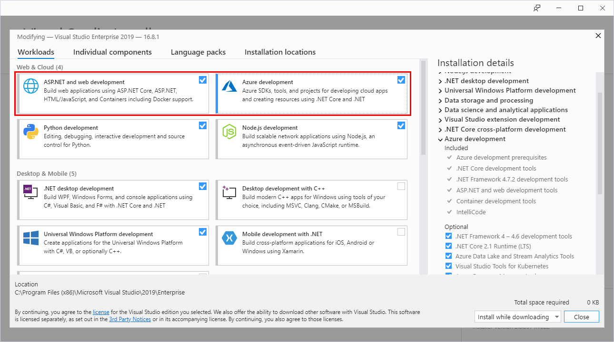

# Configure Visual Studio for Azure development with .NET

Visual Studio includes tooling to help with the development and deployment of applications on Azure.  This guide will help you make sure that you have Visual Studio properly configured for Azure development.

### Download Visual Studio 2019

If you already have Visual Studio 2019 installed, you can skip this step.

> [!div class="nextstepaction"]
> [Download Visual Studio 2019](https://www.visualstudio.com/downloads/)

### Install Azure workloads

Launch the **Visual Studio Installer** and validate that you have the workloads **Azure development** and **ASP.NET and web development** are installed.  If either of these workloads is not installed, select these workloads to install them.

### Authenticate Visual Studio with Azure

When debugging apps through Visual Studio, Visual Studio can use your Azure account to authenticate and access Azure Resources with.  This account is also used when you publish apps directly from Visual Studio to Azure.

To authenticate your Azure account from Visual Studio, select the **Tools** > **Options** menu to launch the **Options** dialog. Navigate to the `Azure Service Authentication` options and sign in using your Azure account.

### Next steps

If you also use [Visual Studio Code](https://code.visualstudio.com/) for development in .NET or any other language, you should also [configure Visual Studio Code for Azure development](./configure-vs-code.md). Otherwise, proceed to [Installing the Azure CLI](./install-azure-cli.md).
