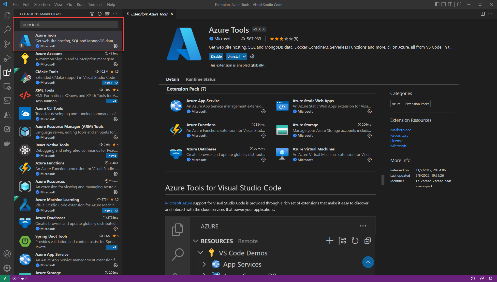
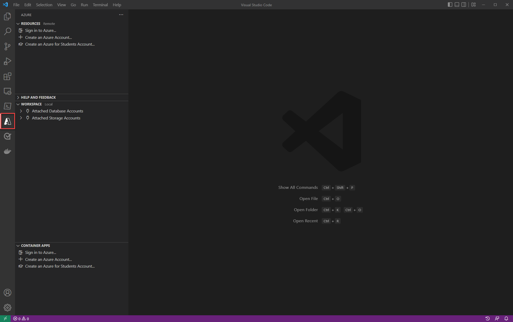

# Configure Visual Studio Code for Azure development

If you are using Visual Studio Code, whether for .NET development, for building single page applications using frameworks like Angular, React or Vue, or for writing applications in another language like Python, you will want to configure Visual Studio Code for Azure development.

### Download Visual Studio Code

If you already have Visual Studio Code installed, you can skip this step

> [!div class="nextstepaction"]
> [Download Visual Studio Code](https://code.visualstudio.com/download)

### Install the Azure Tools Extension Pack

The [Azure Tools Extension Pack](https://marketplace.visualstudio.com/items?itemName=ms-vscode.vscode-node-azure-pack) contains extensions for working with Azure App Service, Azure Functions, Azure Storage, Cosmos DB, and Azure Virtual Machines all in one convenient package.

To install the extension from Visual Studio Code:

1. Press <kbd>Ctrl+Shift+X</kbd> to open the **Extensions** window.
1. Search for the *Azure Tools* extension.
1. Select the **Install** button.

To learn more about installing extensions in Visual Studio Code, refer to the [Extension Marketplace](https://code.visualstudio.com/docs/editor/extension-gallery) document on the Visual Studio Code website.

### Sign in to your Azure account with Azure Tools

On the left hand panel, you'll see an Azure icon. Select this icon, and a control panel for Azure services will appear. Choose **Sign in to Azure...** under any service to complete the authentication process for the Azure tools in Visual Studio Code.

### Next steps

Next, you will want to install the Azure CLI on your workstation.

> [!div class="nextstepaction"]
> [Install the Azure CLI](./install-azure-cli.md)
