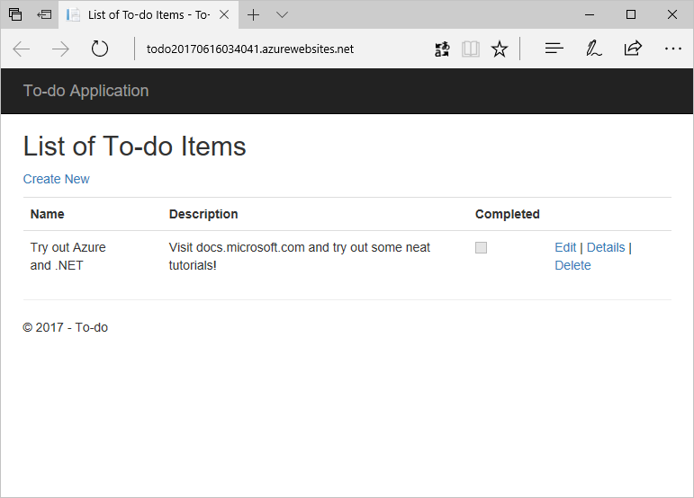

# Deploy to Azure from the command line with .NET Core

This tutorial will walk you through building and deploying a Microsoft Azure application using .NET Core.  When finished, you'll have a web-based to-do application built in ASP.NET MVC Core, hosted as an Azure Web App, and using Azure Cosmos DB for data storage.

## Prerequisites

* A [Microsoft Azure subscription](https://azure.microsoft.com/free/)
* [.NET Core](https://www.microsoft.com/net/download/core) (optional)
* [Azure CLI 2.0](/cli/azure/install-az-cli2) (optional)
* [Git](https://www.git-scm.com/) command line client (optional)

The [Azure Cloud Shell](/azure/cloud-shell/) has all of the optional prerequisites for this tutorial preinstalled.  You only need to install the optional components above if you wish to run the tutorial locally.  To quickly launch the Cloud Shell, just click the **Try it** button in the top-right of any of the below code blocks.

## Create an Azure Cosmos DB account

Azure Cosmos DB is used for data storage in this tutorial, so you'll need to create an account.  Run this script locally or in the Cloud Shell to create an Azure Cosmos DB SQL API account.

```azurecli-interactive
# Create the DotNetAzureTutorial resource group
az group create --name DotNetAzureTutorial --location EastUS

# Generate a unique name for the account
let randomNum=$RANDOM*$RANDOM
cosmosdbname=dotnettutorial$randomNum

# Create the Azure Cosmos DB account
az cosmosdb create --name $cosmosdbname --resource-group DotNetAzureTutorial

# Retrieve the endpoint and key (you'll need these later)
cosmosEndpoint=$(az cosmosdb show -n $cosmosdbname -g DotNetAzureTutorial --query [documentEndpoint] -o tsv)
cosmosAuthKey=$(az cosmosdb list-keys -n $cosmosdbname -g DotNetAzureTutorial --query [primaryMasterKey] -o tsv)

```

## Download and configure the application

The application you're going to deploy is a [simple to-do app](https://github.com/Azure-Samples/dotnet-cosmosdb-quickstart/) written using ASP.NET MVC Core using the Azure Cosmos DB client libraries.  Now you'll get the code for this tutorial and configure it with your Azure Cosmos DB information.

```azurecli-interactive
# Get the code from GitHub
git clone https://github.com/Azure-Samples/dotnet-cosmosdb-quickstart

# Change the working directory
cd dotnet-cosmosdb-quickstart

# Replace authKey and endpoint values in appsettings.json
sed -i "s|AUTHKEYVALUE|$cosmosAuthKey|g" appsettings.json
sed -i "s|ENDPOINTVALUE|$cosmosEndpoint|g" appsettings.json

# Now commit your changes to the local Git repository.
git commit -a -m "Modified settings"

```

> [!NOTE]
> If you've never run `git commit` in this environment before, you may be prompted to set your identity. Follow the on-screen instructions and then re-run the `git commit` command.

Restore the NuGet packages and build the application.

```azurecli-interactive
dotnet restore
dotnet build
```

> [!TIP]
> If you are using the tools on your own machine, you can test the application by running `dotnet run` and browsing to the displayed `localhost` address.  You are not able to browse to this address in the Cloud Shell, however.  

## Configure Azure App Service and deploy the web app

You've successfully downloaded and built the web application, and you're ready to deploy it as an Azure Web App.  You'll start by creating the Web App resource.

```azurecli-interactive
# Generate a unique Web App name
let randomNum=$RANDOM*$RANDOM
webappname=todoApp$randomNum

# Create an App Service plan.
az appservice plan create --name $webappname --resource-group DotNetAzureTutorial --sku FREE

# Create the Web App
az webapp create --name $webappname --resource-group DotNetAzureTutorial --plan $webappname

```

Before you deploy, you need to set the account-level deployment credentials.  Use the script below, making sure to include your own values for the user name and password.

```azurecli-interactive
az webapp deployment user set --user-name <desired user name> --password <desired password>
```

Finally, deploy the application to Azure.  You will be prompted for the password you created above.

```azurecli-interactive
# Get the Git deployment URL
giturl=$(az webapp deployment source config-local-git -n $webappname -g DotNetAzureTutorial --query [url] -o tsv)

# Add the URL as a Git remote repository
git remote add azure $giturl

# Push the local repository to the remote
git push azure master
```

The application will be built remotely and deployed.  Test the application by browsing to `https://<web app name>.azurewebsites.net`.  To display the address in the console, use the following:

```azurecli-interactive
az webapp show -n $webappname -g DotNetAzureTutorial --query defaultHostName -o tsv
```

You can add new items to the to-do list by clicking **Create New**.



## Clean up

When you're done testing the app and inspecting the code and resources, you can delete the Web App and Azure Cosmos DB account by deleting the resource group.

```azurecli-interactive
az group delete -n DotNetAzureTutorial
```

## Next steps

* [Use Azure Active Directory for authentication in an ASP.NET web application](/azure/active-directory/develop/active-directory-devquickstarts-webapp-dotnet)
* [Build an Azure Web App using Azure SQL Database](/azure/app-service-web/web-sites-dotnet-get-started)
* [Try a .NET sample application with Azure Storage](/azure/storage/storage-samples-dotnet)


