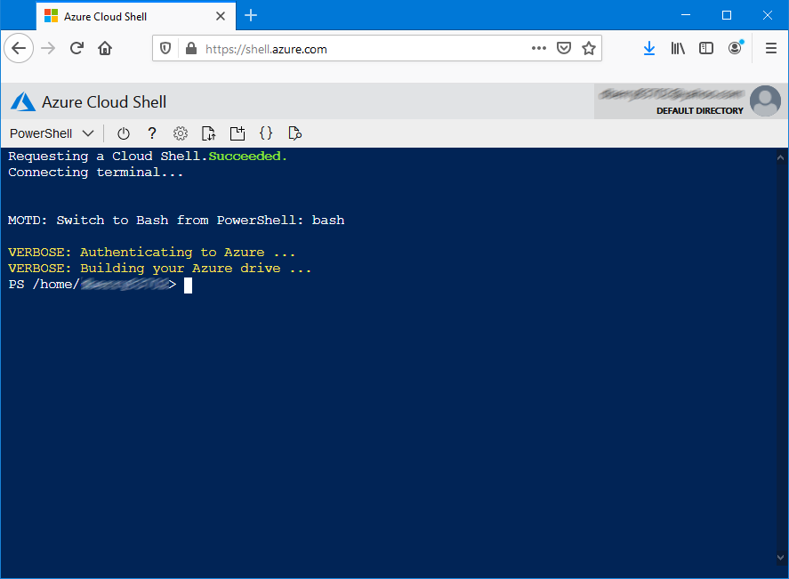

# Install the Azure CLI

In addition to the Azure portal, Azure also offers the [Azure CLI](/cli/azure/) as a command-line tool to create and manage Azure resources. The Azure CLI offers the benefits of efficiency, repeatability, and the ability to script recurring tasks.  

In practice, most developers use both the Azure portal and the Azure CLI. Whereas the Azure portal is useful when exploring new services and getting an overview of all of the resources in your Azure account, most developers find the Azure CLI to be faster and more efficient. The Azure CLI can often accomplish in a single command what takes multiple steps in the Azure portal. In addition, since Azure CLI commands can be saved to a file, you can ensure that recurrent tasks are run the same way each time.

The Azure CLI is available for Windows, macOS, and Linux.

> [!div class="nextstepaction"]
> [Install the Azure CLI for Windows](/cli/azure/install-azure-cli-windows?tabs=azure-cli)

> [!div class="nextstepaction"]
> [Install the Azure CLI for macOS](/cli/azure/install-azure-cli-macos)

> [!div class="nextstepaction"]
> [Install the Azure CLI for Linux](/cli/azure/install-azure-cli-linux)

## Azure Cloud Shell

You can also use the Azure CLI in the Azure Cloud Shell at [https://shell.azure.com](https://shell.azure.com).  The Azure Cloud Shell is a fully functional, browser-based shell for managing Azure resources.  The Azure Cloud Shell is useful when you need a command line environment but are working on a device where you're unable to install the Azure CLI.

## Next steps

Next, you'll want to [install other Azure tools](./azure-tools.md) like Azure Storage Explorer and Azure Data Studio to make you more productive with Azure.
