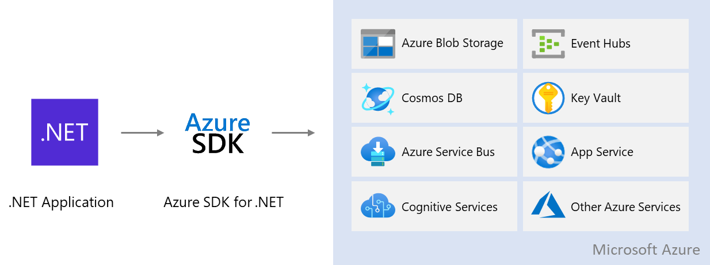

# Introduction to Azure and .NET

Azure is a cloud platform designed to simplify the process of building modern applications.  Whether you choose to host your applications entirely in Azure or extend your on-premises applications with Azure services, Azure helps you create applications that are scalable, reliable, and maintainable.  With extensive support in tools you already use like Visual Studio and Visual Studio Code and a comprehensive SDK library, Azure is designed to make you, the .NET developer productive right from the start.

## Application development scenarios on Azure

You can incorporate Azure into your application in different ways depending on your needs.

- **Application hosting on Azure -** Azure can host your entire application stack from web applications and APIs to databases to storage services. Azure supports a variety of hosting models from fully managed services to containers to virtual machines. When using fully managed Azure services, your applications can take advantage of the scalability, high-availability, and security built in to Azure.

- **Consuming cloud services from applications -** Existing apps can incorporate Azure services to extend their capabilities.  This could include adding full-text searching capability with [Azure Cognitive Search](/azure/search/search-what-is-azure-search), securely storing application secrets in [Azure Key Vault](/azure/key-vault/) or adding vision, speech and language understanding capabilities with [Azure Cognitive Services](/azure/cognitive-services/).  These services are fully managed by Azure and can be easily added to your application without changing your current application architecture or deployment model.

- **Modern serverless architectures -** Azure Functions simplify building solutions to handle event-driven workflows, whether responding to HTTP requests, handling file uploads in Blob storage, or processing events in a queue.  You write only the code necessary to handle your event without worrying about servers or framework code.  Further, you can take advantage of over 250 connectors to other Azure and third-party services to tackle your toughest integration problems.

## Access Azure services from .NET applications

Whether your app is hosted in Azure or on-premises, access to most Azure services is provided through the **Azure SDK for .NET**.  The Azure SDK for .NET is provided as a series of NuGet packages and can be used in both .NET Core (2.1 and higher) and .NET Framework (4.6.1 and higher) applications. The Azure SDK for .NET makes incorporating Azure services into your application as easy as installing the correct NuGet package, instantiating a client object and calling the appropriate methods. More information on the Azure SDK for .NET can be found in the [Azure SDK for .NET Overview](./sdk/azure-sdk-for-dotnet.md).

## Next steps

Next, learn about the most [commonly used Azure services](./key-azure-services.md) for .NET development.
