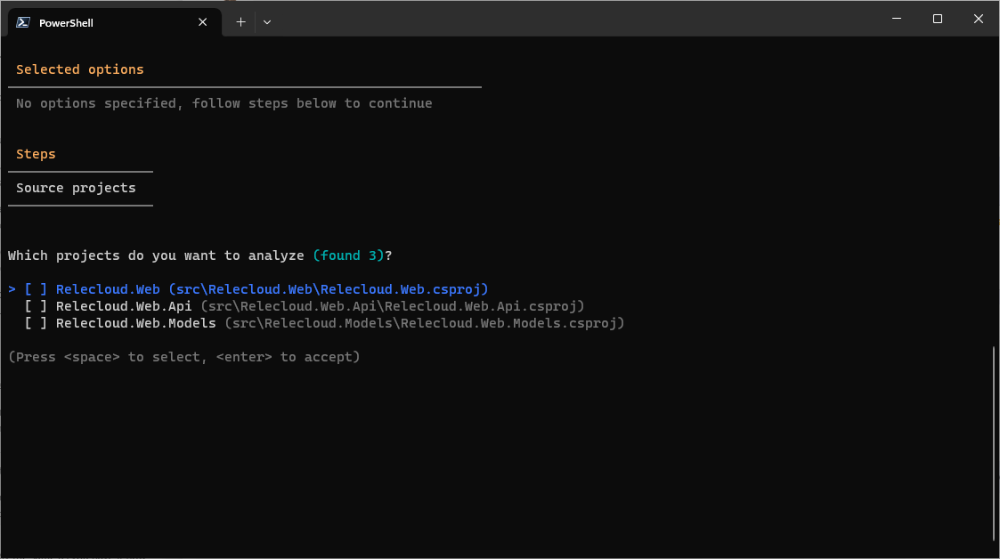
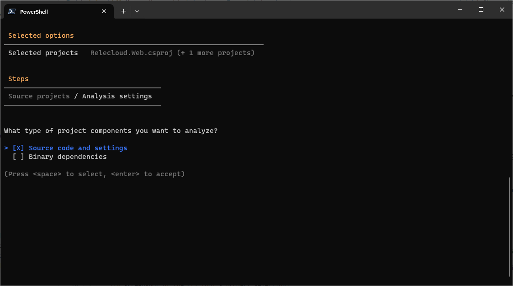
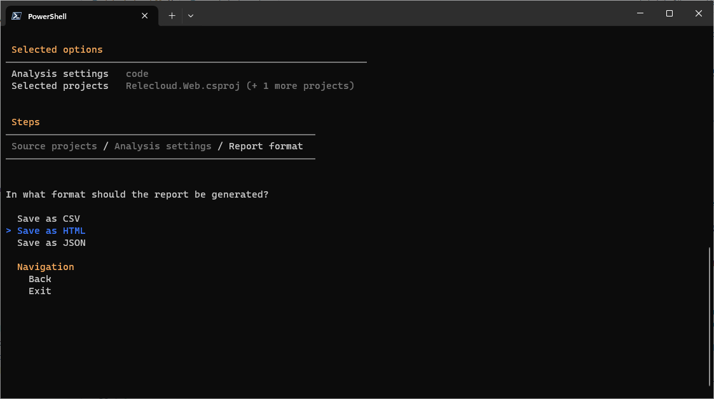
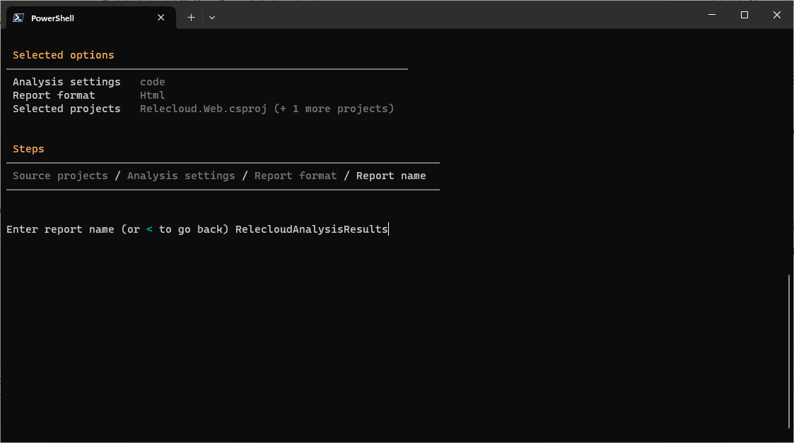
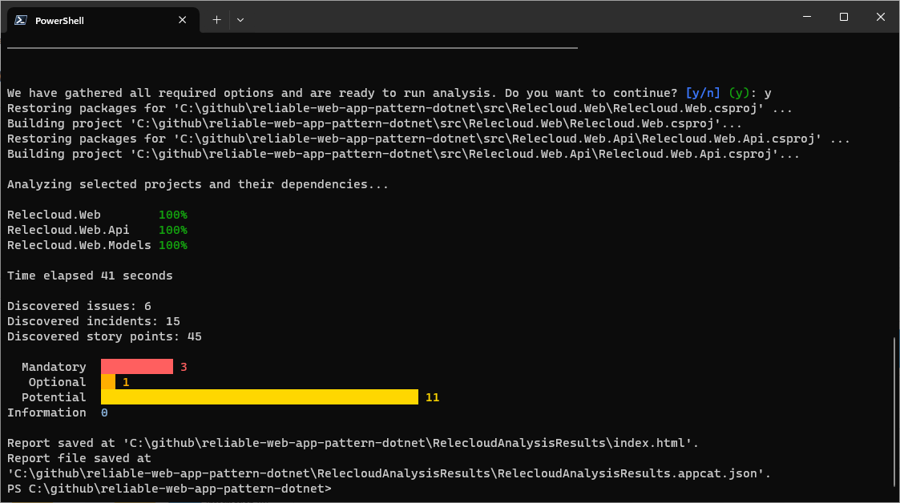

# Analyze applications with the .NET CLI

Azure Migrate application and code assessment for .NET helps you to identify any issues your application might have when it is ported to Azure and improve the performance, scalability and security by suggesting modern, cloud-native solutions.

The tool is available as a [Visual Studio extension](./visual-studio.md) and a CLI tool.

This guide describes how to use the CLI tool to scan your application for possible incompatibilities with Azure.

If you have not installed the .NET CLI tool, please follow [these instructions first](./install.md).

## Scan your application

The application and code assessment for .NET CLI tool lets you decide which projects in your solution to scan to identify migration opportunities to Azure. Follow these steps to scan your application.

1. In CLI type `appcat analyze` and press **Enter**.

    > [!NOTE]
    > If this is your first time running application and code assessment for .NET, you will see an informational message about telemetry and how to opt-out if you should want to.

1. A screen is presented that allows you to pick the projects in your solution to analyze. Use the arrow keys to highlight individual projects and press **Space** to select them. Press **Enter** when you're ready.
    
1. Next you'll be presented with the option to analyze **Source code and settings**, **Binary dependencies**, or both. Make your choice and press **Enter**.
    
    > [!NOTE]
    > The **source code and settings** option will only scan the source code in the projects you selected on the previous screen. The **Binary dependencies** option will scan any dependencies (such as NuGet packages) your projects rely on. You can expect to see many more issues identified when **binary dependencies** is selected. This option can create some "noise" since it will also identify potential compatibility issues of the binaries that are not necessarily apply to your application.
    >

1. You'll then be prompted to generate a report with the results of the analysis. The output can be formatted as CSV, HTML, or JSON. Press **Enter**.
    
1. You'll be prompted for a report name. Input the name and press **Enter**.
    
1. Finally, you'll be asked whether you want to perform the scan. Press **y** to continue, or **n** to go back and change options.
1. Once the analysis completes, the report is saved, and a summary of the results are displayed.
    

## Next Steps

### Interpret the results

For information on how to interpret results, see [Interpret the analysis results from the Azure Migrate application and code assessment for .NET](./interpret-results.md).
