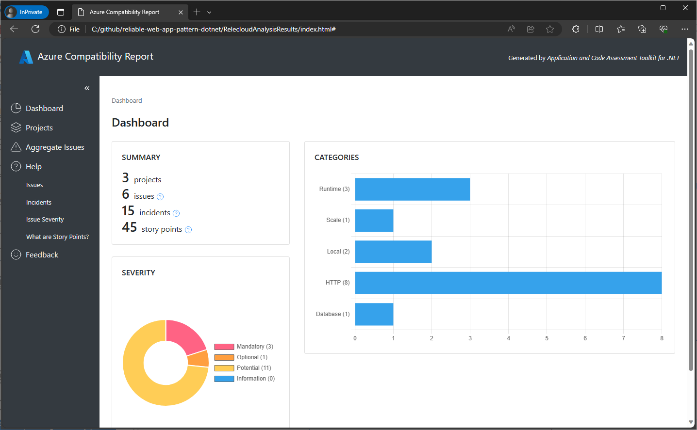
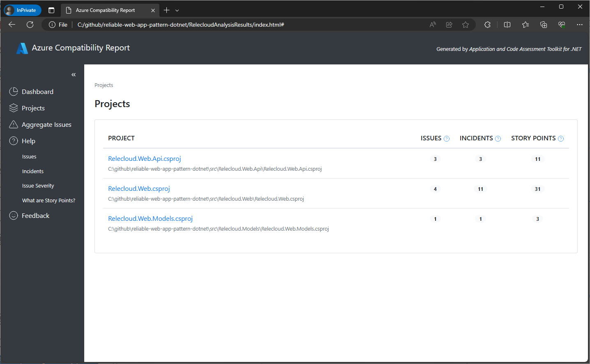
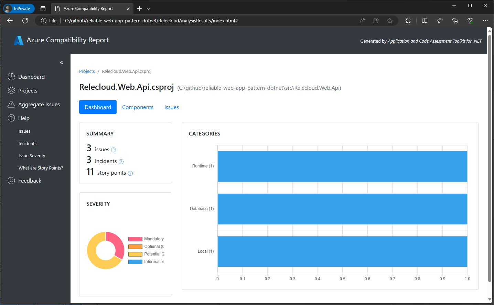
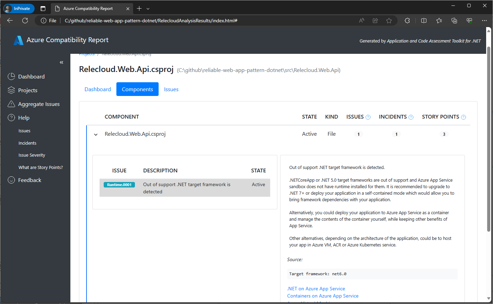
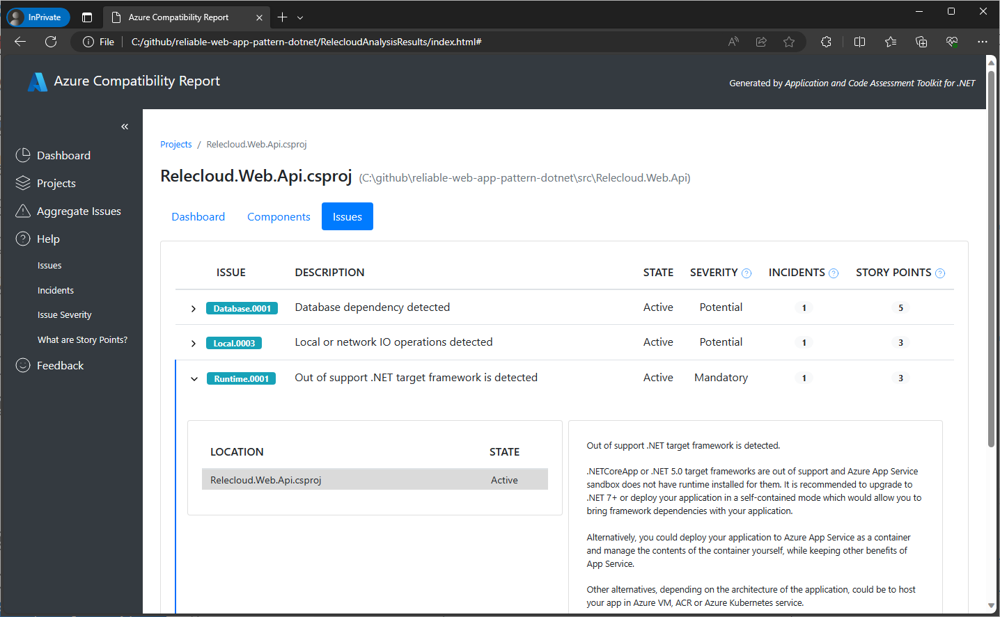
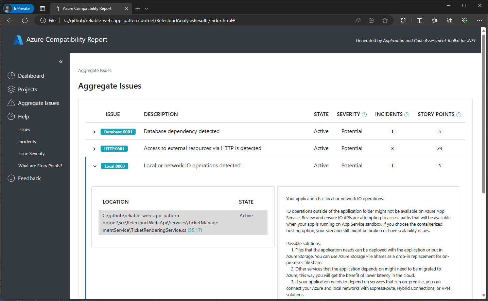

# Analyze projects with the .NET CLI

Azure Migrate application and code assessment for .NET is a tool to assess .NET source code to identify replatforming and migration opportunities to Azure. It helps you modernize and replatform large-scale .NET applications through a broad range of transformations, use cases, and code patterns.

This guide describes how to use the application and code assessment Visual Studio extension to both scan and interpret the results of the scan.

If you have not installed the .NET CLI tool, please follow [these instructions first](./install.md#install-the-NET-global-tool).

## Scan your application

The application and code assessment .NET CLI tool lets you decide which projects in your solution to scan to identify migration opportunities to Azure. Follow these steps to scan your application.

1. Switch to the base directory of your solution.
1. Type `appcat analyze` and press **Enter**.

    > [!NOTE]
    > If this is your first time running application and code assessment for .NET, you will see an informational message about telemetry and how to opt-out if you should want to.

1. A screen is presented that allows you to pick the projects in your solution to analyze. Use the arrow keys to highlight individual projects and press the spacebar to select them. Press **Enter** when you're ready.
    
1. Next you'll be presented with the option to analyze **Source code and settings**, **Binary dependencies**, or both. Make your choice and press **Enter**.
    
    > [!NOTE]
    > The **source code and settings** option will only scan the source code in the projects you selected on the previous screen. The **Binary dependencies** option will scan any dependencies (such as NuGet packages) your projects rely on. You can expect to see many more issues identified when **binary dependencies** is selected.
    > You should consider selecting only **source code and settings** first to figure out what issues reside in your code and fix those before runnig the **binary dependencies** scan.
    >
1. You'll then be prompted to generate a report with the results of the analysis. The output can be formatted as CSV, HTML, or JSON. Press **Enter**.
    
1. You'll be prompted for a report name. Input the name and press **Enter**.
    
1. Finally, you'll be asked whether you want to perform the scan. Press **y** to continue, or **n** to go back and change options.
1. Once the analysis completes, the report is saved, and a summary of the results are displayed.
    

## Interpret the results

For the purposes of explaining the results of the analysis, we're going to use the HTML report. The report presents its results in a dashboard format. In this section we'll describe the different sections of the dashboard and how to interpret them.

### Dashboard view

The main dashboard shows a summary of the results of the scan. It shows the number of projects scanned, the number of issues found, it estimates the amount of effort to fix the issues in story points, and it classifies the issues by severity from Mandatory to Informational.

Here are the issue severity classifications:

* **Mandatory** - the issue has to be resolved for the migration to be successful.
* **Optional** - the issue discovered is a real issue and fixing it could improve the app after migration, however it is not blocking.
* **Potential** - we are not sure if it is necessarily a blocking problem, but raised just in case.
* **Informational** - the issue was raised only for informational purpose and is not required to be resolved.

The dashboard displays a graph of the category of each issue found. The categories can range from HTTP, to database, to scaling, and so on. The categories are based upon rules to identify issues.

The **Summary** section of the dashboard contains several terms that are worth defining as you'll see them in other screens.

* **Projects**: the number of projects scanned.
* **Issues**: the number of unique encounters of a rule that may need to be addressed.
* **Incidents**: the total number of occurences of all issues found.
* **Story points**: the estimated effort to fix all of the issues found. This is a relative measure of effort and is not meant to be an exact estimate.

### Projects view

Click on the **Projects** link below the **Dashboard** on the left side of the report to see the number of issues, incidents, and the estimated effort to fix those issues by each project scanned.

You can drill down to see the issues found in each project by clicking on the project name. This will show a screen similar to the overall dashboard but scoped to the selected project.

At the top of the project dashboard you'll find 3 tabs: **Dashboard**, **Components**, and **Issues**.

Click on the **Components** tab to see which files the incidents of the issues identified reside in. You can drill down into the file to see the rule that triggered the incident, a description of the rule, the exact position in the code where the issue exists, and an estimation of the effort it will take to fix.

Finally, by clicking on the **Issues** tab, you can see the issues organzied by the rules which triggered them. You can drill down into the rules to see the exact file location that needs to be addressed and the effort to fix.

### Aggregate issues

Click on the **Aggregate** link below the **Projects** on the left side of the report's screen to see the issues organized by the rule that triggered them. These are all of the issues across all of the projects scanned, including the number of incidents and an estimated story points effort. You can drill down into the rules to see the exact files and locations that needs to be addressed and the effort to fix.

