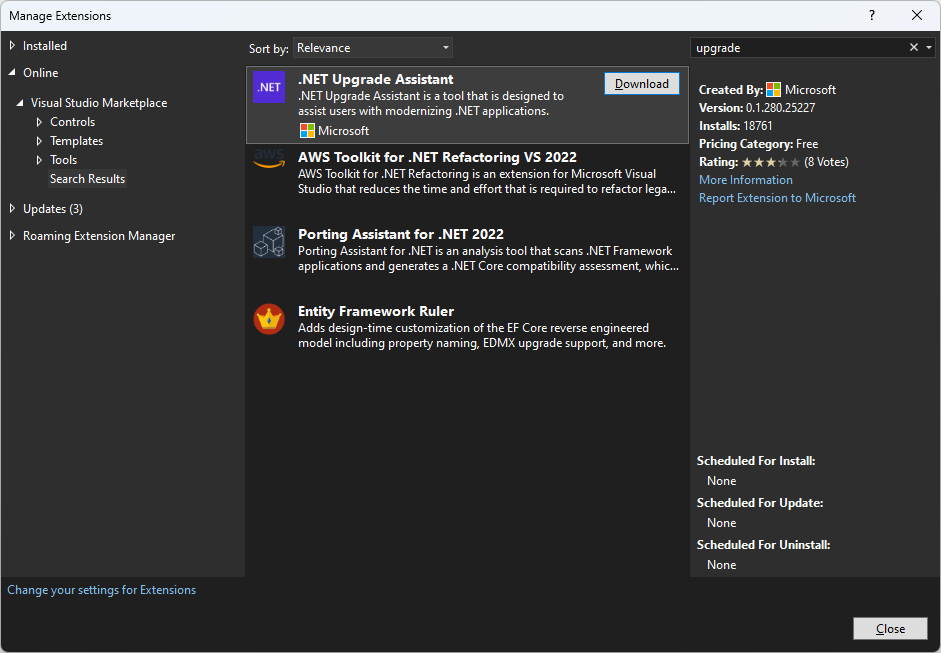
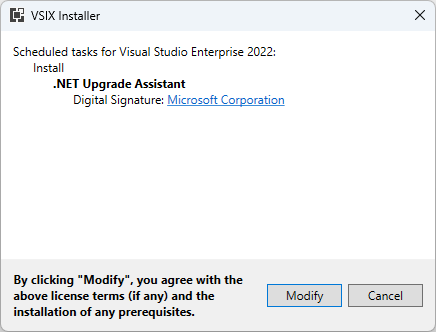

# Install the Application and Code Assessment Toolkit (AppCAT) for .NET

The AppCAT for .NET can be installed as a Visual Studio extension or as a .NET command-line tool. When installed as a Visual Studio extension, loaded projects and solution can be upgraded through the context menu in Solution Explorer. The command-line version of the tool provides an interactive step-by-step experience.

## Prerequisites

- Windows operating system
- Visual Studio 2022 version 17.1 or later
- .NET SDK for the command-line tool

## Install the Visual Studio extension

AppCAT for .NET can be installed as a Visual Studio extension, which lets you analyze an open projects in your solution. Use the following steps to install AppCAT for .NET from inside Visual Studio. Alternatively, you can download and install the extension from the [Visual Studio Marketplace](https://marketplace.visualstudio.com/items?itemName=ms-dotnettools.azureappcat).

  1. With Visual Studio opened, press the **Extensions > Manage Extensions** menu item, which opens the **Manage Extensions** window.
  2. In the **Manage Extensions** window, enter _AppCAT_ into the search input box.
  3. Select the **AppCAT (Application and Code Assessment Toolkit)** item, and then select **Download**.

  

  1. Once the extension has been downloaded, close Visual Studio. This starts the the installation of the extension.

  

  1. Select **Modify** and follow the directions to install the extension.

## Install the .NET global tool

AppCAT for .NET is also available as a .NET global tool. You can install the tool with the following command.

```dotnetcli
dotnet tool install -g appcat
```

Similarly, because the AppCAT tool is installed as a .NET tool, it can be easily updated by running:

```dotnetcli
dotnet tool update -g appcat
```

> [!IMPORTANT]
> Installing this tool may fail if you've configured additional NuGet feed sources. Use the `--ignore-failed-sources` parameter to treat those failures as warnings instead of errors.
>
> ```dotnetcli
> dotnet tool install -g --ignore-failed-sources appcat
> ```

## Next steps

### Use AppCAT for .NET with Visual Studio

For information on how to use and interpret results, see [Use AppCAT for .NET with Visual Studio](visual-studio.md).
