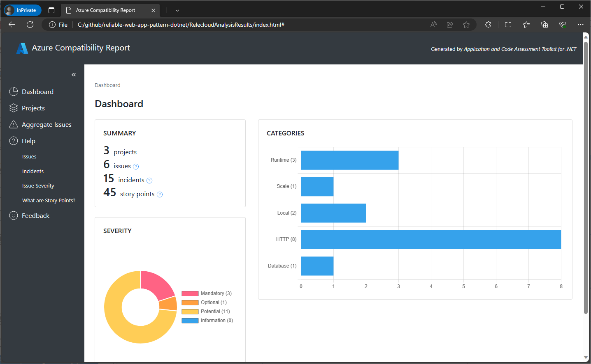
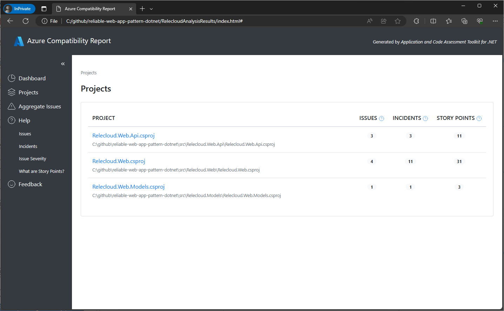
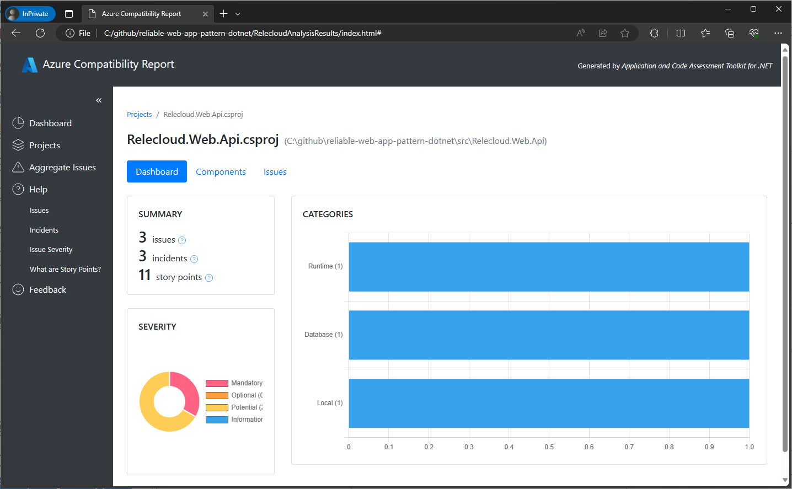
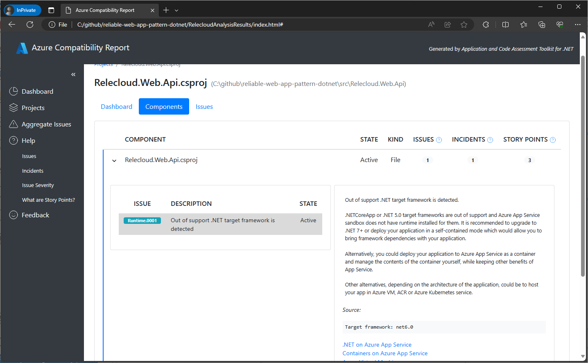
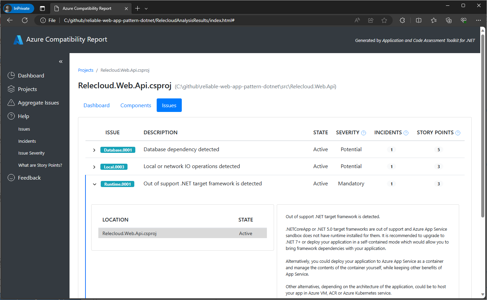
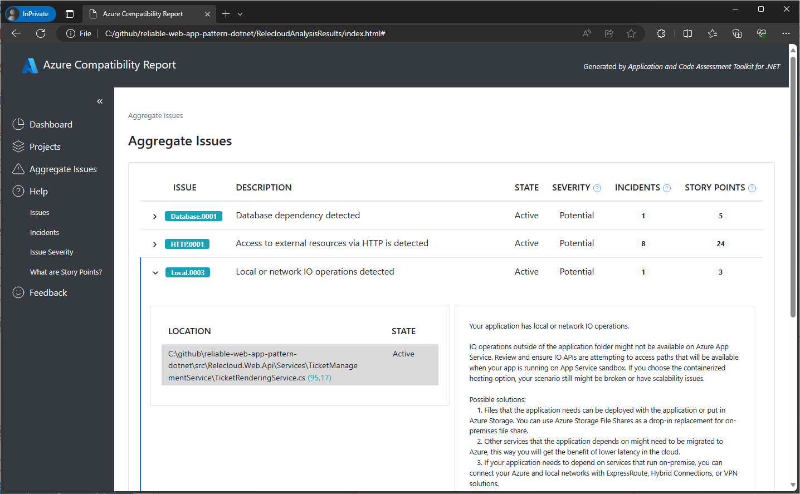

# Interpret the analysis results

Both CLI tool and Visual Studio allow you to create HTML, CSV and JSON reports. This section describes how to interpret these reports.

For the purposes of this document we're going to use the HTML report.

## Dashboard view

The report presents its results in a dashboard format.

The main dashboard shows a Summary section with the results of the scan, Severity graph and Categories of the issues and incidents.

The **Summary** section of the dashboard contains several terms that are worth defining as you'll see them in other screens.

* **Projects**: the number of projects scanned.
* **Issues**: an incompatibility with Azure or a potential problem.
* **Incidents**: an occurrence of the issue in your code. For example, an issue could be a call to a database that is not accessible from Azure, and the incidents are the times when you make that call in your code. That way one issue might have many incidents (implementation) across your code.
* **Story points**: the estimated effort to fix all of the issues found. This is a relative measure of effort and is not meant to be an exact estimate.

Here are the issue severity classifications:

* **Mandatory** - the issue has to be resolved for the migration to be successful.
* **Optional** - the issue discovered is a real issue and fixing it could improve the application work after migration, however it is not blocking.
* **Potential** - it could or could not be a blocking problem depending on the specifics of your app and the migration scenario, so the tool draws your attention and suggests what checks could be made to ensure the application will work in Azure.
* **Informational** - the issue was raised only for informational purpose and is not required to be resolved.

Categories section displays a graph with issues grouped by different categories such as HTTP, database, scaling, and so on.

* **Projects**: the number of projects scanned.
* **Issues**: the number of unique encounters of a rule that may need to be addressed.
* **Incidents**: the total number of occurrences of all issues found.
* **Story points**: the estimated effort to fix all of the issues found. This is a relative measure of effort and is not meant to be an exact estimate.

## Projects view

Click on the **Projects** link below the **Dashboard** on the left side of the report to see the number of issues, incidents, and the estimated effort to fix those incidents by each project scanned.

You can drill down to see the issues found in each project by clicking on the project name. This will show a screen similar to the overall dashboard but scoped to the selected project.

At the top of the project dashboard you'll find 3 tabs: **Dashboard**, **Components**, and **Issues**.

Click on the **Components** tab to see which files the incidents of the issues identified reside in. You can drill down into the file to see the issues that triggered the incident, a description of the issue, the exact position in the code where the incidents exist, and an estimation of the effort it will take to fix the incidents.

Finally, by clicking on the **Issues** tab, you can see the incidents organized by the issues which triggered them. You can drill down into the issues to see the exact file location that needs to be addressed and the effort to fix.

### Aggregate Issues view

Click on the **Aggregate issues** link below the **Projects** on the left side of the report's screen to see the incidents organized by the issues that triggered them. These are all of the issues across all of the projects scanned, including the number of incidents and an estimated story points effort. You can drill down into each issue to see the exact files and locations that needs to be addressed and the effort to fix.

In the section on the right, you will find an explanation for the selected issue with suggestions on how to fix it or the verifications you should make to ensure your application will work properly in Azure. There are also links to the detailed documentation in the bottom part of that section.

