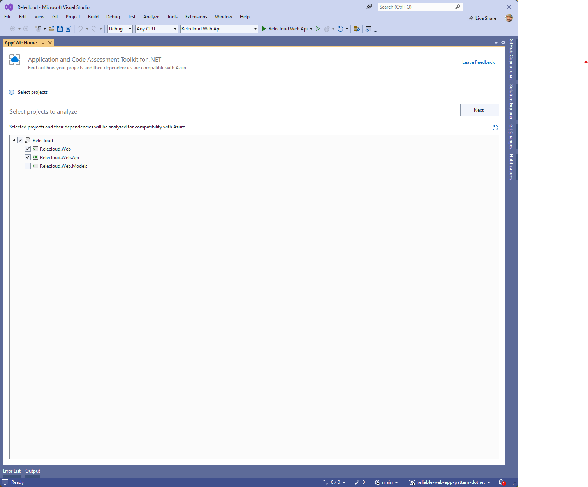

# Analyze applications with Visual Studio

Azure Migrate application and code assessment for .NET helps you to identify any issues your application might have when it is ported to Azure and improve the performance, scalability and security by suggesting modern, cloud-native solutions.

The tool is available as a Visual Studio extension and a [CLI tool](./dotnet-cli.md).

This guide describes how to use the Visual Studio extension to scan your application for possible incompatibilities with Azure.

If you have not installed the Visual Studio extension, please follow [these instructions first](./install.md).

## Scan your application

The application and code assessment lets you decide which projects in your solution to scan to identify migration opportunities to Azure. Follow these steps to scan your application.

1. Open the solution containing the projects you want to migrate to Azure in Visual Studio 2022.
1. Right-click on any of the projects in the Solution Explorer window and select **Re-platform to Azure**.
    
1. The utility will start and give you the option to start a new analysis report or open an existing one. It will also display any recent analysis reports.
    
1. Click on **New report** and it will display the projects in your solution in a treeview. It will give you an option to select which projects to analyze. You will find web projects pre-selected for you and you can change the selection by checking or unchecking the boxes next to the projects. When the tool runs, it also analyzes the dependencies your selected projects has.
    
1. Click the **Next** button and you'll be presented with the option to analyze **Source code and settings**, **Binary dependencies**, or both.
    
    > [!NOTE]
    > The **source code and settings** option will only scan the source code in the projects you selected on the previous screen. The **Binary dependencies** option will scan any dependencies (such as NuGet packages or referenced dlls) your projects rely on. You can expect to see many more issues identified when **binary dependencies** is selected.
    > Scanning binaries can be valuable because the issues detected may identify potential problem in dependencies, but also might not be as useful because source code is not available for these dependencies, so the issues can't be fixed and, in the case of potential issues, it may not be an issues in your case.

> It might be helpful to generate two different reports: for action items and for your awareness.
    >

1. Click the **Analyze** button to start the scan. The selected projects are scanned to look for potential issues when migrating to Azure. When finished, you'll see a dashboard of results.
  

## Next steps

### Interpret the results

For information on how to interpret results, see [Interpret the analysis results from the Azure Migrate application and code assessment for .NET](./interpret-results.md).
