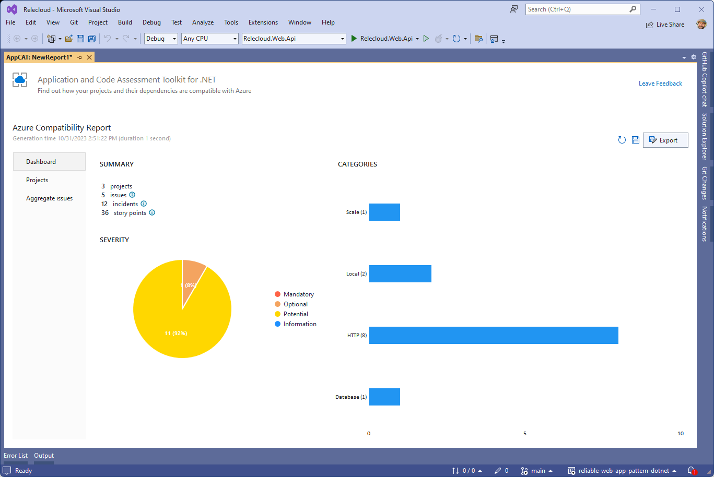
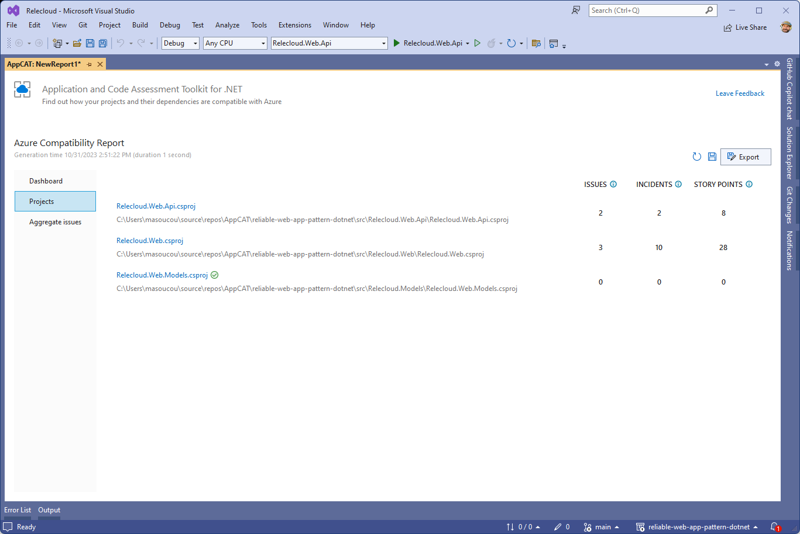
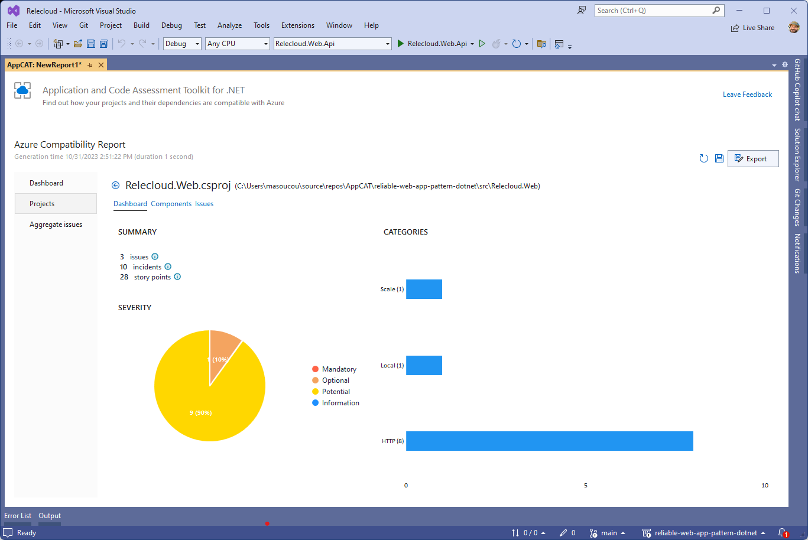
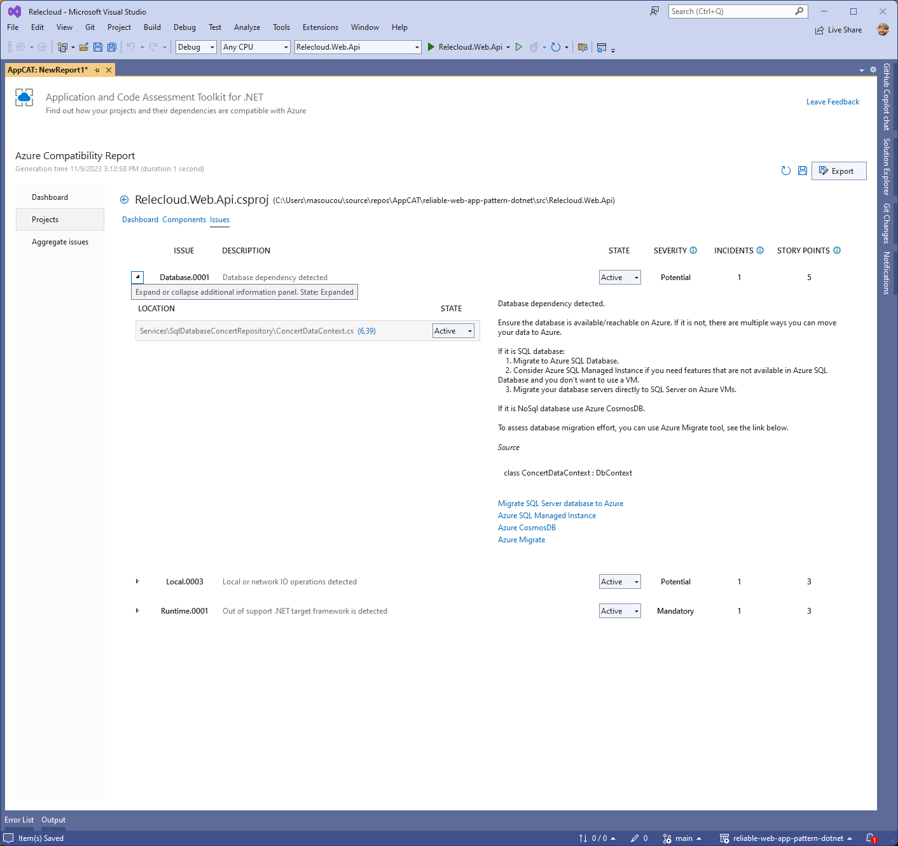
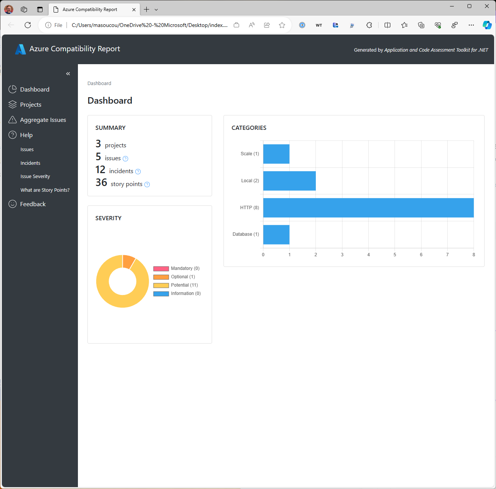

# Analyze projects with Azure AppCAT tool with Visual Studio

AppCAT (Application Code Assessment Toolkit) for .NET is a tool to assess .NET source code to identify replatforming and migration opportunities to Azure. It helps you modernize and replatform large-scale .NET applications through a broad range of transformations, use cases, and code patterns.

This guide describes how to use the AppCAT for .NET Visual Studio extension to both scan and interpret the results of the scan.

If you have not installed the AppCAT for .NET Visual Studio extension, please follow [these instructions first](./install.md).

## Scan your application

AppCAT for .NET lets you decide which projects in your solution to scan to identify migration opportunities to Azure. Follow these steps to scan your application.

1. Open the solution containing the projects you want to migrate to Azure in Visual Studio 2022.
1. Right click on any of the projects in the Solution Explorer window and select **Replatform to Azure**.
  
1. AppCAT will start and display the projects in your solution in a treeview. It will give you an option to select which projects to analyze. AppCAT will have pre-selected projects for you that it thinks are most likely to have compatibility issues. You can change the selection by checking or unchecking the boxes next to the projects.
  
1. Click the **Analyze** button to start the scan. AppCAT will scan all the code in the selected projects to look for potential issues when migrating to Azure. When it's finished, you'll see a dashboard of its results.
  

## Interpret the results

After the projects have been scanned, AppCAT presents its results in a dashboard format. In this section we'll describe the different sections of the dashboard and how to interpret them.

### Dashboard view

The main dashboard shows a summary of the results of the scan. It shows the number of projects scanned, the number of issues found, it estimates the amount of effort to fix the issues in story points, and it classifies the issues by severity from Mandatory to Informational.

Here are the issue severity classifications:

* **Mandatory** - the issue has to be resolved for the migration to be successful.
* **Optional** - the issue discovered is a real issue and fixing it could improve the app after migration, however it is not blocking.
* **Potential** - we are not sure if it is necessarily a blocking problem, but raised just in case.
* **Informational** - the issue was raised only for informational purpose and is not required to be resolved.

The dashboard displays a graph of the category of each issue found. The categories can range from HTTP, to database, to scaling, and so on. The categories are based upon rules that the AppCAT tool uses to identify issues.

### Projects view

Click on the **Projects** tab below the **Dashboard** tab on the left side of the AppCAT result's screen to see the number of issues and the estimated effort to fix those issues by each project scanned.

You can drill down to see the issues found in each project by clicking on the project name. This will show a screen similar to the overall dashboard but scoped to the selected project.

At the top of the project dashboard you'll find 3 tabs: **Dashboard**, **Components**, and **Issues**.

Click on the **Components** tab to see which files the issues AppCAT identified reside in. You can drill down into the file to see the rule that triggered the issue, a description of the rule, the exact position in the code where the issue exists, and an estimation of the effort it will take to fix.

Finally, by clicking on the **Issues** tab, you can see the issues organzied by the rules which triggered them. You can drill down into the rules to see the exact file location that needs to be addressed and the effort to fix.

### Aggregate issues

Click on the **Aggregate** tab below the **Projects** tab on the left side of AppCAT result's screen to see the issues organized by the rule that triggered them. These are all of the issues across all of the projects scanned. You can drill down into the rules to see the exact files and locations that needs to be addressed and the effort to fix.

### Export results

AppCAT for .NET also lets you export all of the results it finds into HTML, JSON, or CSV file formats. Click on the **Export** button and select the file format you want to export to as well as the file location.

Exporting to HTML will produce a page that renders similar to the following:

## Next steps

### AppCAT for .NET CLI

For information on how to use and interpret results from the .NET CLI version of AppCAT, see [Use AppCAT for .NET with the .NET CLI](./donet-cli.md).
