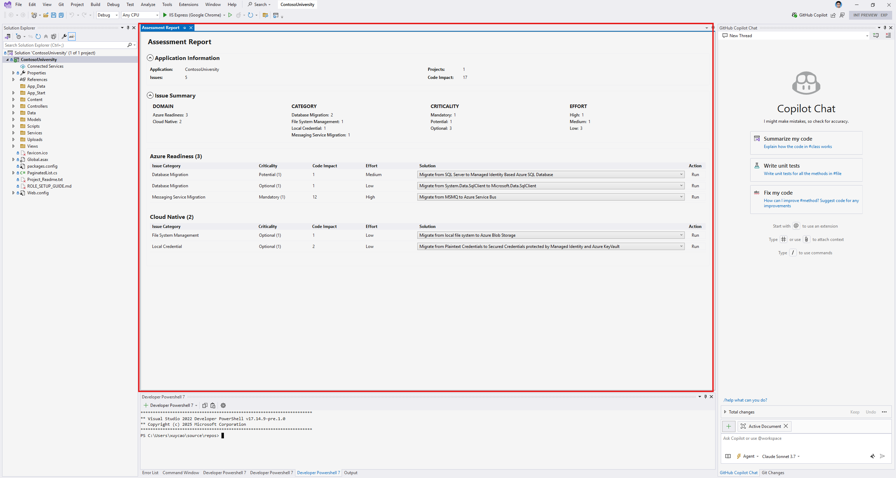
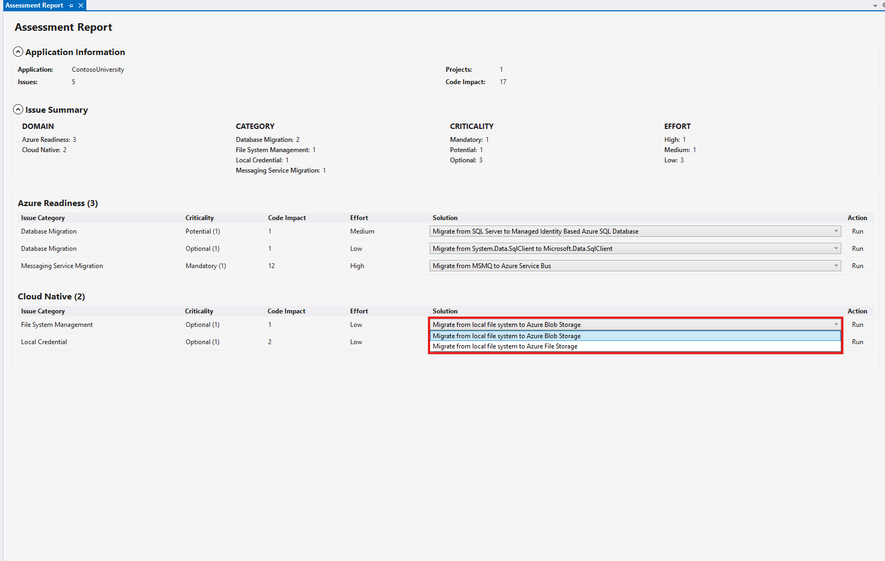

# What is GitHub Copilot App Modernization for .NET?

GitHub Copilot App Modernization for .NET aims to help enterprises migrate their .NET applications to Azure with confidence and efficiency, covering assessment, code remediation and validation, powered by the intelligence of GitHub Copilot.

## Assessment of modernization issues

App Modernization for .NET evaluates the readiness of developer's applications for migration to Azure, with an interactive experience on Visual Studio, powered by [AppCAT for .NET](../appcat/install.md).

## Solution recommendations

App modernization for .NET recommends target Azure services for the resource dependencies of developer's application, for each category of assessed issues.

## Code remediation for common issues
To accelerate code changes for [common modernization issues](predefined-tasks.md), the developer may apply predefined tasks (code change patterns) that represent best practices from experts.

## Automatic fix for compilation errors

After applying tasks, app modernization for .NET will automatically find and fix compilation errors introduced by the code changes.

# How do I get started?

To use App Modernization for .NET, you need:
- [A GitHub account with GitHub Copilot enabled](https://github.com/features/copilot)
    - Pro, Pro+, Business or Enterprise plan is needed
- [The GitHub Copilot extension](https://marketplace.visualstudio.com/items?itemName=GitHub.copilot)
    - The latest version is recommended
- [AppCAT for .NET](../appcat/install.md)
    - For the assessment feature of GitHub Copilot app modernization for .NET

# Feedback

We value your feedback — share [your thoughts here](https://aka.ms/AM4JFeedback) to help us continue improving the product.

# License

This extension is licensed under [GitHub Copilot Product Specific Terms](https://github.com/customer-terms/github-copilot-product-specific-terms).

# Trademarks

This project may contain trademarks or logos for projects, products, or services. Authorized use of Microsoft trademarks or logos is subject to and must follow [Microsoft's Trademark & Brand Guidelines](https://www.microsoft.com/en-us/legal/intellectualproperty/trademarks/usage/general). Use of Microsoft trademarks or logos in modified versions of this project must not cause confusion or imply Microsoft sponsorship. Any use of third-party trademarks or logos are subject to those third-party's policies.

# Privacy statement

App Modernization for .NET uses GitHub Copilot just like how you modify code with GitHub Copilot, which does not retain code snippets beyond the immediate session. Telemetry metrics are collected and analyzed to track feature usage and effectiveness. Please review the [Microsoft Privacy Statement](https://go.microsoft.com/fwlink/?LinkId=521839) if necessary.

# Transparency note

App Modernization for .NET uses GitHub Copilot to make code changes, and AI sometimes makes mistakes. Please carefully review and test the code changes made by the tool, before using them on your production environment.

# More information

Here is some documentation that may be helpful.
* [Common modernization issues with predefined tasks](predefined-tasks.md)
* [Quickstart on assessing an application and applying code changes](quick-start.md)
* [Frequently Asked Questions](faq.md)