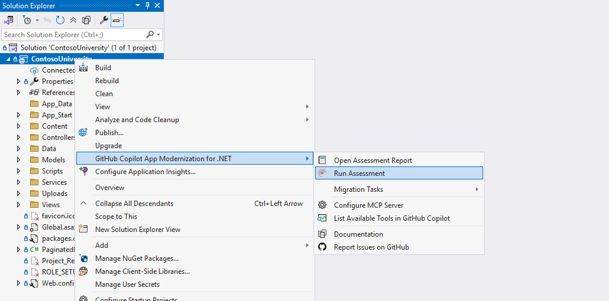
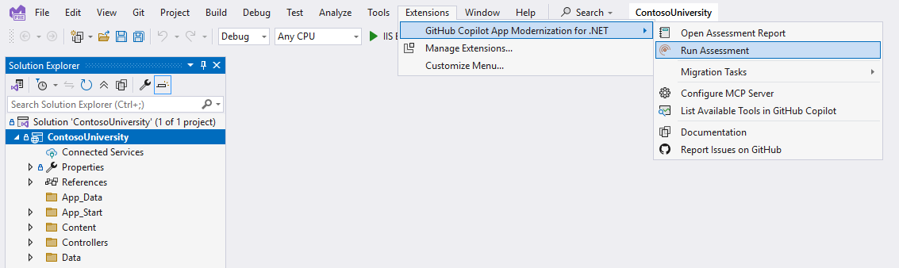
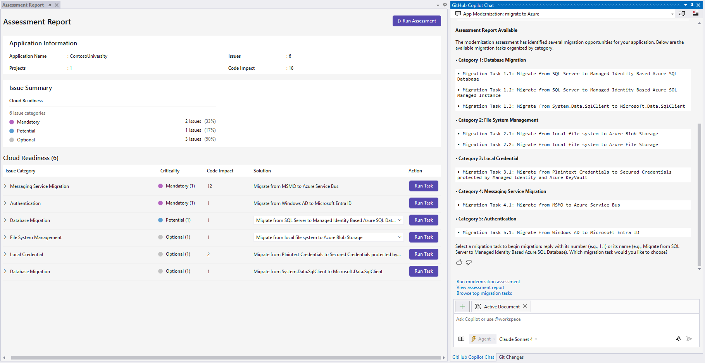

# Quickstart: assess and migrate a .NET project using GitHub Copilot App Modernization for .NET

This quickstart shows you how to use GitHub Copilot App Modernization for .NET to assess and migrate a .NET project. In this quickstart, you install and configure the extension, then assess and migrate a sample project. 

## Prerequisites

- A GitHub account with [GitHub Copilot](https://github.com/features/copilot) enabled. All plans are supported, including the Free plan.
- The latest version of [Visual Studio 2022](https://visualstudio.microsoft.com/zh-hans/downloads/). Must be version 17.14.7 or later.
- Enable agent mode for VS GitHub Copilot [Use Copilot agent mode](https://learn.microsoft.com/en-us/visualstudio/ide/copilot-agent-mode?view=vs-2022).

## Sign in to use Copilot and then install App Modernization extension

To use GitHub Copilot, sign in to your GitHub account in Visual Studio. Select the Copilot icon at the top of Visual Studio to access the GitHub Copilot pane. For more information about setting up GitHub Copilot, see [Set up GitHub Copilot in Visual Stuido](https://learn.microsoft.com/en-us/visualstudio/ide/visual-studio-github-copilot-install-and-states?view=vs-2022).

Then, use the following steps to install GitHub Copilot App Modernization for .NET:
1. In Visual Studio, navigate to `Extensions -> Manage Extensions`.
1. Search for `Github Copilot App Modernization for .NET` in the marketplace.
1. On the extension page, select `Install`. 
1. There will be notification bar showing up to guide you close Visual Studio to install the extension.
1. Launch Visual Studio after installation.

For more information, see [Find, install, and manage extensions for Visual Studio](https://learn.microsoft.com/en-us/visualstudio/ide/finding-and-using-visual-studio-extensions?view=vs-2022).

## Assess cloud readiness

Use the following steps to start your migration process with solution assessment. This assessment helps you understand what your cloud readiness challenges are and how impactful they are, provides recommended solutions. A solution recommendation includes references to set up Azure resources, add configurations, and make code changes.

1. Clone the [.NET migration copilot samples](https://github.com/Azure-Samples/dotnet-migration-copilot-samples) repository.
1. In Visual Studio, open the **Contoso University** project folder in the samples repository.
1. Three ways to start the assessment:
    - [Option 1] Right click on the solution, navigate through `GitHub Copilot App Moderniation for .NET -> Run Assessment`
    - [Option 2] On the top menu, navigate through `Extensions -> GitHub Copilot App Moderniation for .NET -> Run Assessment` 
    - [Option 3] In the feature search panel (ctrl + shift + p), search for `Run Assessment`
1. Then a background task will be triggered and after a while, an assessment report tab will be shown. (Note that there will be a small icon in the left bottom corner indicating the background running task on-going)

## Start a migration

 GitHub Copilot App Modernization for .NET provides predefined tasks for common migration scenarios using Microsoft's best practice.

 You can start the migration with a simple click on the `Migrate` button in the `Assessment Report` generated in last step.

 > If you are clear with the migration scenario you want to migrate, you can navigate through `GitHub Copilot App Moderniation for .NET -> Migration Tasks` and select the proper task to start a migration.

 ### Plan and progress tracker generation

 Once you started the migration, a GitHub Copilot session will be started with our pre-defined prompts sent to GitHub Copilot in agent mode. This step will create two files under folder `.appmod/.migration`:
 - plan.md - This file acts as the plan for the overall migration
 - progress.md - This file acts as the progress tracker of the entire migration process, GitHub Copilot will mark items when it finish specific task deined in the progress tracker file. 
 > You can modify these two files to include your customizations before going into next step.

### Start code remediation

If you are satisfied with the two files generated, just prompt like `The plan and progress tracker look good to me. Go ahead with the migration.`

Then GitHub Copilot will start the migration process. It may ask for your approval to call knowledge base tools in the MCP server provided by the extension, please grant the permission for such operations.

Basically, GitHub Copilot will follow the plan and progress tracker to do the following tasks:
1. Dependency management
1. Configuration changes
1. Code changes
1. ​​Build the entire solution, fix all compilation/configuration errors, and ensure a successful build

## Next step
[Predefined Tasks](predefined-tasks.md)
[FAQ](faq.md)