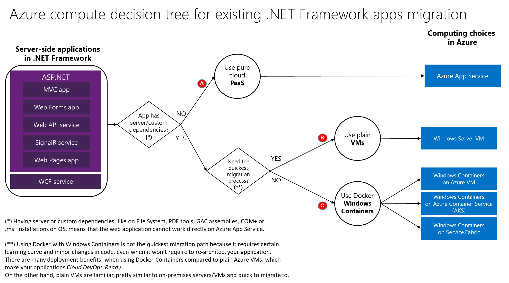

# Choose the right Azure hosting option

This article provides considerations and comparisons between the multiple choices you have in Azure when migrating your existing .NET Framework applications from on-premises to Azure.

The fundamental areas to consider when migrating existing .NET applications to Azure are:

1. Compute choices
1. Database choices
1. Networking and security considerations
1. Authentication and authorization considerations

## Compute choices

When migrating existing .NET Framework applications to Azure you have multiple choices. However, since .NET Framework depends on Windows, the following choices are limited to Windows-based compute services.

The following table shows several comparisons and recommendations to help you choose the right compute migration path for your existing .NET application.

|                 | Azure VMs | Azure App Service | Windows Containers |
|-----------------|-----------|-------------------|--------------------|
|**When to use**      |<ul><li>Application has strong dependencies on the server and local .msi installations.</li><li>You want the easiest application migration path</li></ul>|App has no dependencies on the server, it is just a clean ASP.NET web app (MVC, WebForm) or N-Tier app (Web API, WCf) accessing a database server. |<ul><li>Application has dependencies on the original server but those dependencies can be included in the Docker Windows image.</li><li>Want to modernize the app so it is  [Cloud DevOps-Ready](../../architecture/modernize-with-azure-containers/modernize-existing-apps-to-cloud-optimized/reasons-to-modernize-existing-net-apps-to-cloud-optimized-applications.md)</li></ul>|
|**Pros & benefits**  |<ul><li>Easiest migration path</li><li>Familiar environment. Deployment environment is a VM, so it's similar to on-premises servers.</li></ul> |Ongoing PaaS maintenance, simplest way to manage and scale apps in Azure. |<ul><li>Prepared for the future, Cloud DevOps-Ready with dependencies included in the app's containers.</li><li>Almost no need to refactor .NET /C# code.</li></ul> |
|**Cons**             |It is IaaS. Maintenance is costly. You have to manage the VM's infrastructure about networking, load-balancer, scale-out, IIS management, and so on. |<ul><li>Not all apps are [supported](https://appmigration.microsoft.com/assessment)</li><li>Some apps might need to be refactored and even slightly rearchitected, so they support Azure App Service.</li></ul> |<ul><li>Docker's skills learning curve</li><li>Some code and app configuration settings changes</li></ul>|
|**Requirements** |Windows Server VM with the same requirements than the app for on-premises | Azure App Service requirements specified in [Readiness checks](https://github.com/Azure/App-Service-Migration-Assistant/wiki/Readiness-Checks). |<ul><li>[Docker Engine - Enterprise for Windows Server 2019](https://azuremarketplace.microsoft.com/marketplace/apps/cloud-infrastructure-services.docker-windows-2019) or</li><li>[Azure Container Service (AKS)](https://azure.microsoft.com/services/container-service/) (That is Kubernetes orchestrator) or<li>[Azure Service Fabric](https://azure.microsoft.com/services/service-fabric/) orchestrator</li></ul> |
|**How to migrate** |See [Migrate to Azure Virtual Machines](vm.md) | See [Migrate Azure App Service](app-service.md) | Follow considerations, scenarios, and walkthroughs explained in the [Modernizing existing .NET apps with Azure and Windows Containers eBook](https://aka.ms/liftandshiftwithcontainersebook) |

The following flowchart diagram shows a decision tree when planning a migration to Azure for your existing .NET Framework applications. If it's viable, try option A first, but option B is the easiest path to perform.

## Database choices

When migrating relational databases to Azure you have multiple choices. See [Migrate your SQL Server database to Azure](sql.md) to help you choose the right database migration path for your existing .NET application.

## Networking and security considerations

When deploying applications to a public cloud like Microsoft Azure, you might want to isolate and secure certain networks by [creating network DMZs](/azure/architecture/reference-architectures/dmz/), such as a [DMZ between Azure and on-premises](/azure/architecture/reference-architectures/dmz/secure-vnet-hybrid) or a [DMZ between Azure and the Internet](/azure/architecture/reference-architectures/dmz/secure-vnet-dmz). DMZs can be implemented with [Azure Virtual Network](/azure/virtual-network/virtual-networks-overview).

Azure Virtual networks enable you to:

- Build a hybrid infrastructure that you control
- Bring your own IP addresses and DNS servers
- Secure your connections with an IPsec VPN or ExpressRoute
- Get granular control over traffic between subnets
- Create sophisticated network topologies using virtual appliances
- Get an isolated and highly secure environment for your applications

To get started building your own virtual network, see the [Azure Virtual Network documentation](/azure/virtual-network/).

## Authentication and authorization considerations when migrating to Azure

A top concern of any organization moving to the cloud is security. Most companies have invested a substantial amount of time, money, and engineering into designing and developing a security model, and it's important that they're able to leverage existing investments such as identity stores and single sign-on solutions.

Many existing enterprise B2E .NET applications running on-premises use Active Directory for authentication and identity management. Azure AD Connect enables you to integrate your on-premises directories with Azure Active Directory. To get started, see [Integrate your on-premises directories with Azure Active Directory](/azure/active-directory/connect/active-directory-aadconnect).

See [Identity requirements for your hybrid identity solution](/azure/active-directory/active-directory-hybrid-identity-design-considerations-business-needs) for further planning related to Azure Active Directory.

Other authentication protocol choices are [OAuth](https://en.wikipedia.org/wiki/OAuth) and [OpenID](https://en.wikipedia.org/wiki/OpenID), which are common in consumer-facing applications. When using autonomous identity databases, such as an ASP.NET Identity SQL database wrapped by IdentityServer4 using OAuth, no connectivity to on-premises databases or directories is usually required.

## Next steps

> [!div class="nextstepaction"]
> [Migrate an ASP.NET web application to Azure App Service](app-service.md)
