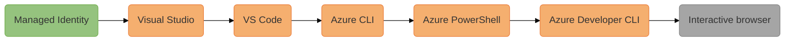

```mermaid
%% STEPS TO GENERATE IMAGE
%% =======================
%% 1. Install mermaid CLI v10.9.1 (see https://github.com/mermaid-js/mermaid-cli/blob/master/README.md):
%%    npm i -g @mermaid-js/mermaid-cli@10.9.1
%% 2. Run command: mmdc -i DefaultAzureCredentialExcludes.md -o DefaultAzureCredentialExcludes.svg

%%{
  init: {
    'theme': 'base',
    'themeVariables': {
      'tertiaryBorderColor': '#fff',
      'tertiaryColor': '#fff'
    }
  }
}%%

flowchart LR;
    C(Managed Identity):::deployed --> D(Visual Studio):::developer --> E(VS Code):::developer --> F(Azure CLI):::developer --> G(Azure PowerShell):::developer --> H(Azure Developer CLI):::developer --> I(Interactive browser):::interactive;

    %% Define styles for credential type boxes
    classDef deployed fill:#95C37E, stroke:#71AD4C;
    classDef developer fill:#F5AF6F, stroke:#EB7C39;
    classDef interactive fill:#A5A5A5, stroke:#828282;
```
