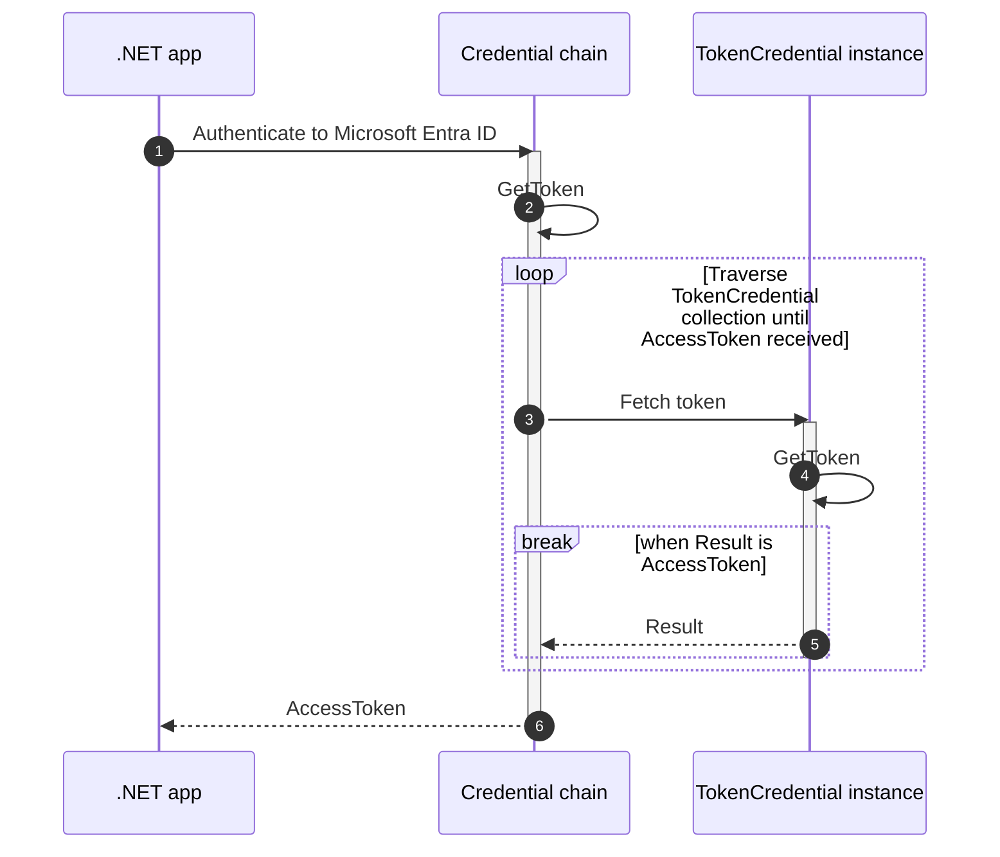

```mermaid
%% STEPS TO GENERATE IMAGE
%% =======================
%% 1. Install mermaid CLI v10.9.1 (see https://github.com/mermaid-js/mermaid-cli/blob/master/README.md):
%%    npm i -g @mermaid-js/mermaid-cli@10.9.1
%% 2. Run command: mmdc -i ChainSequence.md -o ../../media/mermaidjs/ChainSequence.svg

sequenceDiagram
  autonumber;

  participant A as .NET app;
  participant B as Credential chain;
  participant C as TokenCredential instance;
    
  A->>B: Authenticate to Microsoft Entra ID;
  activate B;
  B->>B: GetToken;
  loop Traverse TokenCredential collection until AccessToken received
    B->>C: Fetch token;
    activate C;
    C->>C: GetToken;
    break when Result is AccessToken
        C-->>B: Result;
    end;
    deactivate C;
  end;
  
  B-->>A: AccessToken;
  deactivate B;
```
