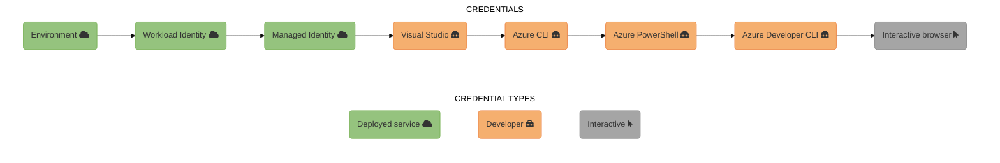

```mermaid
%% STEPS TO GENERATE IMAGE
%% =======================
%% 1. Install mermaid CLI v10.9.1 (see https://github.com/mermaid-js/mermaid-cli/blob/master/README.md):
%%    npm i -g @mermaid-js/mermaid-cli@10.9.1
%% 2. Run command: mmdc -i DefaultAzureCredentialAuthFlow.md -o DefaultAzureCredentialAuthFlow.svg

%%{
  init: {
    'theme': 'base',
    'themeVariables': {
      'tertiaryBorderColor': '#fff',
      'tertiaryColor': '#fff'
    }
  }
}%%

flowchart LR;
    subgraph CREDENTIAL TYPES;
        direction LR;
        Deployed(Deployed service fa:fa-cloud):::deployed ~~~ Developer(Developer fa:fa-toolbox):::developer ~~~ Interactive(Interactive fa:fa-arrow-pointer):::interactive;
    end;

    subgraph CREDENTIALS;
        direction LR;
        A(Environment fa:fa-cloud):::deployed --> B(Workload Identity fa:fa-cloud):::deployed --> C(Managed Identity fa:fa-cloud):::deployed --> D(Visual Studio fa:fa-toolbox):::developer --> E(Azure CLI fa:fa-toolbox):::developer --> F(Azure PowerShell fa:fa-toolbox):::developer --> G(Azure Developer CLI fa:fa-toolbox):::developer --> H(Interactive browser fa:fa-arrow-pointer):::interactive;
    end;

    %% Define styles for credential type boxes
    classDef deployed fill:#95C37E, stroke:#71AD4C;
    classDef developer fill:#F5AF6F, stroke:#EB7C39;
    classDef interactive fill:#A5A5A5, stroke:#828282;

    %% Add API ref links to credential type boxes
    click A "https://learn.microsoft.com/dotnet/api/azure.identity.environmentcredential?view=azure-dotnet" _blank;
    click B "https://learn.microsoft.com/dotnet/api/azure.identity.workloadidentitycredential?view=azure-dotnet" _blank;
    click C "https://learn.microsoft.com/dotnet/api/azure.identity.managedidentitycredential?view=azure-dotnet" _blank;
    click D "https://learn.microsoft.com/dotnet/api/azure.identity.visualstudiocredential?view=azure-dotnet" _blank;
    click E "https://learn.microsoft.com/dotnet/api/azure.identity.azureclicredential?view=azure-dotnet" _blank;
    click F "https://learn.microsoft.com/dotnet/api/azure.identity.azurepowershellcredential?view=azure-dotnet" _blank;
    click G "https://learn.microsoft.com/dotnet/api/azure.identity.azuredeveloperclicredential?view=azure-dotnet" _blank
    click H "https://learn.microsoft.com/dotnet/api/azure.identity.interactivebrowsercredential?view=azure-dotnet" _blank;
```
