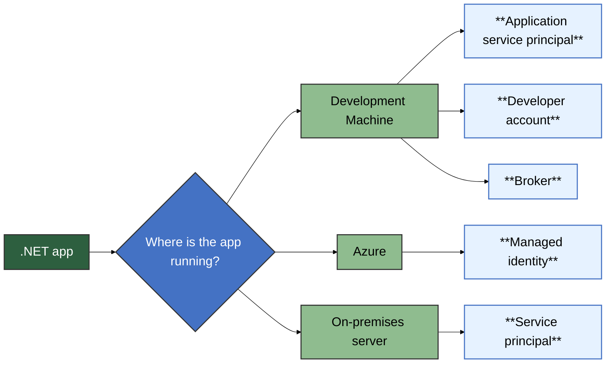

```mermaid
%% STEPS TO GENERATE IMAGE 
%% ======================= 
%% 1. Install mermaid CLI v10.9.1 (see https://github.com/mermaid-js/mermaid-cli/blob/master/README.md): 
%%    npm i -g @mermaid-js/mermaid-cli@10.9.1 
%% 2. Run command: mmdc -i authentication-environments.md -o ../../media/mermaidjs/authentication-environments.svg 

%%{init: {'theme':'base', 'themeVariables': { 'primaryColor': '#fff', 'edgeLabelBackground':'#fff', 'fontSize': '24px'}}}%%
flowchart LR
    NetApp[".NET app"]
    Q1{Where is the app running?}
    
    NetApp --> Q1
    
    %% Local Development Machine Branch
    Q1 --> LocalDev[Development Machine]
    LocalDev --> AppSP["**Application service principal**"]
    LocalDev --> DevAccount["**Developer account**"]
    LocalDev --> Broker["**Broker**"]
    
    %% Azure Branch
    Q1 --> AzureApp[Azure]
    AzureApp --> ManagedId["**Managed identity**"]
    
    %% On-premises Server Branch
    Q1 --> OnPremApp[On-premises server]
    OnPremApp --> ServicePrincipal["**Service principal**"]

    %% Styling
    classDef questionBox fill:#4472C4,stroke:#333,stroke-width:2px,color:#fff,font-size:24px
    classDef authMethod fill:#e6f2ff,stroke:#4472C4,stroke-width:2px,color:#000,font-size:24px
    classDef envNode fill:#8fbc8f,stroke:#333,stroke-width:2px,color:#000,font-size:24px
    classDef startNode fill:#2d5f3f,stroke:#333,stroke-width:2px,color:#fff,font-size:24px
    
    %% Edge label styling
    linkStyle default font-size:24px
    
    class NetApp startNode
    class Q1 questionBox
    class AppSP,DevAccount,Broker,ManagedId,ServicePrincipal authMethod
    class LocalDev,AzureApp,OnPremApp envNode
```
