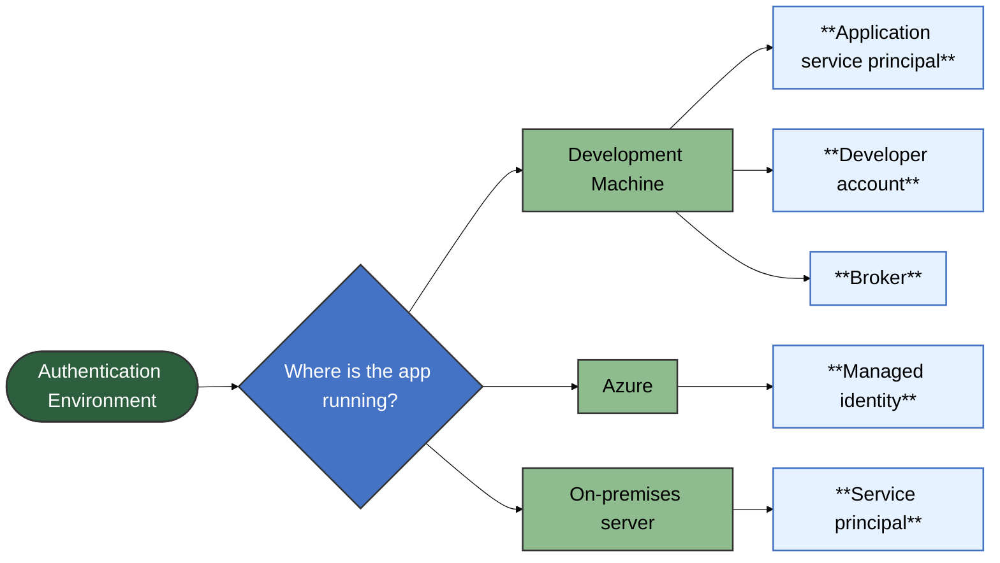

```mermaid
%%{init: {'theme':'base', 'themeVariables': { 'primaryColor': '#fff', 'edgeLabelBackground':'#fff', 'fontSize': '24px'}}}%%
flowchart LR
    Start([Authentication Environment]) --> Q1{Where is the app running?}
    
    %% Local Development Machine Branch
    Q1 --> LocalDev[Development Machine]
    LocalDev --> AppSP["**Application service principal**"]
    LocalDev --> DevAccount["**Developer account**"]
    LocalDev --> Broker["**Broker**"]
    
    %% Azure Branch
    Q1 --> AzureApp[Azure]
    AzureApp --> ManagedId["**Managed identity**"]
    
    %% On-premises Server Branch
    Q1 --> OnPremApp[On-premises server]
    OnPremApp --> ServicePrincipal["**Service principal**"]

    %% Styling
    classDef questionBox fill:#4472C4,stroke:#333,stroke-width:2px,color:#fff,font-size:24px
    classDef authMethod fill:#e6f2ff,stroke:#4472C4,stroke-width:2px,color:#000,font-size:24px
    classDef startNode fill:#2d5f3f,stroke:#333,stroke-width:2px,color:#fff,font-size:24px
    classDef envNode fill:#8fbc8f,stroke:#333,stroke-width:2px,color:#000,font-size:24px
    
    %% Edge label styling
    linkStyle default font-size:24px
    
    class Start startNode
    class Q1 questionBox
    class AppSP,DevAccount,Broker,ManagedId,ServicePrincipal authMethod
    class LocalDev,AzureApp,OnPremApp envNode
```
