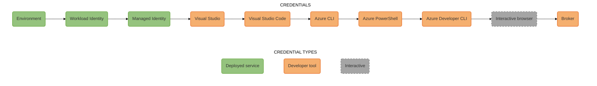

```mermaid
%% STEPS TO GENERATE IMAGE
%% =======================
%% 1. Install mermaid CLI v10.9.1 (see https://github.com/mermaid-js/mermaid-cli/blob/master/README.md):
%%    npm i -g @mermaid-js/mermaid-cli@10.9.1
%% 2. Run commands:
%%    mmdc -i default-azure-credential-authentication-flow.md -o ../../media/mermaidjs/default-azure-credential-authentication-flow-inline.svg
%%    mmdc -i default-azure-credential-authentication-flow.md -o ../../media/mermaidjs/default-azure-credential-authentication-flow-expanded.png -w 1156

%%{
  init: {
    'theme': 'base',
    'themeVariables': {
      'tertiaryBorderColor': '#fff',
      'tertiaryColor': '#fff'
    }
  }
}%%

flowchart LR;
    accTitle: DefaultAzureCredential authentication flow;
    accDescr: Flowchart showing the credential chain implemented by DefaultAzureCredential;

    subgraph CREDENTIAL TYPES;
        direction LR;
        Deployed(Deployed service):::deployed ~~~ Developer(Developer tool):::developer ~~~ Interactive(Interactive):::interactive;
    end;

    subgraph CREDENTIALS;
        direction LR;
        A(Environment):::deployed -->
        B(Workload Identity):::deployed -->
        C(Managed Identity):::deployed -->
        D(Visual Studio):::developer -->
        E(Visual Studio Code):::developer -->
        F(Azure CLI):::developer -->
        G(Azure PowerShell):::developer -->
        H(Azure Developer CLI):::developer -->
        I(Interactive browser):::interactive -->
        J(Broker):::developer;
    end;

    %% Define styles for credential type boxes
    classDef deployed fill:#95C37E, stroke:#71AD4C, stroke-width:2px;
    classDef developer fill:#F5AF6F, stroke:#EB7C39, stroke-width:2px;
    classDef interactive fill:#A5A5A5, stroke:#828282, stroke-dasharray:5 5, stroke-width:2px;

    %% Add API ref links to credential type boxes
    click A "https://learn.microsoft.com/dotnet/api/azure.identity.environmentcredential?view=azure-dotnet" _blank;
    click B "https://learn.microsoft.com/dotnet/api/azure.identity.workloadidentitycredential?view=azure-dotnet" _blank;
    click C "https://learn.microsoft.com/dotnet/api/azure.identity.managedidentitycredential?view=azure-dotnet" _blank;
    click D "https://learn.microsoft.com/dotnet/api/azure.identity.visualstudiocredential?view=azure-dotnet" _blank;
    click E "https://learn.microsoft.com/dotnet/api/azure.identity.visualstudiocodecredential?view=azure-dotnet" _blank;
    click F "https://learn.microsoft.com/dotnet/api/azure.identity.azureclicredential?view=azure-dotnet" _blank;
    click G "https://learn.microsoft.com/dotnet/api/azure.identity.azurepowershellcredential?view=azure-dotnet" _blank;
    click H "https://learn.microsoft.com/dotnet/api/azure.identity.azuredeveloperclicredential?view=azure-dotnet" _blank
    click I "https://learn.microsoft.com/dotnet/api/azure.identity.interactivebrowsercredential?view=azure-dotnet" _blank;
    click J "https://learn.microsoft.com/dotnet/api/azure.identity.interactivebrowsercredential?view=azure-dotnet" _blank;
```
