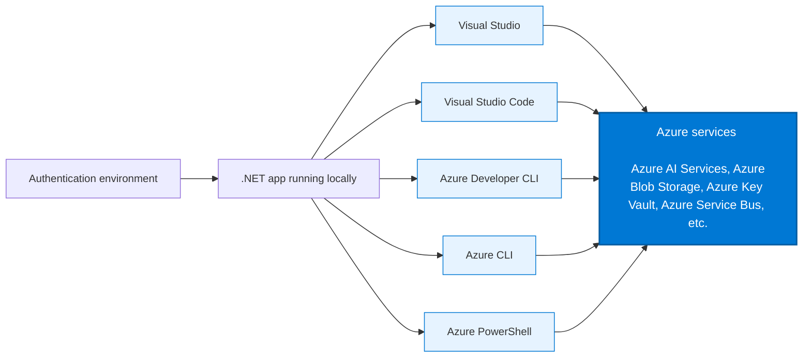

```mermaid
flowchart LR
    LA[Authentication environment]
    ARL[.NET app running locally]
    
    VS[Visual Studio]
    VSC[Visual Studio Code]
    AZCLI[Azure CLI]
    AZPS[Azure PowerShell]
    AZD[Azure Developer CLI]
    
    AS["Azure services <br/><br/> Azure AI Services, Azure Blob Storage, Azure Key Vault, Azure Service Bus, etc."]
    
    LA --> ARL
    ARL --> VS
    ARL --> VSC
    ARL --> AZD
    ARL --> AZCLI
    ARL --> AZPS
    
    VS --> AS
    VSC --> AS
    AZD --> AS
    AZCLI --> AS
    AZPS --> AS
    
    classDef highlight fill:#0078d4,stroke:#005ba1,stroke-width:2px,color:#fff,font-size:16px
    classDef tools fill:#e6f3ff,stroke:#0078d4,stroke-width:1px,font-size:14px
    classDef default font-size:14px
    
    class AS highlight
    class VS,VSC,AZD,AZCLI,AZPS tools
    class LA,ARL default
```
