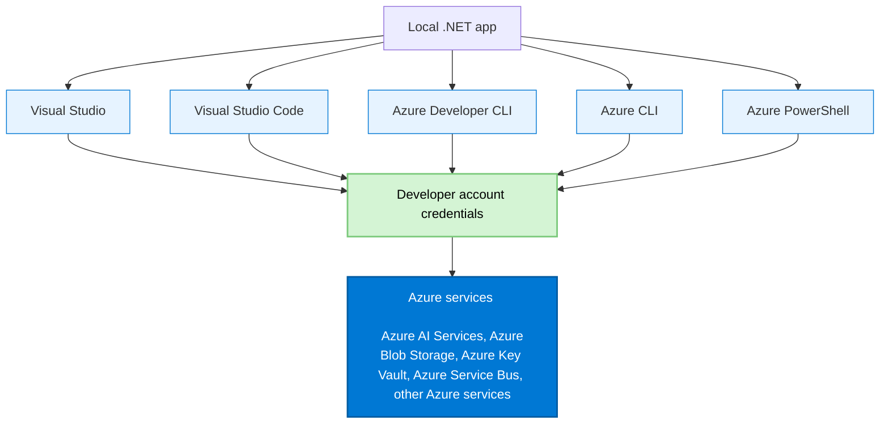

```mermaid
flowchart TD
    ARL[Local .NET app]
    
    VS[Visual Studio]
    VSC[Visual Studio Code]
    AZCLI[Azure CLI]
    AZPS[Azure PowerShell]
    AZD[Azure Developer CLI]

    DevAccount["Developer account credentials"]

    AS["Azure services <br/><br/> Azure AI Services, Azure Blob Storage, Azure Key Vault, Azure Service Bus, other Azure services"]
    
    ARL --> VS
    ARL --> VSC
    ARL --> AZD
    ARL --> AZCLI
    ARL --> AZPS
    
    VS --> DevAccount
    VSC --> DevAccount
    AZD --> DevAccount
    AZCLI --> DevAccount
    AZPS --> DevAccount

    DevAccount --> AS
    
    classDef highlight fill:#0078d4,stroke:#005ba1,stroke-width:2px,color:#fff,font-size:16px
    classDef tools fill:#e6f3ff,stroke:#0078d4,stroke-width:1px,font-size:16px
    classDef default font-size:16px
    classDef lightgreen fill:#D4F4D4,stroke:#7BC97B,stroke-width:2px,color:#000,font-size:16px
    
    class AS highlight
    class VS,VSC,AZD,AZCLI,AZPS tools
    class LA,ARL default
    class DevAccount lightgreen
```
