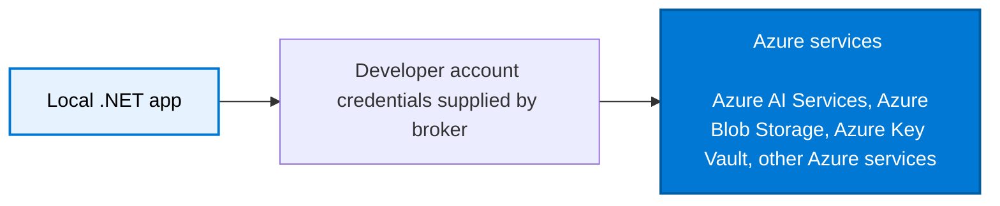

```mermaid
flowchart LR
    APP["Local .NET app"]
    BK["Developer account credentials supplied by broker"]
    AS["Azure services <br/><br/> Azure AI Services, Azure Blob Storage, Azure Key Vault, other Azure services"]
    
    APP --> BK
    BK --> AS
    
    classDef app fill:#e6f3ff,stroke:#0078d4,stroke-width:2px,color:#000,font-size:16px
    classDef serviceP fill:#D4F4D4,stroke:#7BC97B,stroke-width:2px,color:#000,font-size:16px
    classDef services fill:#0078d4,stroke:#005ba1,stroke-width:2px,color:#fff,font-size:16px
    
    class APP app
    class SP serviceP
    class AS services
```
