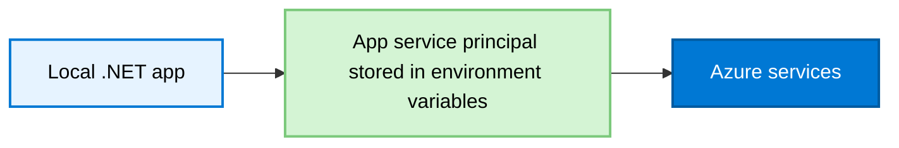

```mermaid
%% STEPS TO GENERATE IMAGE 
%% ======================= 
%% 1. Install mermaid CLI v10.9.1 (see https://github.com/mermaid-js/mermaid-cli/blob/master/README.md): 
%%    npm i -g @mermaid-js/mermaid-cli@10.9.1 
%% 2. Run command: mmdc -i local-service-principal-authentication.md -o ../../media/mermaidjs/local-service-principal-authentication.svg 

flowchart LR
    APP["Local .NET app"]
    SP["App service principal stored in environment variables"]
    AS["Azure services"]
    
    APP --> SP
    SP --> AS
    
    classDef app fill:#e6f3ff,stroke:#0078d4,stroke-width:2px,color:#000,font-size:16px
    classDef serviceP fill:#D4F4D4,stroke:#7BC97B,stroke-width:2px,color:#000,font-size:16px
    classDef services fill:#0078d4,stroke:#005ba1,stroke-width:2px,color:#fff,font-size:16px
    
    class APP app
    class SP serviceP
    class AS services
```
