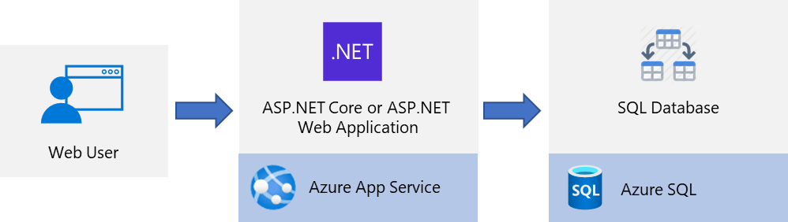

# Host ASP.NET Core and ASP.NET applications on Azure - Solution overview

This tutorial shows how to deploy an ASP.NET Core or ASP.NET web application to Azure using an Azure SQL database. This article will show you how to provision the required
Azure services, establish connectivity between the web app and database, run database migrations, and deploy your application to Azure

## Solution overview



When hosting web apps in Azure, it is typical to first define a resource group which will contain all of the other Azure resources used by the app.  Then, you will create an App Service Plan which specifies the amount of compute (CPU and memory) resources and scaling features available to one or more App Services contained in the App Service Plan.  An App Service is the resource that actually runs your web app.  SQL Azure is used to host the data for the application.  First, a logical server is created that can hold one or more SQL Databases.

In this tutorial, you will provision all of these resources on Azure, deploy your ASP.NET or ASP.NET Core application to Azure App Service and deploy your data to an Azure SQL database.

The Azure resources used for this solution can be provisioned using Visual Studio, the Azure Portal, Azure CLI or Azure PowerShell.  Regardless of which method you choose, the resulting Azure infrastructure is the same.

## Sample application

To follow along, you may download or clone the sample application from the repository [https://github.com/azure-samples/dotnetcore-sqldb-tutorial](https://github.com/azure-samples/dotnetcore-sqldb-tutorial).

```bash
git clone https://github.com/azure-samples/dotnetcore-sqldb-tutorial
```

## 1 - Create a Resource Group

The first step is to create a resource group which serves as a logical container for all of the Azure resources for your application.

```azurecli
az group create \
    --name <resource-group-name> \
    --location "East US"
```
