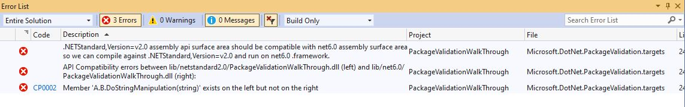
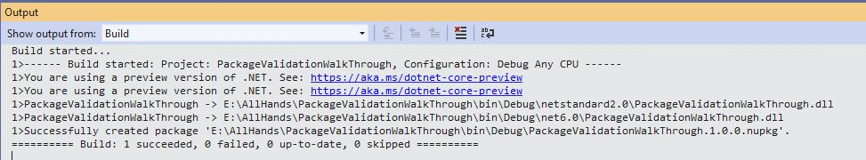
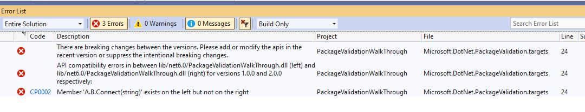
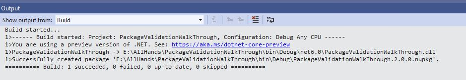
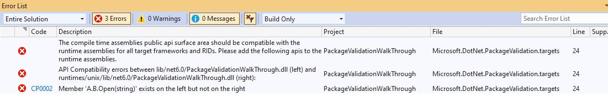
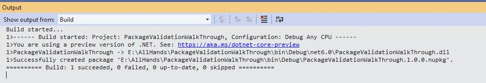

## Importance of Package Validation

With .NET Core & Xamarin we have made cross-platform a mainstream requirement for library authors. However, we lack validation tooling for cross targeting packages, which can result in packages that don't work well, which in turn hurts our ecosystem. This is especially problematic for emerging platforms where adoption isn't high enough to warrant special attention by library authors.

The tooling we provide as part of the SDK has close to zero validation that multi-targeted packages are well-formed. For example, a package that multi-targets for .NET 6.0 and .NET Standard 2.0 needs to ensure that code compiled against the .NET Standard 2.0 binary can run against the .NET 6.0 binary. We have seen this issue in the wild, even with 1st parties, for example, the Azure AD libraries.

It's easy to think that a change is safe and compatible if source consuming that change continues to compile without changes. However, certain changes may work fine in C# but can cause problems at runtime if the consumer wasn't recompiled, for example, adding a defaulted parameter or changing the value of a constant.

Package Validation tooling will allow library developers to validate that their packages are consistent and well-formed. It involves validating that there are no breaking changes across versions. It will validate that the package have the same set of publics APIs for all the different runtime-specific implementations. It will also help developers to catch any applicability holes.


## Enabling Package Validation

Package Validation can be enabled in the .NET project by setting `EnablePackageValidation`. 

```xml
<Project Sdk="Microsoft.NET.Sdk">

  <PropertyGroup>
    <TargetFrameworks>netstandard2.0;net6.0</TargetFrameworks>
    <EnablePackageValidation>true</EnablePackageValidation>
  </PropertyGroup>

</Project>
```

`EnablePackageValidation` runs a series of checks after the pack task. There are some additional checks which could be run by setting other msbuild properties which will be discussed later on.


## Validation Compatible Frameworks

Packages containing compatible frameworks need to ensure that code compiled against one can run against another. Examples of compatible framework pairs are:

* .NET Standard 2.0 and .NET 6.0
* .NET 5.0 and .NET 6.0

In both of these cases, the consumers can build against .NET Standard 2.0 or NET 5.0 and run on .NET 6.0. In case your binaries are not compatible between these frameworks, consumers could end up with compile and/or runtime errors.

Package Validation will catch these errors at pack time. Here is an example scenario:

Suppose you're writing a game which does a lot of string manipulation. You need to support both .NET Framework and .NET Core consumers. You started with just targeting .NET Standard 2.0 but now you realize you want to take advantage of spans in .NET 6.0 to avoid unnecessary string allocations. In order to do that, you now want to multi-target for .NET Standard 2.0 and .NET 6.0.

You have written the following code:

```c#
#if NET6_0_OR_GREATER
    public void DoStringManipulation(ReadOnlySpan<char> input)
    {
        // use spans to do string operations.
    }
#else
    public void DoStringManipulation(string input)
    {
        // Do some string operations.
    }
#endif
```

You then try to pack the project (using dotnet pack cmd or using VS) it fails with the following error:



You understand that you shouldn't exclude ```DoStringManipulation(string)``` but instead just provide an additional ```DoStringManipulation(ReadOnlySpan<char>)``` method for .NET 6.0 and changes the code accordingly:

```c#
#if NET6_0_OR_GREATER
    public void DoStringManipulation(ReadOnlySpan<char> input)
    {
        // use spans to do string operations.
    }
#endif
    public void DoStringManipulation(string input)
    {
        // Do some string operations.
    }
```

You try to pack the project again.



### Validation Against Baseline Package Version

Package Validation can also help you validate your library project against a previous released stable version of your package. In order to use this feature, you will need to add the ```PackageValidationBaselineVersion``` or ```PackageValidationBaselinePath``` to your project.

Package validation will detect any breaking changes on any of the shipped target frameworks and will also detect if any target framework support has been dropped.

For example consider the following scenario: you are working on the AdventureWorks.Client NuGet package. You want to make sure that you don't accidentally make breaking changes so you configure your project to instruct package validation tooling to run API compatibility against the previous version of the package.

```xml
<Project Sdk="Microsoft.NET.Sdk">

  <PropertyGroup>
    <TargetFramework>net6.0</TargetFramework>
    <PackageVersion>2.0.0</PackageVersion>
    <PackageValidationBaselineVersion>1.0.0</PackageValidationBaselineVersion>
  </PropertyGroup>

</Project>
```

A few weeks later, you are tasked with adding support for a connection timeout to your library. The Connect method currently looks like this:

```C#
public static HttpClient Connect(string url)
{
    // ...
}
```

Since a connection timeout is an advanced configuration setting, you reckon that you can just add an optional parameter:

```c#
public static HttpClient Connect(string url, TimeSpan timeout = default)
{
    // ...
}
```

However, when you try to pack, it throws an error.



You realize that while this is not a [source breaking change](https://docs.microsoft.com/dotnet/standard/library-guidance/breaking-changes#source-breaking-change), it's a binary [breaking change](https://docs.microsoft.com/dotnet/standard/library-guidance/breaking-changes#binary-breaking-change). You solve this problem by adding an overload instead:

```c#
public static HttpClient Connect(string url)
{
    return Connect(url, Timeout.InfiniteTimeSpan);
}
public static HttpClient Connect(string url, TimeSpan timeout)
{
    // ...
}
```

You try to pack the project again.



## Validation Against Different Runtimes

You may choose to have different implementation assemblies for different runtimes in your nuget package. In that case, you will need to make sure that these assemblies are compatible with the compile-time assemblies.

For example, consider the following scenario: you are working on a library involving some interop calls to unix and windows API respectively. You have written the following code:

```c#
#if Unix
    public static void Open(string path, bool securityDescriptor)
    {
        // call unix specific stuff
    }
#else
    public static void Open(string path)
    {
        // call windows specific stuff
    }
#endif
```

The resulting package structure looks like

```xml
lib/net6.0/A.dll 
runtimes/unix/lib/net6.0/A.dll
```

`lib\net6.0\A.dll` will always be used at compile time regardless of the underlying operating system. `lib\net6.0\A.dll` will also be used at runtime for non-Unix systems, but `runtimes\unix\lib\net6.0\A.dll` will be used at runtime for Unix systems.

When you try to pack this project, you get an error:



you quickly realize your mistake and adds `A.B.Open(string)` to the unix runtime as well.

```c#
#if Unix
    public static void Open(string path, bool securityDescriptor)
    {
        // call unix specific stuff
    }
    
    public static void Open(string path)
    {
        // throw not supported exception
    }
#else
    public static void Open(string path)
    {
        // call windows specific stuff
    }
#endif
```

You try to pack the project again.



## Suprresing Compatibilty Errors

The compatibility errors for intentional changes can be suppressed by adding the ```CompatibilitySuppressions.xml``` file to your project. You can generate this file automatically by passing ```/p:GenerateCompatibilitySuppressionFile=true``` while building the project from the commandline.
You can also set and unset ```<GenerateCompatibilitySuppressionFile>true</GenerateCompatibilitySuppressionFile>``` in your project.

The file will look like this
```
<?xml version="1.0" encoding="utf-8"?>
<Suppressions xmlns:xsi="http://www.w3.org/2001/XMLSchema-instance" xmlns:xsd="http://www.w3.org/2001/XMLSchema">
  <Suppression>
    <DiagnosticId>CP0002</DiagnosticId>
    <Target>M:A.B.DoStringManipulation(System.String)</Target>
    <Left>lib/netstandard2.0/A.dll</Left>
    <Right>lib/net6.0/A.dll</Right>
  </Suppression>
</Suppressions>
```

where 
DiagnosticID =  The DiagnosticId representing the error to be suppressed.
Target = The target of where to suppress the <see cref="DiagnosticId"/>.
Left = Left operand of an APICompat comparison.
Right = Right operand of an APICompat comparison.
isBaseline = <see langword="true"/> if the suppression is to be applied to a baseline validation. <see langword="false"/> otherwise.

## Extra features

1) Strict mode:- By default, Package validation runs the api-compat in non-strict mode. Enabling strict mode will change some rules and some other rules will be executed when when getting the differences.
This is useful when you want both sides we are comparing to be strictly the same on their surface area and identity. This could be enabled for different validators by setting 
`EnableStrictModeForCompatibleTfms` & `EnableStrictModeForCompatibleFrameworksInPackage` respectively.

2) Running using references:- Some of the api compatibility rules require references eg resolving typeforwards, enums. 
You can pass the references using `referencesPath` item.


