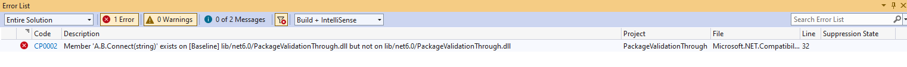

### Validation against baseline package version

Package Validation can also help you validate your library project against a previous released stable version of your package. In order to use this feature, you will need to add the ```PackageValidationBaselineVersion``` or ```PackageValidationBaselinePath``` to your project.

Package validation will detect any breaking changes on any of the shipped target frameworks and will also detect if any target framework support has been dropped.

For example consider the following scenario: you are working on the AdventureWorks.Client NuGet package. You want to make sure that you don't accidentally make breaking changes so you configure your project to instruct package validation tooling to run API compatibility against the previous version of the package.

```xml
<Project Sdk="Microsoft.NET.Sdk">

  <PropertyGroup>
    <TargetFramework>net6.0</TargetFramework>
    <PackageVersion>2.0.0</PackageVersion>
    <EnablePackageValidation>true</EnablePackageValidation>
    <PackageValidationBaselineVersion>1.0.0</PackageValidationBaselineVersion>
  </PropertyGroup>

</Project>
```

A few weeks later, you are tasked with adding support for a connection timeout to your library. The Connect method currently looks like this:

```C#
public static HttpClient Connect(string url)
{
    // ...
}
```

Since a connection timeout is an advanced configuration setting, you reckon that you can just add an optional parameter:

```c#
public static HttpClient Connect(string url, TimeSpan timeout = default)
{
    // ...
}
```

However, when you try to pack, it throws an error.



You realize that while this is not a [source breaking change](https://docs.microsoft.com/dotnet/standard/library-guidance/breaking-changes#source-breaking-change), it's a binary [breaking change](https://docs.microsoft.com/dotnet/standard/library-guidance/breaking-changes#binary-breaking-change). You solve this problem by adding an overload instead:

```c#
public static HttpClient Connect(string url)
{
    return Connect(url, Timeout.InfiniteTimeSpan);
}

public static HttpClient Connect(string url, TimeSpan timeout)
{
    // ...
}
```

You try to pack the project again.


