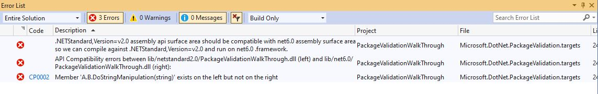
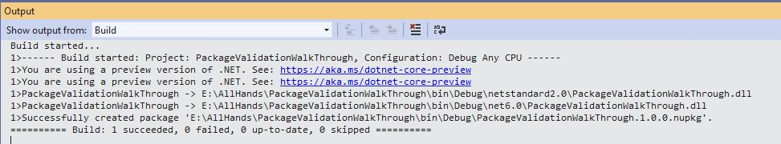

# Validate compatible frameworks

Packages containing compatible frameworks need to ensure that code compiled against one can run against another. Examples of compatible framework pairs are:

* .NET Standard 2.0 and .NET 6.0
* .NET 5.0 and .NET 6.0

In both of these cases, the consumers can build against .NET Standard 2.0 or NET 5.0 and run on .NET 6.0. In case your binaries are not compatible between these frameworks, consumers could end up with compile and/or runtime errors.

Package Validation will catch these errors at pack time. Here is an example scenario:

Suppose you're writing a game which does a lot of string manipulation. You need to support both .NET Framework and .NET Core consumers. You started with just targeting .NET Standard 2.0 but now you realize you want to take advantage of `Span<T>` in .NET 6.0 to avoid unnecessary string allocations. In order to do that, you now want to multi-target for .NET Standard 2.0 and .NET 6.0.

You have written the following code:

```csharp
#if NET6_0_OR_GREATER
    public void DoStringManipulation(ReadOnlySpan<char> input)
    {
        // use spans to do string operations.
    }
#else
    public void DoStringManipulation(string input)
    {
        // Do some string operations.
    }
#endif
```

You then try to pack the project (using dotnet pack cmd or using VS) it fails with the following error:



You understand that you shouldn't exclude ```DoStringManipulation(string)``` but instead just provide an additional ```DoStringManipulation(ReadOnlySpan<char>)``` method for .NET 6.0 and change the code accordingly:

```c#
#if NET6_0_OR_GREATER
    public void DoStringManipulation(ReadOnlySpan<char> input)
    {
        // use spans to do string operations.
    }
#endif
    public void DoStringManipulation(string input)
    {
        // Do some string operations.
    }
```

You try to pack the project again.



You can enable the strict mode for this validator by setting `EnableStrictModeForCompatibleFrameworksInPackage` property in your project file. Enabling strict mode will change some rules and some other rules will be executed when getting the differences. This is useful when you want both sides we are comparing to be strictly the same on their surface area and identity.
