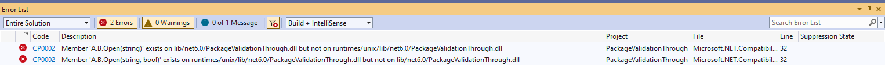
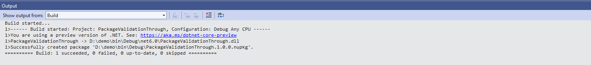

## Validation against different runtimes

You may choose to have different implementation assemblies for different runtimes in your nuget package. In that case, you will need to make sure that these assemblies are compatible with the compile-time assemblies and among themselves.

For example, consider the following scenario: you are working on a library involving some interop calls to unix and windows API respectively. You have written the following code:

```c#
#if Unix
    public static void Open(string path, bool securityDescriptor)
    {
        // call unix specific stuff
    }
#else
    public static void Open(string path)
    {
        // call windows specific stuff
    }
#endif
```

The resulting package structure looks like

```xml
lib/net6.0/A.dll 
runtimes/unix/lib/net6.0/A.dll
```

`lib\net6.0\A.dll` will always be used at compile time regardless of the underlying operating system. `lib\net6.0\A.dll` will also be used at runtime for non-Unix systems, but `runtimes\unix\lib\net6.0\A.dll` will be used at runtime for Unix systems.

When you try to pack this project, you get an error:



you quickly realize your mistake and add `A.B.Open(string)` to the unix runtime as well.

```c#
#if Unix
    public static void Open(string path, bool securityDescriptor)
    {
        // call unix specific stuff
    }
    
    public static void Open(string path)
    {
        throw new PlatformNotSupportedException();
    }
#else
    public static void Open(string path)
    {
        // call windows specific stuff
    }
#endif
```

You try to pack the project again.




You can enable the strict mode for this validator by setting `EnableStrictModeForCompatibleTfms` property in your project file. Enabling strict mode will change some rules and some other rules will be executed when getting the differences. This is useful when you want both sides we are comparing to be strictly the same on their surface area and identity.
