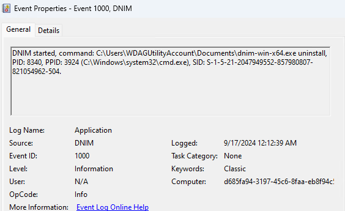

# Logging

DNIM provides a rich set of logs to assit with diagnosing and troubleshooting issues.

## Console

DNIM always generates output to the console. The default verbosity is `normal`. It is recommended to set the verbosity level to `quiet` when deploying DNIM using Configuration Manager to avoid disrupting users.

## Diagnostic file log

DNIM always generates a diagnostic log in the current user's `%TEMP%` directory. The default filename consists of the `dnim` prefix followed by the date and time, for example, `dnim_20260811_203922.log` indicates the log was generated on August 11, 2026 at 8:39:22 pm.

The contents of the log varies based on the command and the state of the machine. The start of the log will include information like the version and the command that was executed.

Each line consists of a timestamp, message type and event ID followed by a detailed message.

```console
[2026-08-11 20:39:23.495]d1000: DNIM started, command: c:\Users\user1\Downloads\dnim-win-x64.exe scan, PID: 18800, PPID: 34220 (C:\WINDOWS\System32\cmd.exe), SID: S-1-5-21-2127521184-1604012920-1887927527-5663403.
```

In the preceeding example, `d1000` indicates that a diagnostic message with event ID 1000 was logged. Messages can also be prefixed with `i` (informational) or `e` (error). Only messages with non-zero event ID are sent to the Windows Event log.

## Registry

DNIM tracks information pertaining to it's last execution in the registry. The data is stored under `HKCU\Software\Microsoft\DNIM` or `HKLM\Software\Microsoft\DNIM` (if the command was run with elevated permissions).

```console
D:\>reg query HKCU\Software\Microsoft\DNIM /s

HKEY_CURRENT_USER\Software\Microsoft\DNIM
    LastRunCommandLine    REG_SZ    c:\Users\user1\Downloads\dnim-win-x64.exe --help
    LastRun               REG_SZ    08/12/2026 03:40
    LastRunDate           REG_SZ    08/12/2026
    LastRunTime           REG_SZ    3:40:04.1996353

HKEY_CURRENT_USER\Software\Microsoft\DNIM\License
    Accepted    REG_DWORD    0x1
    Type        REG_SZ       prerelease
```

## Events

Commands that modify a machine's state by removing or updating .NET will log events to the Windows Application log using `DNIM` as the event source.



### Event IDs

| Event ID | Remarks |
| --- | --- |
| 1000 | The application started and recorded its command and process details. |
| 1001 | An application configuration or environment problem was encountered. |
| 1002 | An installer signature was verified or signature verification failed. |
| 1003 | A general application error or exception occurred. |
| 1100 | An installation was evaluated against the configured policies. |
| 1101 | One or more installations require remediation. |
| 1200 | An uninstall operation started. |
| 1210 | An uninstall operation completed and reported its exit code. |
| 1299 | An uninstall operation threw an exception and failed. |
| 1300 | A system restore point was created. |
| 1301 | The System Restore service was not initialized. |
| 1310 | A system restore point was ended successfully. |
| 1399 | A System Restore initialization, creation, or completion operation failed. |
| 1400 | The Windows Update Agent service was started. |
| 1410 | The Windows Update Agent service was stopped or an attempt to stop it failed. |
| 1499 | The Windows Update Agent service failed to start. |
| 1500 | An update operation started. |
| 1510 | An update operation completed and reported its exit code. |
| 1550 | An update operation was skipped. This event ID is not currently used. |
| 1599 | An update could not be acquired or the update operation threw an exception. |
