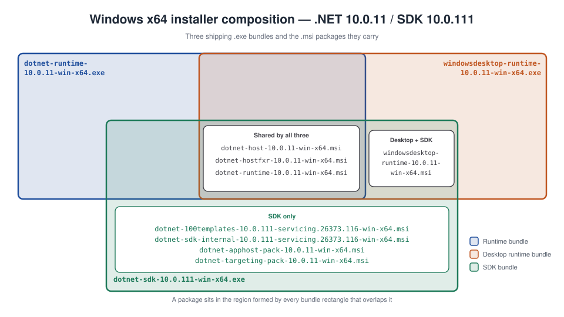

# Managed .NET installations on Windows

Partially removed .NET installations are a common reason why vulnerability scanning software like Microsoft Defender Vulnerability Management will report a device. Understanding how .NET installations work can assist administrators with investigating reports and taking remedial actions.

On Windows, .NET components like the runtime and SDK consist of multiple MSIs. Individual MSIs are not directly distributed. Instead, they are chained together to create bundles.

## Acquiring .NET on Windows

- Standalone bundles (EXEs) can be downloaded from [the .NET website](https://dotnet.microsoft.com/download).
- WinGet provides packages that contain the .NET bundles.
- Servicing updates distribute the bundles through Microsoft Update using automatic updates, WSUS and the Windows Update Catalog.
- Independent software vendors (ISVs) may redistribute .NET bundles as part of their software.
- OEMs sometimes include preinstalled copies of .NET bundles in the factory images of new devices.
- Some Azure marketplace images of Windows include preinstalled copies of the bundles.
- Third party package managers like Chocolatey also distribute the .NET bundles.
- Enterprises sometimes repackage the bundles using proprietary packages for internal distribution.
- Some .NET application hosts may also direct users to download and install missing runtime bundles.

Visual Studio can also be used to acquire .NET and uses the same MSIs as the standalone bundles.

> [!NOTE]
> The .NET SDK bundle shipped with Visual Studio until 16.2. Starting with .NET Core 3.0 in Visual Studio 16.3, the SDK bundles were replaced with the individual .NET MSIs.

## Upgrades

.NET supports upgrades between patch versions within a major/minor release. .NET 8.0.7 will upgrade previous releases like 8.0.4 or 8.0.0, including prerelease versions, but won't upgrade a previous major release like .NET 7.0. The .NET SDK supports upgrades between patches within a feature band. The 8.0.100 SDK can be upgraded to 8.0.103, but the 8.0.3xx SDK will not upgrade the 1xx or 2xx feature bands.

The majority of upgrades are handled at the bundle level. The previous version is only removed once the new version is installed. There are two exceptions: the .NET host and ASP.NET Core Module MSIs are updated in place.

Starting with .NET 8, users have the option to [defer](/dotnet/core/install/windows#choose-when-previous-versions-are-removed) removing the previous version of a bundle.

## Bundle composition and reference counting

Bundles are composed from multiple MSIs, some of which are shared between multiple bundles.



- The runtime bundle contains three MSIs that also ship in the desktop runtime and SDK bundles.
- The desktop bundle includes an additional MSI that is shared with the SDK bundle.
- The SDK includes additional MSIs that contain the CLI, templates and targeting packs used to create and build .NET applications.

Shared MSIs are managed using reference counting. Every .NET MSI creates a registry key called a provider key that allows a bundle to register itself as a dependent. If an MSI is already installed, the bundle only updates the registration information. Bundles are unregistered when they're removed. The shared MSIs are only removed once there are no registered dependents.

The registry information below is an example of the .NET host MSI provider key. There are four registered dependents, including Visual Studio.

```console
HKEY_LOCAL_MACHINE\SOFTWARE\Classes\Installer\Dependencies\Dotnet_CLI_SharedHost_10.0_x64
    (Default)   REG_SZ    {8A8CC49F-7D1E-45DC-B7B5-35FF61A2C25E}
    Version     REG_SZ    80.40.55332
    DisplayName REG_SZ    Microsoft .NET Host - 10.0.10 (x64)

HKEY_LOCAL_MACHINE\SOFTWARE\Classes\Installer\Dependencies\Dotnet_CLI_SharedHost_10.0_x64\Dependents\VS.{AEF703B8-D2CC-4343-915C-F54A30B90937}

HKEY_LOCAL_MACHINE\SOFTWARE\Classes\Installer\Dependencies\Dotnet_CLI_SharedHost_10.0_x64\Dependents\{609A456D-467D-4077-9BA2-B6404F1B1163}

HKEY_LOCAL_MACHINE\SOFTWARE\Classes\Installer\Dependencies\Dotnet_CLI_SharedHost_10.0_x64\Dependents\{866BECDA-F284-473A-9E84-0CCE816BF06F}

HKEY_LOCAL_MACHINE\SOFTWARE\Classes\Installer\Dependencies\Dotnet_CLI_SharedHost_10.0_x64\Dependents\{FD5EA214-C690-466F-B8FB-1741881913F9}
```

> [!NOTE]
> Individual MSIs become orphaned when dependents remain registered after a bundle is removed, for example, when the uninstall is interrupted.

> [!NOTE]
> Visual Studio uses a well-known value, `VS.{AEF703B8-D2CC-4343-915C-F54A30B90937}`, to register itself as a dependent. The actual reference count is determined by checking the installation manifest for each Visual Studio instance.

## Bin deployed installations

Bin deployed installations refer to copies of .NET that aren't associated with an MSI. This can be achieved by running the install scripts as an administrator and setting the installation directory to `Program Files\dotnet'. This can complicate remediation. Scanners will report vulnerabilities, but administrators won't find MSIs to uninstall. DNIM is able to detect bin deployed installs.

## Detection

DNIM relies on a number of heuristics to identify bundles and MSIs associated with .NET. Accurately detecting installations is critical to successfully remediate a non-complaint devices.

### Bundles

Bundles are identified using their display names and file information stored in the registry. Additional checks are performed on  executables to ensure they are valid installers. This informatio is also compared against the JSON data .NET publishes for each release.

### MSI Detection

DNIM performs an exhaustive search against the installer component data stored in the registery under `HKLM\SOFTWARE\Microsoft\Windows\CurrentVersion\Installer\UserData\S-1-5-18\Components` to identify .NET MSIs.

The installer service tracks each component registry ey contains the component ID while its values contain MSI product codes. Both the component ID and product code is stored as packed GUIDs. The example below is of the component associated with `dotnet.exe`.

```console
HKEY_LOCAL_MACHINE\SOFTWARE\Microsoft\Windows\CurrentVersion\Installer\UserData\S-1-5-18\Components\BBB993545ADD68342A9E16F83B5CA481
    40A3E8A8CB38EDC4299598B366C6A11B    REG_SZ    C:\Program Files\dotnet\dotnet.exe
    A75437C333A10ED46B2CF6AB78E7F1FC    REG_SZ    C:\Program Files (x86)\dotnet\dotnet.exe
    79D2396D1F638B04C9CDAC38562B0100    REG_SZ    C:\Program Files\dotnet\dotnet.exe
    EA6D9CBF69367CF4CB81005882631FD6    REG_SZ    C:\Program Files (x86)\dotnet\dotnet.exe
    872D9C61B8AA60F47A4CDF137C8523A3    REG_SZ    C:\Program Files (x86)\dotnet\dotnet.exe
    6235DF10DB18AED4F910D396BBDD7AE5    REG_SZ    C:\Program Files\dotnet\dotnet.exe
    0370151E43A53FE48B564853D1B81FAB    REG_SZ    C:\Program Files\dotnet\dotnet.exe
    F6D22817F79056B46B45655C7495EE9A    REG_SZ    C:\Program Files (x86)\dotnet\dotnet.exe
    D512842CB6C6A404BAE605D564042E50    REG_SZ    C:\Program Files\dotnet\dotnet.exe
```

### Bin deployed installs

Because DNIM performs an exhaustive search of installer components, any files under `Program Files\dotnet` not associated with an MSI are classified as bin deployed installations.

## Classification

Incorrect classification of installations can result in removing or retaining the wrong installation, potentially breaking applications or leaving devices in a non-compliant state.

Once a product (e.g., NET 10) is identified, additional information like its release (e.g., 10.0.4) and support phase (e.g., active) can be determined. This allows administrators to create flexible deploymentss.

Installations are further classified according to their .NET component (ASP.NET Core, SDK, etc.), architecure and type of installation (bundle, MSI, or bin deployed).

There are some special cases worth mentioning.

### .NET Standard 2.1

Ensuring consistent behavior requires installations to define their product, release and support phase. The targeting pack for .NET Standard 2.1 presents an interesting challenge. It doesn't contain executable code and only provides reference assemblies for the APIs defined by the standard. The targeting pack first shipped as part of the .NET Core 3.0.100 SDK, but was included in every subsequent SDKs until .NET 10. While DNIM will classify the release and product under .NET Core 3.0, the support phase is always reported as active since it may be included in SDKs that are in active support.

> [!NOTE]
> The .NET Standard 2.1 targeting pack was removed from the SDK installation in .NET 10. SDKs automatically download missing targeting packs using NuGet packages when building applications.

### .NET SDK Feature bands

In .NET Core 1.0 and 1.1, SDKs used a versioning scheme similar to the runime. The last SDK in .NET Core 1.1 was versioned as 1.1.14 and included the 1.1.13 runtime.

SDK features bands were introduced in the 2.1.100 SDK to differentiate between supported features in Visual Studio. The SDK shipped as part of the .NET Core 2.0.5 release. The last 2.0 SDK was versioned as 2.1.202 and included in the 2.0.9 release. The first SDK to ship in .NET Core 2.1 was versioned as 2.1.300. In later releases, SDK feature bands always start at 100, e.g., 2.2.100, 3.0.100, etc.
