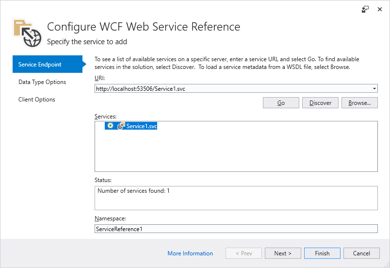

--- 
title: Microsoft WCF Web Service Reference Provider Tool
description: An overview of the Microsoft WCF Web Service Reference Provider Tool that adds functionality for .NET Core and ASP.NET Core projects, similar to Add Service Reference for .NET Framework projects.
author: mlacouture
manager: wpickett
ms.author: johalex
ms.date: 12/20/2017
ms.topic: article
ms.prod: .net-core
ms.custom: mvc
---
# Microsoft WCF Web Service Reference Provider Tool

Over the years, many Visual Studio developers have enjoyed the productivity that the [Add Service Reference](https://docs.microsoft.com/en-us/visualstudio/data-tools/how-to-add-update-or-remove-a-wcf-data-service-reference) tool provided when their .NET Framework projects needed to access Windows Communication Foundation (WCF) services. The **WCF Web Service Reference** tool is a Visual Studio connected service extension that provides an experience like the Add Service Reference functionality for .NET Core and ASP.NET Core projects. This tool retrieves metadata from a WCF service in the current solution, from a WSDL file or on a network location, and generates a .NET Core compatible source file containing WCF client proxy code that you can use to access the web service.

> [!IMPORTANT]
> You should only reference services from a trusted source. Adding references from an untrusted source may compromise security. 

## How to use the extension

> [!NOTE]
> The **WCF Web Service Reference** option is applicable to projects created using the following project templates:
> * **Visual C#** > **.NET Core**  
> * **Visual C#** > **.NET Standard**
> * **Visual C#** > **Web** > **ASP.NET Core Web Application**

Using the **ASP.NET Core Web Application** project template as an example, this article walks you through adding a WCF service reference to the project:

1. In Solution Explorer, double-click the **Connected Services** node of the project (for a .NET Core or .NET Standard project this option is available from the context menu of the **Dependencies** node). 

The **Connected Services** page appears as shown in the following image:

2. On the **Connected Services** page, click **Microsoft WCF Web Service Reference Provider**. This will bring up the **Configure WCF Web Service Reference** wizard:

3. Select a service.

3a. There are several services search options available within the **Configure WCF Web Service Reference** wizard:

 * To search for services defined in the current solution, click the **Discover** button. 
 * To search for services hosted at a specified address, enter a service URL in the **Address** box and click the **Go** button.
 * To select a WSDL file containing the web service metadata information, click the **Browse** button. 
 
3b. Select the service from the search results list in the **Services** box. If needed, enter the namespace for the generated code in the corresponding **Namespace** text box.

3c. Click the **Next** button to visit the **Data Type Options** and the **Client Options** pages. Alternatively, click the **Finish** button to use the default options.

4. The **Data Type Options** form enables you to refine the generated service reference configuration settings. 

> [!NOTE]
> The **Reuse types in referenced assemblies** check box option is useful when data types needed for service reference code generation are defined in one of your project's referenced assemblies.  It's important to reuse those existing data types to avoid compile-time type clash or runtime issues.

There may be a delay while type information is loaded, depending on the number of project dependencies and other system performance factors. The **Finish** button is disabled during loading unless the **Reuse types in referenced assemblies** check box is unchecked.

5. Click **Finish** when you are done. 

While displaying progress, the tool will:

* Download metadata from the WCF service 
* Generate the service reference code in a file named *reference.cs*, and add it to your project under the **Connected Services** node. * Update the project file (.csproj) with NuGet package references required to compile and run on the target platform.

When these processes complete, you can create generated WCF web service communication client type instances.

## Next Steps

### Feedback & Questions
If you have any questions or feedback, please [open an issue on GitHub](https://github.com/dotnet/wcf/issues/new). You can also review any existing questions or issues [at the WCF repo on GitHub](https://github.com/dotnet/wcf/issues?utf8=%E2%9C%93&q=is:issue%20label:tooling).

### Release Notes
* Refer to the [Release notes](https://github.com/dotnet/wcf/blob/master/release-notes/WCF-Web-Service-Reference-notes.md) for updated release information, including known issues. 
