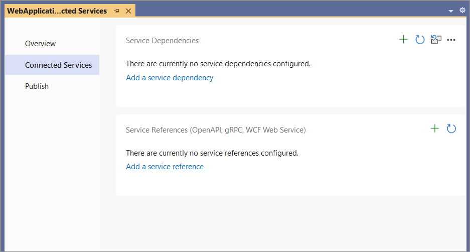
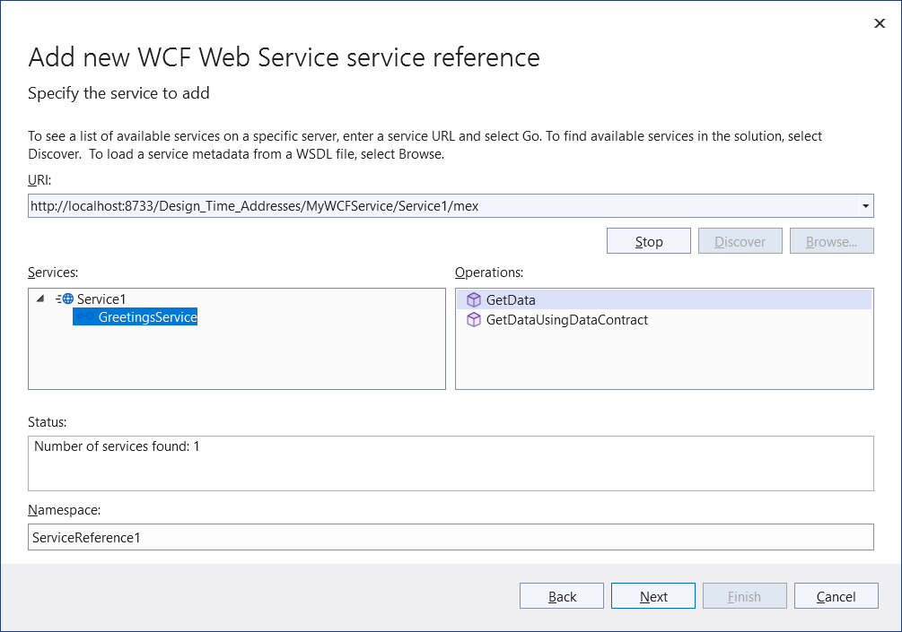
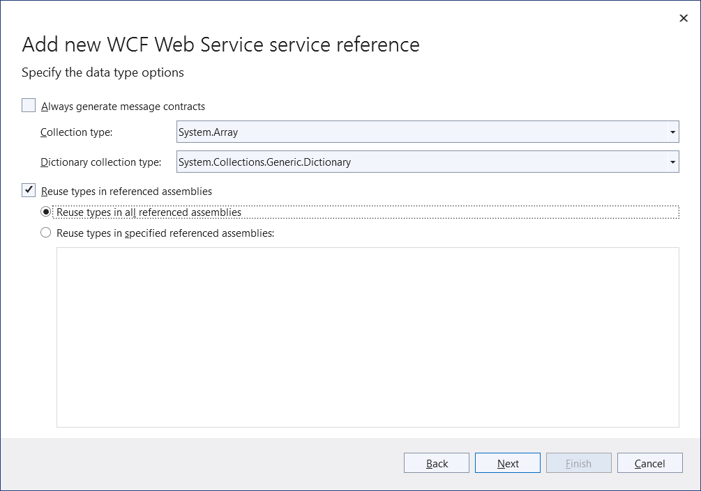
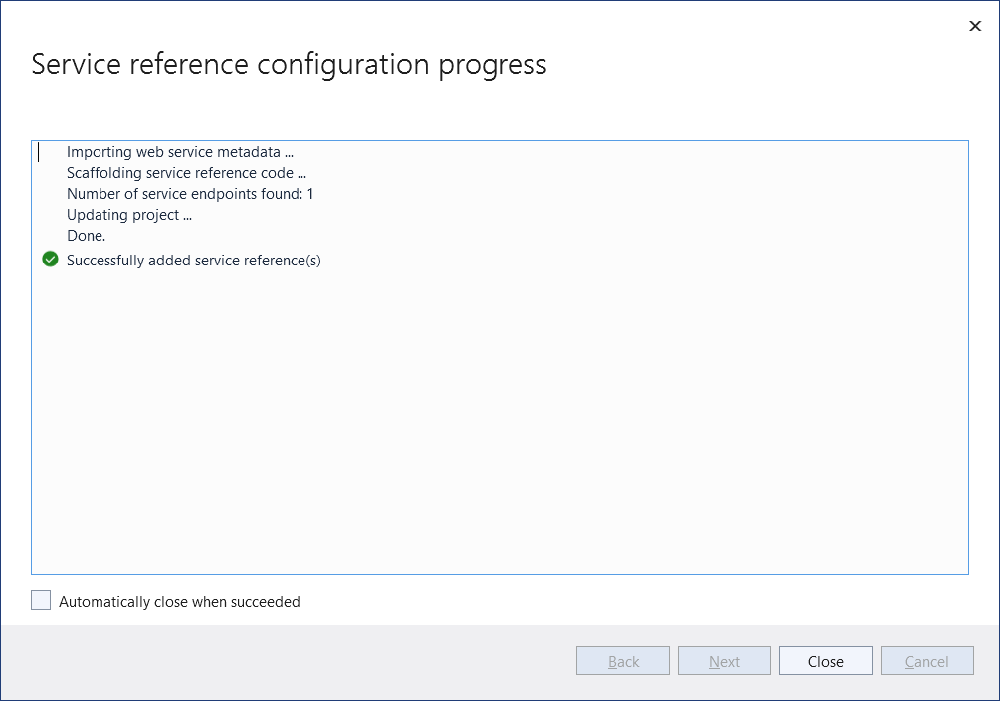

# Use the WCF Web Service Reference Provider Tool

Over the years, many Visual Studio developers have enjoyed the productivity that the [**Add Service Reference**](/visualstudio/data-tools/how-to-add-update-or-remove-a-wcf-data-service-reference) tool provided when their .NET Framework projects needed to access web services.

The **WCF Web Service Reference** tool is a Visual Studio connected service extension that lets you connect your .NET 5+, .NET Core, or ASP.NET Core project to a web service. It provides an experience similar to the [**Add Service Reference**](/visualstudio/data-tools/how-to-add-update-or-remove-a-wcf-data-service-reference) functionality, which is for .NET Framework projects only. The **WCF Web Service Reference** tool retrieves metadata from a web service in the current solution, on a network location, or from a WSDL file, and generates a source file containing Windows Communication Foundation (WCF) client proxy code that your .NET app can use to access the web service.

> [!IMPORTANT]
> You should only reference services from a trusted source. Adding references from an untrusted source may compromise security.

## Prerequisites

- [Visual Studio 2017 version 15.5](https://aka.ms/vsdownload?utm_source=mscom&utm_campaign=msdocs) or a later version

The screenshots in this article are from Visual Studio 2022.

## How to use the extension

> [!NOTE]
> The **WCF Web Service Reference** tool is applicable only to C# .NET Core and .NET Standard projects, including ASP.NET Core Web apps.

Using the **ASP.NET Core Web Application** project template as an example, this article walks you through adding a WCF service reference to the project.

1. In Solution Explorer, double-click the **Connected Services** node of the project. (For a .NET Core or .NET Standard project, this option is available when you right-click on the **Dependencies** node of the project in Solution Explorer and choose **Manage Connected Services**.)

   The **Connected Services** page appears as shown in the following image:

   

1. On the **Connected Services** page, select **Add Service Reference**.

   The **Add service reference** page opens.

1. Select **WCF Web Service**, and then choose **Next**.

   This brings up the **Add new WCF Web Service service reference** wizard.

   

1. Select a service.

   a. There are several services search options available:

      - To search for services defined in the current solution, click the **Discover** button.
      - To search for services hosted at a specified address, enter a service URL in the **Address** box and click the **Go** button.
      - To select a WSDL file that contains the web service metadata information, click the **Browse** button.

   b. Select the service from the search results list in the **Services** box. If needed, enter the namespace for the generated code in the corresponding **Namespace** text box.

   c. Click the **Next** button to specify data type options or client options. Alternatively, click the **Finish** button to use the default options.

1. The **data type options** page lets refine the generated service reference configuration settings:

    

    > [!NOTE]
    > The **Reuse types in referenced assemblies** check box option is useful when data types needed for service reference code generation are defined in one of your project's referenced assemblies.  It's important to reuse those existing data types to avoid compile-time type clash or runtime issues.

    There may be a delay while type information is loaded, depending on the number of project dependencies and other system performance factors. The **Finish** button is disabled during loading unless the **Reuse types in referenced assemblies** check box is unchecked.

1. Click **Finish** when you are done.

While displaying progress, the tool:

- Downloads metadata from the WCF service.
- Generates the service reference code in a file named *reference.cs*, and adds it to your project under the **Connected Services** node.
- Updates the project file (.csproj) with NuGet package references required to compile and run on the target platform.

When these processes complete, you can create an instance of the generated WCF client type and invoke the service operations.

## See also

- [Get started with Windows Communication Foundation applications](../../framework/wcf/getting-started-tutorial.md)
- [Windows Communication Foundation services and WCF data services in Visual Studio](/visualstudio/data-tools/windows-communication-foundation-services-and-wcf-data-services-in-visual-studio)
- [WCF supported features on .NET Core](https://github.com/dotnet/wcf/blob/main/release-notes/SupportedFeatures-v2.1.0.md)

## Feedback & questions

If you have any product feedback, report it at [Developer Community](https://aka.ms/feedback/report?space=61) using the [Report a problem](/visualstudio/ide/how-to-report-a-problem-with-visual-studio) tool.

## Release notes

- Refer to the [Release notes](https://github.com/dotnet/wcf/blob/main/release-notes/WCF-Web-Service-Reference-notes.md) for updated release information, including known issues.
