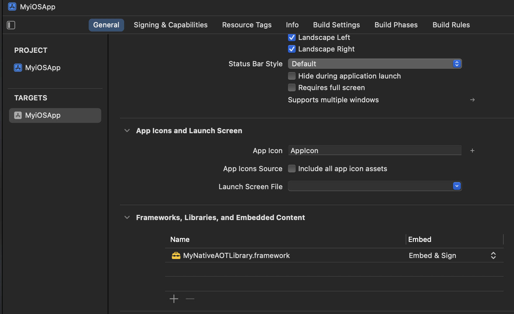
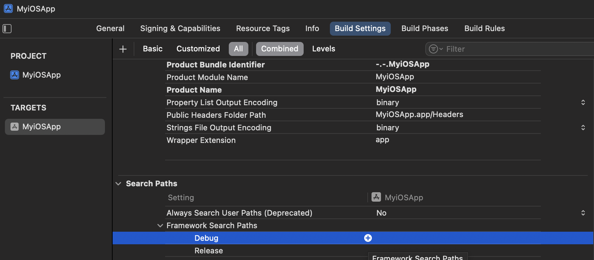

# Create and consume custom frameworks for iOS-like platforms

Starting from .NET 9, Native AOT supports publishing .NET class libraries that don't depend on iOS workloads for iOS-like platforms.
This support enables you to create self-contained native libraries that can be consumed from iOS, Mac Catalyst, and tvOS applications.

> [!IMPORTANT]
> This approach does not come with the built-in Objective-C interoperability support and additional code adaptations might be required (such as marshalling reference type arguments) to achieve interoperability.

## Build shared libraries

This section describes steps to create a simple .NET Class Library project with NativeAOT support and produce a native library for iOS-like platforms from it.

1. Download .NET 9 SDK
2. Create a class library project

    ```bash
    dotnet new classlib -n "MyNativeAOTLibrary"
    ```

3. Add the following properties into the project file `MyNativeAOTLibrary.csproj`

    ```xml
    <PublishAot>true</PublishAot>
    <PublishAotUsingRuntimePack>true</PublishAotUsingRuntimePack>
    ```

4. Edit the `MyNativeAOTLibrary/Class1.cs` source code to expose a managed method so that it can be referenced from the native code as `aotsample_add`. For example:

    ```cs
    using System.Runtime.InteropServices;
    namespace NaotLib;

    public class Class1
    {
        [UnmanagedCallersOnly(EntryPoint = "aotsample_add")]
        public static int Add(int a, int b)
        {
            return a + b;
        }
    }
    ```

5. Publish the class library and target the desired iOS-like platform by specifying the appropriate runtime identifier (referenced below as `<rid>`):

    ```bash
    dotnet publish -r <rid> MyNativeAOTLibrary/MyNativeAOTLibrary.csproj
    ```

Successful completion of the previous step produces a pair of files: a shared library `MyNativeAOTLibrary.dylib` and its debug symbols `MyNativeAOTLibrary.dylib.dSYM`, which are located at: `MyNativeAOTLibrary/bin/Release/net9.0/<rid>/publish/`.

> [!NOTE]
> For creating universal frameworks, it is required to publish the class library for both `Arm64` and `x64` architectures for a given platform.
> This means that you need to repeat step 5 with a different runtime identifier.
> For example, you'd publish the class library with both `maccatalyst-arm64` and `maccatalyst-x64` runtime identifiers as a prerequisite for [Packaging the shared library into a custom MacCatalyst universal framework](#package-the-shared-library-into-a-custom-maccatalyst-universal-framework).

## Create and consume a custom framework

Apple imposes a requirement that shared libraries (.dylibs) need to be packaged into frameworks in order to be consumed from applications.

This section describes all required steps to achieve this and a simple scenario of a iOS/MacCatalyst application consuming a shared NativeAOT library/framework.

> [!NOTE]
> The described steps are just for demonstration purposes. The actual requirements might differ depending on the exact use case.

### Package the shared library into custom iOS framework

1. Create a framework folder:

    ```bash
    mkdir MyNativeAOTLibrary.framework
    ```

2. Adjust load commands:

    - `LC_RPATH` load command

        ```bash
        install_name_tool -rpath @executable_path @executable_path/Frameworks MyNativeAOTLibrary/bin/Release/net9.0/ios-arm64/publish/MyNativeAOTLibrary.dylib
        ```

    - `LC_ID_DYLIB` load command

        ```bash
        install_name_tool -id @rpath/MyNativeAOTLibrary.framework/MyNativeAOTLibrary MyNativeAOTLibrary/bin/Release/net9.0/ios-arm64/publish/MyNativeAOTLibrary.dylib
        ```

3. Manually package the binary into a universal file:

    ```bash
    lipo -create MyNativeAOTLibrary/bin/Release/net9.0/ios-arm64/publish/MyNativeAOTLibrary.dylib -output MyNativeAOTLibrary.framework/MyNativeAOTLibrary
    ```

4. Add a property list file to your framework:

    - Create a `Info.plist` file

    ```bash
    touch MyNativeAOTLibrary.framework/Info.plist
    ```

    - Add the contents from the [appendix](#appendix-infoplist-contents) into the created `Info.plist` file

After the final step, the framework structure should look like this:

```
MyNativeAOTLibrary.framework
    |_ MyNativeAOTLibrary
    |_ Info.plist
```

### Package the shared library into a custom MacCatalyst universal framework

Universal frameworks require binaries for both `Arm64` and `x64` architecture.
For this reason, you must publish native libraries targeting both of the following RIDs beforehand: `maccatalyst-arm64` and `maccatalyst-x64`.

1. Create a framework folder structure:

    ```bash
    mkdir -p MyNativeAOTLibrary.framework/Versions/A/Resources
    ln -sfh Versions/Current/MyNativeAOTLibrary MyNativeAOTLibrary.framework/MyNativeAOTLibrary
    ln -sfh Versions/Current/Resources MyNativeAOTLibrary.framework/Resources
    ln -sfh A MyNativeAOTLibrary.framework/Versions/Current
    ```

2. Adjust load commands:

    - `LC_RPATH` load command

        ```bash
        install_name_tool -rpath @executable_path @executable_path/../Frameworks MyNativeAOTLibrary/bin/Release/net9.0/maccatalyst-arm64/publish/MyNativeAOTLibrary.dylib
        install_name_tool -rpath @executable_path @executable_path/../Frameworks MyNativeAOTLibrary/bin/Release/net9.0/maccatalyst-x64/publish/MyNativeAOTLibrary.dylib
        ```

    - `LC_ID_DYLIB` load command

        ```bash
        install_name_tool -id @rpath/MyNativeAOTLibrary.framework/Versions/A/MyNativeAOTLibrary MyNativeAOTLibrary/bin/Release/net9.0/maccatalyst-arm64/publish/MyNativeAOTLibrary.dylib
        install_name_tool -id @rpath/MyNativeAOTLibrary.framework/Versions/A/MyNativeAOTLibrary MyNativeAOTLibrary/bin/Release/net9.0/maccatalyst-x64/publish/MyNativeAOTLibrary.dylib
        ```

3. Manually package the binary into a universal file:

    ```bash
    lipo -create MyNativeAOTLibrary/bin/Release/net9.0/maccatalyst-arm64/publish/MyNativeAOTLibrary.dylib MyNativeAOTLibrary/bin/Release/net9.0/maccatalyst-x64/publish/MyNativeAOTLibrary.dylib -output MyNativeAOTLibrary.framework/Versions/A/MyNativeAOTLibrary
    ```

4. Add a property list file to your framework:

    - Create a `Info.plist` file

    ```bash
    touch MyNativeAOTLibrary.framework/Versions/A/Resources/Info.plist
    ```

    - Add the contents from the [appendix](#appendix-infoplist-contents) into the created `Info.plist` file

After the final step, the framework structure should look like this:

```
MyNativeAOTLibrary.framework
    |_ MyNativeAOTLibrary -> Versions/Current/MyNativeAOTLibrary
    |_ Resources -> Versions/Current/Resources
    |_ Versions
        |_ A
        |   |_ Resources
        |   |   |_ Info.plist
        |   |_ MyNativeAOTLibrary
        |_ Current -> A
```

### Consume custom frameworks

1. Open `Xcode` (in this example `Xcode 16.0` is used)
2. Create a new `App` project
3. Choose the name for your app (for example, `MyiOSApp`) and choose Objective-C as the source language
4. Add a reference to the `MyNativeAOTLibrary` framework
    - In the `MyiOSApp` targets **General** tab, under **Frameworks, Libraries and Embedded Content**, select **+** to add `MyNativeAOTLibrary` as the referenced framework
    - In the dialog, choose **Add Other** -> **Add Files** and then browse to the location of `MyNativeAOTLibrary.framework` and select it
    - Once selected, set `Embed and Sign` option for `MyNativeAOTLibrary` framework

    

5. Add `MyNativeAOTLibrary.framework` location to the list of **Framework Search Paths** in the **Build Settings** tab

    

6. Edit `main.m` by calling the exposed managed method `aotsample_add` and printing the result

    ```objc
    extern int aotsample_add(int a, int b);
    int main(int argc, char * argv[]) {
        ...
        NSLog(@"2 + 5 = %d", aotsample_add(2, 5));
        ...
    }
    ```

7. Select your physical iOS device and build/run the app
8. Inspect the logs after the app has successfully launched. The app should print out: `2 + 5 = 7`

> [!NOTE]
> For MacCatalyst, use the same steps except for step 7, where the Run Destination needs to be set as: `Mac (Mac Catalyst)`.

## Build static libraries with NativeAOT for iOS-like platforms

As described in [building native libraries overview](../libraries.md#building-native-libraries), it's better to build shared libraries over static ones due to several limitations.

However, if desired, you can build a static library by following the steps for building a shared one and including an additional property in the project file:

```xml
<NativeLib>Static</NativeLib>
```

After the project has been published, the static library `MyNativeAOTLibrary.a` can be found at: `MyNativeAOTLibrary/bin/Release/net9.0/<rid>/publish`.

This article doesn't cover how to consume the static library and configure the consumer project.

## Appendix Info.plist contents

```xml
<?xml version="1.0" encoding="UTF-8"?>
<!DOCTYPE plist PUBLIC "-//Apple//DTD PLIST 1.0//EN" "http://www.apple.com/DTDs/PropertyList-1.0.dtd">
<plist version="1.0">
<dict>
    <key>CFBundleName</key>
    <string>MyNativeAOTLibrary</string>
    <key>CFBundleIdentifier</key>
    <string>com.companyname.MyNativeAOTLibrary</string>
    <key>CFBundleVersion</key>
    <string>1.0</string>
    <key>CFBundleExecutable</key>
    <string>MyNativeAOTLibrary</string>
    <key>CFBundlePackageType</key>
    <string>FMWK</string>
</dict>
</plist>
```
