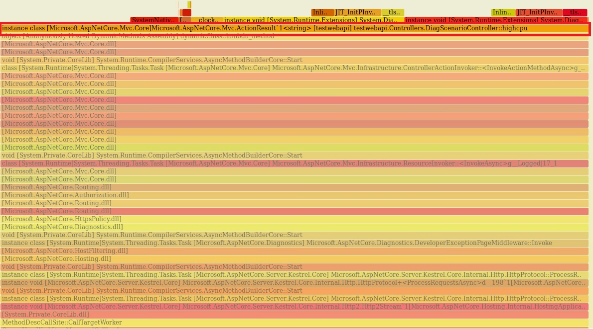
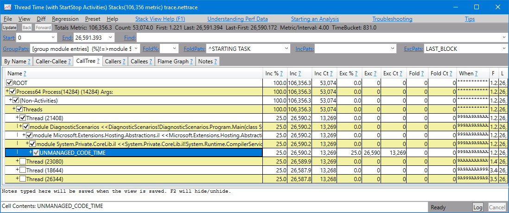

# Debug high CPU usage in .NET Core

**This article applies to: ✔️** .NET Core 3.1 SDK and later versions

In this tutorial, you'll learn how to debug an excessive CPU usage scenario. Using the provided example [ASP.NET Core web app](/samples/dotnet/samples/diagnostic-scenarios) source code repository, you can cause a deadlock intentionally. The endpoint will stop responding and experience thread accumulation. You'll learn how you can use various tools to diagnose this scenario with several key pieces of diagnostics data.

In this tutorial, you will:

> [!div class="checklist"]
>
> - Investigate high CPU usage
> - Determine CPU usage with [dotnet-counters](dotnet-counters.md)
> - Use [dotnet-trace](dotnet-trace.md) for trace generation
> - Profile performance in PerfView
> - Diagnose and solve excessive CPU usage

## Prerequisites

The tutorial uses:

- [.NET Core 3.1 SDK](https://dotnet.microsoft.com/download/dotnet) or a later version.
- [Sample debug target](/samples/dotnet/samples/diagnostic-scenarios) to trigger the scenario.
- [dotnet-trace](dotnet-trace.md) to list processes and generate a profile.
- [dotnet-counters](dotnet-counters.md) to monitor cpu usage.

## CPU counters

Before attempting to collect diagnostics data, you need to observe a high CPU condition. Run the [sample application](/samples/dotnet/samples/diagnostic-scenarios) using the following command from the project root directory.

```dotnetcli
dotnet run
```

To find the process ID, use the following command:

```dotnetcli
dotnet-trace ps
```

Take note of the process ID from your command output. Our process ID was `22884`, but yours will be different. To check the current CPU usage, use the [dotnet-counters](dotnet-counters.md) tool command:

```dotnetcli
dotnet-counters monitor --refresh-interval 1 -p 22884
```

The `refresh-interval` is the number of seconds between the counter polling CPU values. The output should be similar to the following:

```console
Press p to pause, r to resume, q to quit.
    Status: Running

[System.Runtime]
    % Time in GC since last GC (%)                         0
    Allocation Rate / 1 sec (B)                            0
    CPU Usage (%)                                          0
    Exception Count / 1 sec                                0
    GC Heap Size (MB)                                      4
    Gen 0 GC Count / 60 sec                                0
    Gen 0 Size (B)                                         0
    Gen 1 GC Count / 60 sec                                0
    Gen 1 Size (B)                                         0
    Gen 2 GC Count / 60 sec                                0
    Gen 2 Size (B)                                         0
    LOH Size (B)                                           0
    Monitor Lock Contention Count / 1 sec                  0
    Number of Active Timers                                1
    Number of Assemblies Loaded                          140
    ThreadPool Completed Work Item Count / 1 sec           3
    ThreadPool Queue Length                                0
    ThreadPool Thread Count                                7
    Working Set (MB)                                      63
```

With the web app running, immediately after startup, the CPU isn't being consumed at all and is reported at `0%`. Navigate to the `api/diagscenario/highcpu` route with `60000` as the route parameter:

`https://localhost:5001/api/diagscenario/highcpu/60000`

Now, rerun the [dotnet-counters](dotnet-counters.md) command. To monitor just the `cpu-usage`, specify `System.Runtime[cpu-usage]` as part of the command.

```dotnetcli
dotnet-counters monitor --counters System.Runtime[cpu-usage] -p 22884 --refresh-interval 1
```

You should see an increase in CPU usage as shown below:

```console
Press p to pause, r to resume, q to quit.
    Status: Running

[System.Runtime]
    CPU Usage (%)                                         25
```

Throughout the duration of the request, the CPU usage will hover around 25% . Depending on the host machine, expect varying CPU usage.

> [!TIP]
> To visualize an even higher CPU usage, you can exercise this endpoint in multiple browser tabs simultaneously.

At this point, you can safely say the CPU is running higher than you expect.

## Trace generation

When analyzing a slow request, you need a diagnostics tool that can provide insights into what the code is doing. The usual choice is a profiler, and there are different profiler options to choose from.

### [Linux](#tab/linux)

The `perf` tool can be used to generate .NET Core app profiles. Exit the previous instance of the [sample debug target](/samples/dotnet/samples/diagnostic-scenarios).

Set the `DOTNET_PerfMapEnabled` environment variable to cause the .NET Core app to create a `map` file in the `/tmp` directory. This `map` file is used by `perf` to map CPU address to JIT-generated functions by name. For more information, see [Write perf map](../run-time-config/debugging-profiling.md#write-perf-map).

[!INCLUDE [complus-prefix](../../../includes/complus-prefix.md)]

Run the [sample debug target](/samples/dotnet/samples/diagnostic-scenarios) in the same terminal session.

```dotnetcli
export DOTNET_PerfMapEnabled=1
dotnet run
```

Exercise the high CPU API endpoint (`https://localhost:5001/api/diagscenario/highcpu/60000`) again. While it's running within the 1-minute request, run the `perf` command with your process ID:

```bash
sudo perf record -p 2266 -g
```

The `perf` command starts the performance collection process. Let it run for about 20-30 seconds, then press <kbd>Ctrl+C</kbd> to exit the collection process. You can use the same `perf` command to see the output of the trace.

```bash
sudo perf report -f
```

You can also generate a _flame-graph_ by using the following commands:

```bash
git clone --depth=1 https://github.com/BrendanGregg/FlameGraph
sudo perf script | FlameGraph/stackcollapse-perf.pl | FlameGraph/flamegraph.pl > flamegraph.svg
```

This command generates a `flamegraph.svg` that you can view in the browser to investigate the performance problem:

[](media/flamegraph.jpg#lightbox)

### [Windows](#tab/windows)

On Windows, you can use the [dotnet-trace](dotnet-trace.md) tool as a profiler. Using the previous [sample debug target](/samples/dotnet/samples/diagnostic-scenarios), exercise the high CPU endpoint (`https://localhost:5001/api/diagscenario/highcpu/60000`) again. While it's running within the 1-minute request, use the `collect` command as follows:

```dotnetcli
dotnet-trace collect -p 22884 --providers Microsoft-DotNETCore-SampleProfiler
```

Let [dotnet-trace](dotnet-trace.md) run for about 20-30 seconds, and then press the <kbd>Enter</kbd> to exit the collection. The result is a `nettrace` file located in the same folder. The `nettrace` files are a great way to use existing analysis tools on Windows.

Open the `nettrace` with [`PerfView`](https://github.com/microsoft/perfview/blob/main/documentation/Downloading.md) as shown below.

[](media/perfview.jpg#lightbox)

---

## See also

- [dotnet-trace](dotnet-trace.md) to list processes
- [dotnet-counters](dotnet-counters.md) to check managed memory usage
- [dotnet-dump](dotnet-dump.md) to collect and analyze a dump file
- [dotnet/diagnostics](https://github.com/dotnet/diagnostics/tree/main/documentation/tutorial)

## Next steps

> [!div class="nextstepaction"]
> [Debug a deadlock in .NET Core](debug-deadlock.md)
