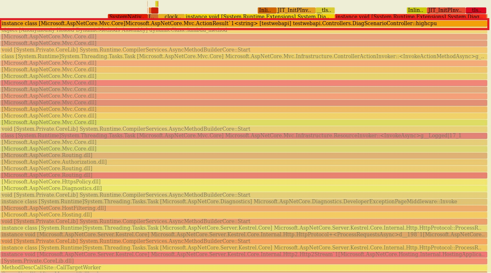
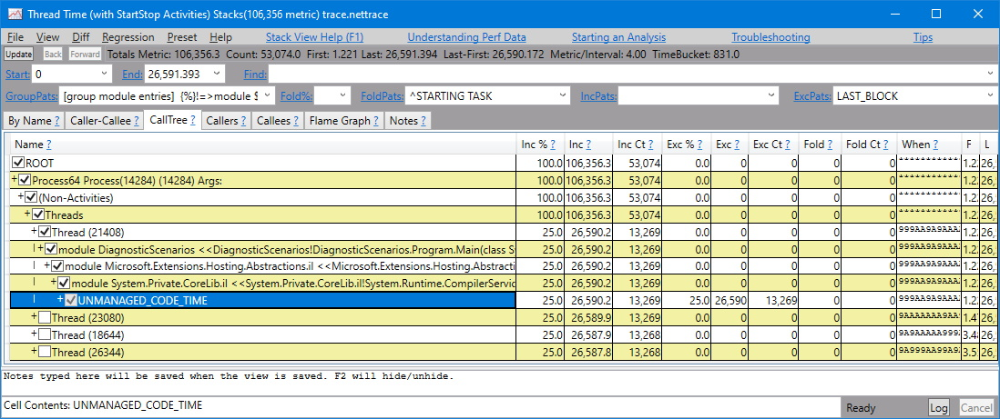

# Debug high CPU usage in .NET

In this tutorial, you'll learn how to debug an excessive CPU usage scenario. Using the provided example [ASP.NET Core web app](/samples/dotnet/samples/diagnostic-scenarios), you can intentionally run CPU-intensive work and use metrics and platform-appropriate profiling tools to identify the expensive code.

In this tutorial, you will:

> [!div class="checklist"]
>
> - Investigate high CPU usage
> - Determine CPU usage with [dotnet-counters](dotnet-counters.md)
> - Use [dotnet-trace](dotnet-trace.md) for trace generation
> - Profile performance in PerfView
> - Diagnose and solve excessive CPU usage

## Prerequisites

The tutorial uses:

- A supported [.NET SDK](https://dotnet.microsoft.com/download/dotnet).
- [Sample debug target](/samples/dotnet/samples/diagnostic-scenarios) to trigger the scenario.
- [dotnet-trace](dotnet-trace.md) to collect CPU profiles and runtime traces.
- [dotnet-counters](dotnet-counters.md) to monitor cpu usage.

## CPU counters

Before attempting this tutorial, please install the latest version of dotnet-counters:

  ```dotnetcli
  dotnet tool install --global dotnet-counters
  ```

If your app is running a version of .NET older than .NET 9, the output UI of dotnet-counters will look slightly different; see [dotnet-counters](dotnet-counters.md) for details.

Before attempting to collect diagnostics data, you need to observe a high CPU condition. Run the [sample application](/samples/dotnet/samples/diagnostic-scenarios) using the following command from the project root directory.

```dotnetcli
dotnet run
```

To check the current CPU usage, use the [dotnet-counters](dotnet-counters.md) tool command:

```dotnetcli
dotnet-counters monitor -n DiagnosticScenarios --showDeltas
```

The output should be similar to the following:

```console
Press p to pause, r to resume, q to quit.
    Status: Running

Name                                                            Current Value      Last Delta
[System.Runtime]
    dotnet.assembly.count ({assembly})                               111               0
    dotnet.gc.collections ({collection})
        gc.heap.generation
        ------------------
        gen0                                                           8               0
        gen1                                                           1               0
        gen2                                                           0               0
    dotnet.gc.heap.total_allocated (By)                        4,042,656          24,512
    dotnet.gc.last_collection.heap.fragmentation.size (By)
        gc.heap.generation
        ------------------
        gen0                                                     801,728               0
        gen1                                                       6,048               0
        gen2                                                           0               0
        loh                                                            0               0
        poh                                                            0               0
    dotnet.gc.last_collection.heap.size (By)
        gc.heap.generation
        ------------------
        gen0                                                     811,512               0
        gen1                                                     562,024               0
        gen2                                                   1,095,056               0
        loh                                                       98,384               0
        poh                                                       24,528               0
    dotnet.gc.last_collection.memory.committed_size (By)       5,623,808               0
    dotnet.gc.pause.time (s)                                           0.019           0
    dotnet.jit.compilation.time (s)                                    0.582           0
    dotnet.jit.compiled_il.size (By)                             138,895               0
    dotnet.jit.compiled_methods ({method})                         1,470               0
    dotnet.monitor.lock_contentions ({contention})                     4               0
    dotnet.process.cpu.count ({cpu})                                  22               0
    dotnet.process.cpu.time (s)
        cpu.mode
        --------
        system                                                         0.109           0
        user                                                           0.453           0
    dotnet.process.memory.working_set (By)                    65,515,520               0
    dotnet.thread_pool.queue.length ({work_item})                      0               0
    dotnet.thread_pool.thread.count ({thread})                         0               0
    dotnet.thread_pool.work_item.count ({work_item})                   6               0
    dotnet.timer.count ({timer})                                       0               0
```

Focusing in on the ```Last Delta``` values of ```dotnet.process.cpu.time```, these tell us how many seconds within the refresh period (currently set to the default of 1 s) the CPU has been active. With the web app running, immediately after startup, the CPU isn't being consumed at all and these deltas are both `0`. Navigate to the `api/diagscenario/highcpu` route with `60000` as the route parameter:

`https://localhost:5001/api/diagscenario/highcpu/60000`

Now, rerun the [dotnet-counters](dotnet-counters.md) command.

```dotnetcli
dotnet-counters monitor -n DiagnosticScenarios --showDeltas
```

You should see an increase in CPU usage as shown below (depending on the host machine, expect varying CPU usage):

```console
Press p to pause, r to resume, q to quit.
    Status: Running

Name                                                            Current Value      Last Delta
[System.Runtime]
    dotnet.assembly.count ({assembly})                               111               0
    dotnet.gc.collections ({collection})
        gc.heap.generation
        ------------------
        gen0                                                           8               0
        gen1                                                           1               0
        gen2                                                           0               0
    dotnet.gc.heap.total_allocated (By)                        4,042,656          24,512
    dotnet.gc.last_collection.heap.fragmentation.size (By)
        gc.heap.generation
        ------------------
        gen0                                                     801,728               0
        gen1                                                       6,048               0
        gen2                                                           0               0
        loh                                                            0               0
        poh                                                            0               0
    dotnet.gc.last_collection.heap.size (By)
        gc.heap.generation
        ------------------
        gen0                                                     811,512               0
        gen1                                                     562,024               0
        gen2                                                   1,095,056               0
        loh                                                       98,384               0
        poh                                                       24,528               0
    dotnet.gc.last_collection.memory.committed_size (By)       5,623,808               0
    dotnet.gc.pause.time (s)                                           0.019           0
    dotnet.jit.compilation.time (s)                                    0.582           0
    dotnet.jit.compiled_il.size (By)                             138,895               0
    dotnet.jit.compiled_methods ({method})                         1,470               0
    dotnet.monitor.lock_contentions ({contention})                     4               0
    dotnet.process.cpu.count ({cpu})                                  22               0
    dotnet.process.cpu.time (s)
        cpu.mode
        --------
        system                                                         0.344           0.013
        user                                                          14.203           0.963
    dotnet.process.memory.working_set (By)                    65,515,520               0
    dotnet.thread_pool.queue.length ({work_item})                      0               0
    dotnet.thread_pool.thread.count ({thread})                         0               0
    dotnet.thread_pool.work_item.count ({work_item})                   6               0
    dotnet.timer.count ({timer})                                       0               0
```

Throughout the duration of the request, the CPU usage will hover around the increased value.

> [!TIP]
> To visualize an even higher CPU usage, you can exercise this endpoint in multiple browser tabs simultaneously.

At this point, you can safely say the CPU is running higher than you expect. Identifying the effects of a problem is key to finding the cause. We will use the effect of high CPU consumption in addition to diagnostic tools to find the cause of the problem.

## Analyze high CPU with a profiler

When analyzing an app with high CPU usage, use a profiler to understand what the code is doing. `dotnet-trace collect` works on all operating systems, but safe-point bias and managed-only call stacks limit it to more general information than kernel-aware profiling through ETW on Windows or `perf_events` on Linux. Depending on your operating system and .NET version, improved profiling capabilities might be available. See the platform-specific tabs that follow for detailed guidance.

### [Linux](#tab/linux)

Prefer `dotnet-trace collect-linux` for the .NET-oriented Linux workflow. Use OneCollect `record-trace` when you need its lower-level scripting, filtering, or output controls, and use `perf` directly only when you need `perf.data`, perf-native analysis, or hardware performance counters.

#### Use `dotnet-trace collect-linux` (.NET 10+)

On .NET 10+, [`dotnet-trace collect-linux`](dotnet-trace.md#dotnet-trace-collect-linux) is the recommended Linux workflow. It retains .NET runtime and application event collection while adding kernel CPU samples, native call stacks, and selected Linux events through `perf_events`, all without requiring a process restart. This requires root permissions and Linux kernel 6.4+ with `CONFIG_USER_EVENTS=y`. See [collect-linux prerequisites](dotnet-trace.md#prerequisites) for full requirements.

Ensure the [sample debug target](/samples/dotnet/samples/diagnostic-scenarios) is configured to target .NET 10 or later, then run it and exercise the high CPU endpoint (`https://localhost:5001/api/diagscenario/highcpu/60000`) again. While it's running within the 1-minute request, run `dotnet-trace collect-linux` to capture a machine-wide trace:

```dotnetcli
sudo dotnet-trace collect-linux
```

Let it run for about 20-30 seconds, then press <kbd>Ctrl+C</kbd> or <kbd>Enter</kbd> to stop the collection. The result is a `.nettrace` file that includes both managed and native callstacks.

Open the `.nettrace` with [`PerfView`](https://github.com/microsoft/perfview/blob/main/documentation/Downloading.md) and use the **CPU Stacks** view to identify the methods consuming the most CPU time.

For information about resolving native runtime symbols in the trace, see [Get symbols for native runtime frames](dotnet-trace.md#get-symbols-for-native-runtime-frames).

#### Use OneCollect `record-trace`

OneCollect's [`record-trace`](https://github.com/microsoft/one-collect/tree/main/record-trace) tool provides lower-level control over event selection, process and CPU filtering, scripts, and output format. See the [OneCollect build instructions](https://github.com/microsoft/one-collect/blob/main/CONTRIBUTING.md#building-the-project) to obtain the tool.

This CPU profiling workflow doesn't require .NET 10 or `user_events`. After making the executable available on `PATH`, exercise the high CPU endpoint again, and while it's running, capture a 30-second machine-wide CPU profile:

```bash
sudo record-trace \
  --on-cpu \
  --duration 30 \
  --out highcpu.nettrace
```

This example uses the default NetTrace output so that you can open `highcpu.nettrace` in PerfView and inspect **CPU Stacks**. `record-trace` can also write PerfView XML with `--format perfview-xml`, display samples while recording with `--live`, and use Rhai scripts for more detailed event configuration.

#### Use `perf`

Use `perf` directly when the investigation requires the Linux perf ecosystem, such as `perf.data`, `perf report`, `perf annotate`, established flame graph scripts, or hardware performance counters. The following steps demonstrate the standard `perf record` and `perf report` workflow. Exit the previous instance of the [sample debug target](/samples/dotnet/samples/diagnostic-scenarios).

Set the `DOTNET_PerfMapEnabled` environment variable to cause the .NET app to create a `map` file in the `/tmp` directory. This `map` file is used by `perf` to map CPU addresses to JIT-generated functions by name. For more information, see [Export perf maps and jit dumps](../runtime-config/debugging-profiling.md#export-perf-maps-and-jit-dumps).

Run the [sample debug target](/samples/dotnet/samples/diagnostic-scenarios) in the same terminal session.

```dotnetcli
export DOTNET_PerfMapEnabled=1
dotnet run
```

Exercise the high CPU API endpoint (`https://localhost:5001/api/diagscenario/highcpu/60000`) again. While it's running within the 1-minute request, run the `perf` command with your process ID:

```bash
sudo perf record -p 2266 -g
```

The `perf` command starts the performance collection process. Let it run for about 20-30 seconds, then press <kbd>Ctrl+C</kbd> to exit the collection process. You can use the same `perf` command to see the output of the trace.

```bash
sudo perf report -f
```

You can also generate a _flame-graph_ by using the following commands:

```bash
git clone --depth=1 https://github.com/BrendanGregg/FlameGraph
sudo perf script | FlameGraph/stackcollapse-perf.pl | FlameGraph/flamegraph.pl > flamegraph.svg
```

This command generates a `flamegraph.svg` that you can view in the browser to investigate the performance problem:

[](media/flamegraph.jpg#lightbox)

### [Windows](#tab/windows)

On Windows, you can use the [dotnet-trace](dotnet-trace.md) tool as a profiler. Using the previous [sample debug target](/samples/dotnet/samples/diagnostic-scenarios), exercise the high CPU endpoint (`https://localhost:5001/api/diagscenario/highcpu/60000`) again. While it's running within the 1-minute request, use the `collect` command, with the `providers` option to specify the provider we want: [Microsoft-DotNetCore-SampleProfiler](well-known-event-providers.md#microsoft-dotnetcore-sampleprofiler-provider), to collect a trace of the app as follows:

```dotnetcli
dotnet-trace collect -p 22884 --providers Microsoft-DotNETCore-SampleProfiler
```

Let [dotnet-trace](dotnet-trace.md) run for about 20-30 seconds, and then press the <kbd>Enter</kbd> to exit the collection. The result is a `nettrace` file located in the same folder. The `nettrace` files are a great way to use existing analysis tools on Windows.

Open the `nettrace` with [`PerfView`](https://github.com/microsoft/perfview/blob/main/documentation/Downloading.md) by navigating to samples/core/diagnostics/DiagnosticScenarios/ and clicking on the arrow by the `nettrace` file. Open the 'Thread Time (with StartStop Activities) Stacks' and choose the 'CallTree' tab near the top. After checking the box to the left of one of the threads, your file should look similar to the one pictured below.

[](media/perfview.jpg#lightbox)

---

## Analyze high CPU data with Visual Studio

All \*.nettrace files can be analyzed in Visual Studio. To analyze a Linux \*.nettrace file in Visual Studio, transfer the \*.nettrace file, in addition to the other necessary documents, to a Windows machine, and then open the \*.nettrace file in Visual Studio. For more information, see [Analyze CPU Usage Data](/visualstudio/profiling/beginners-guide-to-performance-profiling?#step-2-analyze-cpu-usage-data).

## See also

- [dotnet-trace](dotnet-trace.md) to collect CPU profiles and runtime traces
- [dotnet-counters](dotnet-counters.md) to check managed memory usage
- [dotnet-dump](dotnet-dump.md) to collect and analyze a dump file
- [dotnet/diagnostics](https://github.com/dotnet/diagnostics/tree/main/documentation/tutorial)

## Next steps

> [!div class="nextstepaction"]
> [Debug a deadlock in .NET](debug-deadlock.md)
