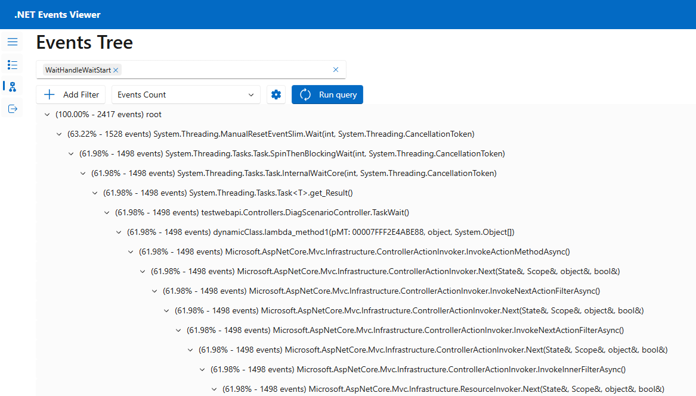

# Debug ThreadPool Starvation

**This article applies to: ✔️** .NET 9.0 and later versions

In this tutorial, you'll learn how to debug a ThreadPool starvation scenario. ThreadPool starvation occurs when the pool has no available threads to process new work items and it often causes applications to respond slowly. Using the provided example [ASP.NET Core web app](/samples/dotnet/samples/diagnostic-scenarios), you can cause ThreadPool starvation intentionally and learn how to diagnose it.

In this tutorial, you will:

> [!div class="checklist"]
>
> - Investigate an app that is responding to requests slowly
> - Use the dotnet-counters tool to identify ThreadPool starvation is likely occurring
> - Use the dotnet-stack and dotnet-trace tools to determine what work is keeping the ThreadPool threads busy

## Prerequisites

The tutorial uses:

- [.NET 9.0 SDK](https://dotnet.microsoft.com/download/dotnet) to build and run the sample app
- [Sample web app](/samples/dotnet/samples/diagnostic-scenarios) to demonstrate ThreadPool starvation behavior
- [Bombardier](https://github.com/codesenberg/bombardier/releases) to generate load for the sample web app
- [dotnet-counters](dotnet-counters.md) to observe performance counters
- [dotnet-stack](dotnet-stack.md) to examine thread stacks
- [dotnet-trace](dotnet-trace.md) to collect wait events
- Optional: [PerfView](https://github.com/microsoft/perfview/releases) to analyze the wait events

## Running the sample app

Download the code for the [sample app](/samples/dotnet/samples/diagnostic-scenarios) and run it using the .NET SDK:

    ```dotnetcli
    E:\demo\DiagnosticScenarios>dotnet run
    Using launch settings from E:\demo\DiagnosticScenarios\Properties\launchSettings.json...
    info: Microsoft.Hosting.Lifetime[14]
          Now listening on: https://localhost:5001
    info: Microsoft.Hosting.Lifetime[14]
          Now listening on: http://localhost:5000
    info: Microsoft.Hosting.Lifetime[0]
          Application started. Press Ctrl+C to shut down.
    info: Microsoft.Hosting.Lifetime[0]
          Hosting environment: Development
    info: Microsoft.Hosting.Lifetime[0]
          Content root path: E:\demo\DiagnosticScenarios
    ```

If you use a web browser and send requests to `https://localhost:5001/api/diagscenario/taskwait`, you should see the response `success:taskwait` returned after about 500 ms. This shows that the web server is serving traffic as expected.

## Observing slow performance

The demo web server has several endpoints which mock doing a database request and then returning a response to the user. Each of these endpoints has a delay of approximately 500 ms when serving requests one at a time but the performance is much worse when the web server is subjected to some load. Download the [Bombardier](https://github.com/codesenberg/bombardier/releases) load testing tool and observe the difference in latency when 125 concurrent requests are sent to each endpoint.

```dotnetcli
bombardier-windows-amd64.exe https://localhost:5001/api/diagscenario/taskwait
Bombarding https://localhost:5001/api/diagscenario/taskwait for 10s using 125 connection(s)
[=============================================================================================] 10s
Done!
Statistics        Avg      Stdev        Max
  Reqs/sec        33.06     234.67    3313.54
  Latency         3.48s      1.39s     10.79s
  HTTP codes:
    1xx - 0, 2xx - 454, 3xx - 0, 4xx - 0, 5xx - 0
    others - 0
  Throughput:    75.37KB/s
```

This second endpoint uses a code pattern that performs even worse:

```dotnetcli
bombardier-windows-amd64.exe https://localhost:5001/api/diagscenario/tasksleepwait
Bombarding https://localhost:5001/api/diagscenario/tasksleepwait for 10s using 125 connection(s)
[=============================================================================================] 10s
Done!
Statistics        Avg      Stdev        Max
  Reqs/sec         1.61      35.25     788.91
  Latency        15.42s      2.18s     18.30s
  HTTP codes:
    1xx - 0, 2xx - 140, 3xx - 0, 4xx - 0, 5xx - 0
    others - 0
  Throughput:    36.57KB/s
```

Both of these endpoints show dramatically more than the 500-ms average latency when load is high (3.48 s and 15.42 s respectively). If you run this example on an older version of .NET Core, you're likely to see both examples perform equally badly. .NET 6 has updated ThreadPool heuristics that reduce the performance impact of the bad coding pattern used in the first example.

## Detecting ThreadPool starvation

If you observed the behavior above on a real world service, you would know it's responding slowly under load but you wouldn't know the cause. [dotnet-counters](dotnet-counters.md) is a tool that can show live performance counters. These counters can provide clues about certain problems and are often easy to get. In production environments, you might have similar counters provided by remote monitoring tools and web dashboards. Install dotnet-counters and begin monitoring the web service:

```dotnetcli
dotnet-counters monitor -n DiagnosticScenarios
Press p to pause, r to resume, q to quit.
    Status: Running

Name Current Value
[System.Runtime]
    dotnet.assembly.count ({assembly}) 115
    dotnet.gc.collections ({collection})
        gc.heap.generation
        gen0 2
        gen1 1
        gen2 1
    dotnet.gc.heap.total_allocated (By) 64,329,632
    dotnet.gc.last_collection.heap.fragmentation.size (By)
        gc.heap.generation
        gen0 199,920
        gen1 29,208
        gen2 0
        loh 32
        poh 0
    dotnet.gc.last_collection.heap.size (By)
        gc.heap.generation
        gen0 208,712
        gen1 3,456,000
        gen2 5,065,600
        loh 98,384
        poh 3,147,488
    dotnet.gc.last_collection.memory.committed_size (By) 31,096,832
    dotnet.gc.pause.time (s) 0.024
    dotnet.jit.compilation.time (s) 1.285
    dotnet.jit.compiled_il.size (By) 565,249
    dotnet.jit.compiled_methods ({method}) 5,831
    dotnet.monitor.lock_contentions ({contention}) 148
    dotnet.process.cpu.count ({cpu}) 16
    dotnet.process.cpu.time (s)
        cpu.mode
        system 2.156
        user 2.734
    dotnet.process.memory.working_set (By) 1.3217e+08
    dotnet.thread_pool.queue.length ({work_item}) 0
    dotnet.thread_pool.thread.count ({thread}) 0
    dotnet.thread_pool.work_item.count ({work_item}) 32,267
    dotnet.timer.count ({timer}) 0
```

The counters above are an example while the web server wasn't serving any requests. Run Bombardier again with the `api/diagscenario/tasksleepwait` endpoint and sustained load for 2 minutes so there's plenty of time to observe what happens to the performance counters.

```dotnetcli
bombardier-windows-amd64.exe https://localhost:5001/api/diagscenario/tasksleepwait -d 120s
```

ThreadPool starvation occurs when there are no free threads to handle the queued work items and the runtime responds by increasing the number of ThreadPool threads. You should observe the `dotnet.thread_pool.thread.count` rapidly increase to 2-3x the number of processor cores on your machine and then further threads are added 1-2 per second until eventually stabilizing somewhere above 125. The slow and steady increase of ThreadPool threads combined with CPU Usage much less than 100% are the key signals that ThreadPool starvation is currently a performance bottleneck. The thread count increase will continue until either the pool hits the maximum number of threads, enough threads have been created to satisfy all the incoming work items, or the CPU has been saturated. Often, but not always, ThreadPool starvation will also show large values for `dotnet.thread_pool.queue.length` and low values for `dotnet.thread_pool.work_item.count`, meaning that there's a large amount of pending work and little work being completed. Here's an example of the counters while the thread count is still rising:

```dotnetcli
[System.Runtime]
    dotnet.assembly.count ({assembly}) 115
    dotnet.gc.collections ({collection})
        gc.heap.generation
        gen0 5
        gen1 1
        gen2 1
    dotnet.gc.heap.total_allocated (By) 1.6947e+08
    dotnet.gc.last_collection.heap.fragmentation.size (By)
        gc.heap.generation
        gen0 0
        gen1 348,248
        gen2 0
        loh 32
        poh 0
    dotnet.gc.last_collection.heap.size (By)
        gc.heap.generation
        gen0 0
        gen1 18,010,920
        gen2 5,065,600
        loh 98,384
        poh 3,407,048
    dotnet.gc.last_collection.memory.committed_size (By) 66,842,624
    dotnet.gc.pause.time (s) 0.05
    dotnet.jit.compilation.time (s) 1.317
    dotnet.jit.compiled_il.size (By) 574,886
    dotnet.jit.compiled_methods ({method}) 6,008
    dotnet.monitor.lock_contentions ({contention}) 194
    dotnet.process.cpu.count ({cpu}) 16
    dotnet.process.cpu.time (s)
        cpu.mode
        system 4.953
        user 6.266
    dotnet.process.memory.working_set (By) 1.3217e+08
    dotnet.thread_pool.queue.length ({work_item}) 0
    dotnet.thread_pool.thread.count ({thread}) 133
    dotnet.thread_pool.work_item.count ({work_item}) 71,188
    dotnet.timer.count ({timer}) 124
```

Once the count of ThreadPool threads stabilizes, the pool is no longer starving. But if it stabilizes at a high value (more than about three times the number of processor cores), that usually indicates the application code is blocking some ThreadPool threads and the ThreadPool is compensating by running with more threads. Running steady at high thread counts won't necessarily have large impacts on request latency, but if load varies dramatically over time or the app will be periodically restarted, then each time the ThreadPool is likely to enter a period of starvation where it's slowly increasing threads and delivering poor request latency. Each thread also consumes memory, so reducing the total number of threads needed provides another benefit.

Starting in .NET 6, ThreadPool heuristics were modified to scale up the number of ThreadPool threads much faster in response to certain blocking Task APIs. ThreadPool starvation can still occur with these APIs, but the duration is much briefer than it was with older .NET versions because the runtime responds more quickly. Run Bombardier again with the `api/diagscenario/taskwait` endpoint:

```dotnetcli
bombardier-windows-amd64.exe https://localhost:5001/api/diagscenario/taskwait -d 120s
```

On .NET 6 you should observe the pool increase the thread count more quickly than before and then stabilize at a high number of threads. ThreadPool starvation is occurring while the thread count is climbing.

## Resolving ThreadPool starvation

To eliminate ThreadPool starvation, ThreadPool threads need to remain unblocked so that they're available to handle incoming work items. There are multiple ways to determine what each thread was doing. If the issue occurs only occasionally then collecting a trace with [dotnet-trace](dotnet-trace.md) is best to record application behavior over a period of time. If the issue is constantly occurring then you can use the [dotnet-stack](dotnet-stack.md) tool or capture a dump with [dotnet-dump](dotnet-dump.md) that can be viewed in [Visual Studio](/visualstudio/debugger/using-dump-files). dotnet-stack can be faster because it shows the thread stacks immediately on the console, but Visual Studio dump debugging offers better visualizations that map frames to source, Just My Code can filter out runtime implementation frames, and the Parallel Stacks feature can help group large numbers of threads with similar stacks. This tutorial shows the dotnet-stack and dotnet-trace options. See the [diagnosing ThreadPool starvation tutorial video](/shows/on-net/diagnosing-thread-pool-exhaustion-issues-in-net-core-apps) for an example of investigating the thread stacks using Visual Studio.

### Diagnose a continuous issue with dotnet-stack

Run Bombardier again to put the web server under load:

```dotnetcli
bombardier-windows-amd64.exe https://localhost:5001/api/diagscenario/taskwait -d 120s
```

Then run dotnet-stack to see the thread stack traces:

```dotnetcli
dotnet-stack report -n DiagnosticScenarios
```

You should see a long output containing a large number of stacks, many of which look like this:

```dotnetcli
Thread (0x25968):
  [Native Frames]
  System.Private.CoreLib.il!System.Threading.ManualResetEventSlim.Wait(int32,value class System.Threading.CancellationToken)
  System.Private.CoreLib.il!System.Threading.Tasks.Task.SpinThenBlockingWait(int32,value class System.Threading.CancellationToken)
  System.Private.CoreLib.il!System.Threading.Tasks.Task.InternalWaitCore(int32,value class System.Threading.CancellationToken)
  System.Private.CoreLib.il!System.Threading.Tasks.Task`1[System.__Canon].GetResultCore(bool)
  DiagnosticScenarios!testwebapi.Controllers.DiagScenarioController.TaskWait()
  Anonymously Hosted DynamicMethods Assembly!dynamicClass.lambda_method1(pMT: 00007FF7A8CBF658,class System.Object,class System.Object[])
  Microsoft.AspNetCore.Mvc.Core.il!Microsoft.AspNetCore.Mvc.Infrastructure.ActionMethodExecutor+SyncObjectResultExecutor.Execute(class Microsoft.AspNetCore.Mvc.Infrastructure.IActionResultTypeMapper,class Microsoft.Extensions.Internal.ObjectMethodExecutor,class System.Object,class System.Object[])
  Microsoft.AspNetCore.Mvc.Core.il!Microsoft.AspNetCore.Mvc.Infrastructure.ControllerActionInvoker.InvokeActionMethodAsync()
  Microsoft.AspNetCore.Mvc.Core.il!Microsoft.AspNetCore.Mvc.Infrastructure.ControllerActionInvoker.Next(value class State&,value class Scope&,class System.Object&,bool&)
  Microsoft.AspNetCore.Mvc.Core.il!Microsoft.AspNetCore.Mvc.Infrastructure.ControllerActionInvoker.InvokeNextActionFilterAsync()
  Microsoft.AspNetCore.Mvc.Core.il!Microsoft.AspNetCore.Mvc.Infrastructure.ControllerActionInvoker.Next(value class State&,value class Scope&,class System.Object&,bool&)
  Microsoft.AspNetCore.Mvc.Core.il!Microsoft.AspNetCore.Mvc.Infrastructure.ControllerActionInvoker.InvokeNextActionFilterAsync()
  Microsoft.AspNetCore.Mvc.Core.il!Microsoft.AspNetCore.Mvc.Infrastructure.ControllerActionInvoker.Next(value class State&,value class Scope&,class System.Object&,bool&)
  Microsoft.AspNetCore.Mvc.Core.il!Microsoft.AspNetCore.Mvc.Infrastructure.ControllerActionInvoker.InvokeInnerFilterAsync()
  Microsoft.AspNetCore.Mvc.Core.il!Microsoft.AspNetCore.Mvc.Infrastructure.ResourceInvoker.Next(value class State&,value class Scope&,class System.Object&,bool&)
  Microsoft.AspNetCore.Mvc.Core.il!Microsoft.AspNetCore.Mvc.Infrastructure.ResourceInvoker.InvokeFilterPipelineAsync()
  Microsoft.AspNetCore.Mvc.Core.il!Microsoft.AspNetCore.Mvc.Infrastructure.ResourceInvoker.InvokeAsync()
  Microsoft.AspNetCore.Mvc.Core.il!Microsoft.AspNetCore.Mvc.Routing.ControllerRequestDelegateFactory+<>c__DisplayClass10_0.<CreateRequestDelegate>b__0(class Microsoft.AspNetCore.Http.HttpContext)
  Microsoft.AspNetCore.Routing.il!Microsoft.AspNetCore.Routing.EndpointMiddleware.Invoke(class Microsoft.AspNetCore.Http.HttpContext)
  Microsoft.AspNetCore.Authorization.Policy.il!Microsoft.AspNetCore.Authorization.AuthorizationMiddleware+<Invoke>d__6.MoveNext()
  System.Private.CoreLib.il!System.Runtime.CompilerServices.AsyncMethodBuilderCore.Start(!!0&)
  Microsoft.AspNetCore.Authorization.Policy.il!Microsoft.AspNetCore.Authorization.AuthorizationMiddleware.Invoke(class Microsoft.AspNetCore.Http.HttpContext)
  Microsoft.AspNetCore.HttpsPolicy.il!Microsoft.AspNetCore.HttpsPolicy.HttpsRedirectionMiddleware.Invoke(class Microsoft.AspNetCore.Http.HttpContext)
  Microsoft.AspNetCore.HttpsPolicy.il!Microsoft.AspNetCore.HttpsPolicy.HstsMiddleware.Invoke(class Microsoft.AspNetCore.Http.HttpContext)
  Microsoft.AspNetCore.HostFiltering.il!Microsoft.AspNetCore.HostFiltering.HostFilteringMiddleware.Invoke(class Microsoft.AspNetCore.Http.HttpContext)
  Microsoft.AspNetCore.Server.Kestrel.Core.il!Microsoft.AspNetCore.Server.Kestrel.Core.Internal.Http.HttpProtocol+<ProcessRequests>d__223`1[System.__Canon].MoveNext()
  System.Private.CoreLib.il!System.Threading.ExecutionContext.RunInternal(class System.Threading.ExecutionContext,class System.Threading.ContextCallback,class System.Object)
  System.Private.CoreLib.il!System.Runtime.CompilerServices.AsyncTaskMethodBuilder`1+AsyncStateMachineBox`1[System.Threading.Tasks.VoidTaskResult,Microsoft.AspNetCore.Server.Kestrel.Core.Internal.Http.HttpProtocol+<ProcessRequests>d__223`1[System.__Canon]].MoveNext(class System.Threading.Thread)
  System.Private.CoreLib.il!System.Threading.Tasks.AwaitTaskContinuation.RunOrScheduleAction(class System.Runtime.CompilerServices.IAsyncStateMachineBox,bool)
  System.Private.CoreLib.il!System.Threading.Tasks.Task.RunContinuations(class System.Object)
  System.IO.Pipelines.il!System.IO.Pipelines.StreamPipeReader+<<ReadAsync>g__Core|36_0>d.MoveNext()
  System.Private.CoreLib.il!System.Threading.ExecutionContext.RunInternal(class System.Threading.ExecutionContext,class System.Threading.ContextCallback,class System.Object)
  System.Private.CoreLib.il!System.Runtime.CompilerServices.AsyncTaskMethodBuilder`1+AsyncStateMachineBox`1[System.IO.Pipelines.ReadResult,System.IO.Pipelines.StreamPipeReader+<<ReadAsync>g__Core|36_0>d].MoveNext(class System.Threading.Thread)
  System.Private.CoreLib.il!System.Threading.Tasks.AwaitTaskContinuation.RunOrScheduleAction(class System.Runtime.CompilerServices.IAsyncStateMachineBox,bool)
  System.Private.CoreLib.il!System.Threading.Tasks.Task.RunContinuations(class System.Object)
  System.Private.CoreLib.il!System.Runtime.CompilerServices.AsyncTaskMethodBuilder`1[System.Int32].SetExistingTaskResult(class System.Threading.Tasks.Task`1<!0>,!0)
  System.Net.Security.il!System.Net.Security.SslStream+<ReadAsyncInternal>d__186`1[System.Net.Security.AsyncReadWriteAdapter].MoveNext()
  System.Private.CoreLib.il!System.Threading.ExecutionContext.RunInternal(class System.Threading.ExecutionContext,class System.Threading.ContextCallback,class System.Object)
  System.Private.CoreLib.il!System.Runtime.CompilerServices.AsyncTaskMethodBuilder`1+AsyncStateMachineBox`1[System.Int32,System.Net.Security.SslStream+<ReadAsyncInternal>d__186`1[System.Net.Security.AsyncReadWriteAdapter]].MoveNext(class System.Threading.Thread)
  Microsoft.AspNetCore.Server.Kestrel.Core.il!Microsoft.AspNetCore.Server.Kestrel.Core.Internal.DuplexPipeStream+<ReadAsyncInternal>d__27.MoveNext()
  System.Private.CoreLib.il!System.Threading.ExecutionContext.RunInternal(class System.Threading.ExecutionContext,class System.Threading.ContextCallback,class System.Object)
  System.Private.CoreLib.il!System.Threading.ThreadPoolWorkQueue.Dispatch()
  System.Private.CoreLib.il!System.Threading.PortableThreadPool+WorkerThread.WorkerThreadStart()
```

The frames at the bottom of these stacks indicate that these threads are ThreadPool threads:

```dotnetcli
  System.Private.CoreLib.il!System.Threading.ThreadPoolWorkQueue.Dispatch()
  System.Private.CoreLib.il!System.Threading.PortableThreadPool+WorkerThread.WorkerThreadStart()
```

And the frames near the top reveal that the thread is blocked on a call to `GetResultCore(bool)` from the DiagnosticScenarioController.TaskWait() function:

```dotnetcli
Thread (0x25968):
  [Native Frames]
  System.Private.CoreLib.il!System.Threading.ManualResetEventSlim.Wait(int32,value class System.Threading.CancellationToken)
  System.Private.CoreLib.il!System.Threading.Tasks.Task.SpinThenBlockingWait(int32,value class System.Threading.CancellationToken)
  System.Private.CoreLib.il!System.Threading.Tasks.Task.InternalWaitCore(int32,value class System.Threading.CancellationToken)
  System.Private.CoreLib.il!System.Threading.Tasks.Task`1[System.__Canon].GetResultCore(bool)
  DiagnosticScenarios!testwebapi.Controllers.DiagScenarioController.TaskWait()
```

### Diagnose an intermittent issue with dotnet-trace

The dotnet-stack approach is effective only for obvious, consistent blocking operations that occur in every request. In some scenarios, the blocking could happen sporadically only every few minutes, making dotnet-stack less useful for diagnosing the issue. dotnet-trace can be used to collect events over a period of time and save them in a nettrace file that can be analyzed later.

There is one particular event that helps diagnosing thread pool starvation that was introduced in .NET 9, the WaitHandleWait event. It's emitted when a thread becomes blocked by operations such as sync-over-async calls (e.g. `Task.Result`, `Task.Wait`, `Task.GetAwaiter().GetResult()`) or by other locking operations like `lock`, `Monitor.Enter`, `ManualResetEventSlim.Wait`, or `SemaphoreSlim.Wait`.

Run Bombardier again to put the web server under load:

```dotnetcli
bombardier-windows-amd64.exe https://localhost:5001/api/diagscenario/taskwait -d 120s
```

Then run dotnet-trace to collect wait events:

```dotnetcli
dotnet trace collect -n DiagnosticScenarios --clrevents waithandle --clreventlevel verbose --duration 00:00:30
```

That should generate a file named `DiagnosticScenarios.exe_yyyyddMM_hhmmss.nettrace` containing the events. This nettrace can be analyzed using two different tools:
- [PerfView](https://github.com/microsoft/perfview/releases): a performance analysis tool developed by Microsoft for Windows only
- [.NET Events Viewer](https://verdie-g.github.io/dotnet-events-viewer): a nettrace analysis [Blazor](https://dotnet.microsoft.com/en-us/apps/aspnet/web-apps/blazor) web tool developed by the community

Let's see how to use each tool to read the nettrace file.

#### Analyze a nettrace with Perfview

1. Download [PerfView](https://github.com/microsoft/perfview/releases) and run it
2. Open the nettrace file by double-clicking it

3. Double click on Advanced Group > Any Stacks. That should open a new window

4. Double click on the line "Event Microsoft-Windows-DotNETRuntime/WaitHandleWait/Start"
5. Now you should see the stack traces where the WaitHandleWait events were emitted. They are split by "WaitSource". Currently there are two sources. MonitorWait for events emitted through [Monitor.Wait](https://learn.microsoft.com/en-us/dotnet/api/system.threading.monitor), and Unknown for all the others.

6. Let's start with the MonitorWait as it represents 64.8% of the events. You can tick the checkboxes to expand the stack traces responsible for emitting this event.

7. This stack trace can be read as: `Task<T>.Result` emitted a WaitHandleWait event with a WaitSource MonitorWait (`Task<T>.Result` uses `Monitor.Wait` to perform a wait). It was called by `DiagScenarioController.TaskWait`, which was called by some lambda, which was called by some ASP.NET code

#### Analyze a nettrace with .NET Events Viewer

1. Go to [verdie-g.github.io/dotnet-events-viewer](https://verdie-g.github.io/dotnet-events-viewer)
2. Drag-and-drop the nettrace file


3. Go to the page "Events Tree", select the event "WaitHandleWaitStart", click "Run query"


4. Now you should see the stack traces where the WaitHandleWait events were emitted. You can click on the arrows to expand the stack traces responsible for emitting this event.



5. This stack trace can be read as: `ManualResetEventSlim.Wait` emitted a WaitHandleWait event. It was called by `Task.SpinThenBlockWait`, which was called by `Task.InternalWaitCore`, which was called by `Task<T>.Result`, which was called by `DiagScenario.TaskWait`, which was called by some lambda, which was called by some ASP.NET code

Note that in real world scenarios, you may find a lot of wait events emitted from threads outside the thread pool. Remember, that here we are investigating a **thread pool** starvation, so all waits on dedicated thread, outside of the thread pool are not relevant. You can know if a stack trace is from a thread pool thread by looking at the first methods which should contain a mention of the thread pool (e.g. `WorkerThread.WorkerThreadStart` or `ThreadPoolWorkQueue`).


### Code fix

Now you can navigate to the code for this controller in the sample app's *Controllers/DiagnosticScenarios.cs* file to see that it's calling an async API without using `await`. This is the [sync-over-async](https://devblogs.microsoft.com/pfxteam/should-i-expose-synchronous-wrappers-for-asynchronous-methods/) code pattern, which is known to block threads and is the most common cause of ThreadPool starvation.

```csharp
public ActionResult<string> TaskWait()
{
    // ...
    Customer c = PretendQueryCustomerFromDbAsync("Dana").Result;
    return "success:taskwait";
}
```

In this case the code can be readily changed to use the async/await instead as shown in the `TaskAsyncWait()` endpoint. Using await allows the current thread to service other workitems while the database query is in progress. When the database lookup is complete a ThreadPool thread will resume execution. This way no thread is blocked in the code during each request:

```csharp
public async Task<ActionResult<string>> TaskAsyncWait()
{
    // ...
    Customer c = await PretendQueryCustomerFromDbAsync("Dana");
    return "success:taskasyncwait";
}
```

Running Bombadier to send load to the `api/diagscenario/taskasyncwait` endpoint shows that the ThreadPool thread count stays much lower and average latency remains near 500ms when using the async/await approach:

```dotnetcli
>bombardier-windows-amd64.exe https://localhost:5001/api/diagscenario/taskasyncwait
Bombarding https://localhost:5001/api/diagscenario/taskasyncwait for 10s using 125 connection(s)
[=============================================================================================] 10s
Done!
Statistics        Avg      Stdev        Max
  Reqs/sec       227.92     274.27    1263.48
  Latency      532.58ms    58.64ms      1.14s
  HTTP codes:
    1xx - 0, 2xx - 2390, 3xx - 0, 4xx - 0, 5xx - 0
    others - 0
  Throughput:    98.81KB/s
```
