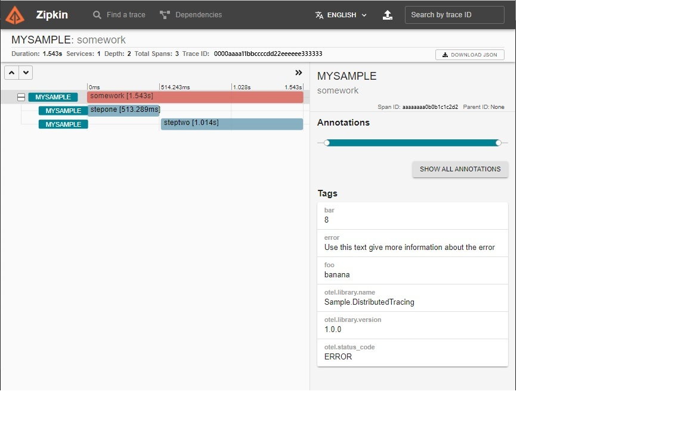

# Adding distributed tracing instrumentation

**This article applies to: ✔️** .NET Core 2.1 and later versions **✔️** .NET Framework 4.5 and later versions

.NET applications can be instrumented using the <xref:System.Diagnostics.Activity?displayProperty=nameWithType> API to produce
distributed tracing telemetry. Some instrumentation is built into standard .NET libraries, but you may want to add more to make
your code more easily diagnosable. In this tutorial, you will add new custom distributed tracing instrumentation. See
[the collection tutorial](distributed-tracing-instrumentation-walkthroughs.md) to learn more about recording the telemetry
produced by this instrumentation.

## Prerequisites

- [.NET Core 2.1 SDK](https://dotnet.microsoft.com/download/dotnet) or a later version

## Create initial app

First you will create a sample app that collects telemetry using OpenTelemetry, but doesn't yet have any instrumentation.

```dotnetcli
dotnet new console
```

Applications that target .NET 5 and later already have the necessary distributed tracing APIs included. For apps targeting older
.NET versions, add the [System.Diagnostics.DiagnosticSource NuGet package](https://www.nuget.org/packages/System.Diagnostics.DiagnosticSource/)
version 5 or greater.

```dotnetcli
dotnet add package System.Diagnostics.DiagnosticSource
```

Add the [OpenTelemetry](https://www.nuget.org/packages/OpenTelemetry/) and
[OpenTelemetry.Exporter.Console](https://www.nuget.org/packages/OpenTelemetry.Exporter.Console/) NuGet packages, which will be used to collect the telemetry.

```dotnetcli
dotnet add package OpenTelemetry
dotnet add package OpenTelemetry.Exporter.Console
```

Replace the contents of the generated Program.cs with this example source:

```C#
using OpenTelemetry;
using OpenTelemetry.Resources;
using OpenTelemetry.Trace;
using System;
using System.Threading.Tasks;

namespace Sample.DistributedTracing
{
    class Program
    {
        static async Task Main(string[] args)
        {
            using var tracerProvider = Sdk.CreateTracerProviderBuilder()
                .SetResourceBuilder(ResourceBuilder.CreateDefault().AddService("MySample"))
                .AddSource("Sample.DistributedTracing")
                .AddConsoleExporter()
                .Build();

            await DoSomeWork("banana", 8);
            Console.WriteLine("Example work done");
        }

        // All the functions below simulate doing some arbitrary work
        static async Task DoSomeWork(string foo, int bar)
        {
            await StepOne();
            await StepTwo();
        }

        static async Task StepOne()
        {
            await Task.Delay(500);
        }

        static async Task StepTwo()
        {
            await Task.Delay(1000);
        }
    }
}
```

The app has no instrumentation yet so there is no trace information to display:

```dotnetcli
> dotnet run
Example work done
```

### Best practices

Only app developers need to reference an optional third-party library for collecting the
distributed trace telemetry, such as OpenTelemetry in this example. .NET library
authors can exclusively rely on APIs in System.Diagnostics.DiagnosticSource, which is part
of .NET runtime. This ensures that libraries will run in a wide range of .NET apps, regardless
of the app developer's preferences about which library or vendor to use for collecting
telemetry.

## Add basic instrumentation

Applications and libraries add distributed tracing instrumentation using the
<xref:System.Diagnostics.ActivitySource?displayProperty=nameWithType> and
<xref:System.Diagnostics.Activity?displayProperty=nameWithType> classes.

### ActivitySource

First create an instance of ActivitySource. ActivitySource provides APIs to create and
start Activity objects. Add the static ActivitySource variable above Main() and
`using System.Diagnostics;` to the using statements.

```csharp
using OpenTelemetry;
using OpenTelemetry.Resources;
using OpenTelemetry.Trace;
using System;
using System.Diagnostics;
using System.Threading.Tasks;

namespace Sample.DistributedTracing
{
    class Program
    {
        private static ActivitySource source = new ActivitySource("Sample.DistributedTracing", "1.0.0");

        static async Task Main(string[] args)
        {
            ...
```

#### Best practices

- Create the ActivitySource once, store it in a static variable and use that instance as long as needed.
Each library or library subcomponent can (and often should) create its own source. Consider creating a new
source rather than reusing an existing one if you anticipate app developers would appreciate being able to
enable and disable the Activity telemetry in the sources independently.

- The source name passed to the constructor has to be unique to avoid the conflicts with any other sources.
If
there are multiple sources within the same assembly, use a hierarchical name that contains the assembly name and optionally a component name, for example, `Microsoft.AspNetCore.Hosting`. If an assembly
is adding instrumentation for code in a second, independent assembly, the name should be based on the
assembly that defines the ActivitySource, not the assembly whose code is being instrumented.

- The version parameter is optional. We recommend that you provide the version in case you release multiple
versions of the library and make changes to the instrumented telemetry.

> [!NOTE]
> OpenTelemetry uses alternate terms 'Tracer' and 'Span'. In .NET 'ActivitySource' is the implementation
> of Tracer and Activity is the implementation of 'Span'. .NET's Activity type long pre-dates
> the OpenTelemetry specification and the original .NET naming has been preserved for
> consistency within the .NET ecosystem and .NET application compatibility.

### Activity

Use the ActivitySource object to Start and Stop Activity objects around meaningful units of work. Update
DoSomeWork() with the code shown here:

```csharp
        static async Task DoSomeWork(string foo, int bar)
        {
            using (Activity activity = source.StartActivity("SomeWork"))
            {
                await StepOne();
                await StepTwo();
            }
        }
```

Running the app now shows the new Activity being logged:

```dotnetcli
> dotnet run
Activity.Id:          00-f443e487a4998c41a6fd6fe88bae644e-5b7253de08ed474f-01
Activity.DisplayName: SomeWork
Activity.Kind:        Internal
Activity.StartTime:   2021-03-18T10:36:51.4720202Z
Activity.Duration:    00:00:01.5025842
Resource associated with Activity:
    service.name: MySample
    service.instance.id: 067f4bb5-a5a8-4898-a288-dec569d6dbef
```

#### Notes

- <xref:System.Diagnostics.ActivitySource.StartActivity%2A?displayProperty=nameWithType> creates and starts
the activity at the same time. The listed code pattern is using the `using` block, which automatically disposes
the created Activity object after executing the block. Disposing the Activity object will stop it so the code
doesn't need to explicitly call <xref:System.Diagnostics.Activity.Stop?displayProperty=nameWithType>.
That simplifies the coding pattern.

- <xref:System.Diagnostics.ActivitySource.StartActivity%2A?displayProperty=nameWithType> internally determines if
there are any listeners recording the Activity. If there are no registered listeners or there are listeners that
are not interested, `StartActivity()` will return `null` and avoid creating the Activity object. This
is a performance optimization so that the code pattern can still be used in functions that are called frequently.

## Optional: Populate tags

Activities support key-value data called Tags, commonly used to store any parameters of the work that
may be useful for diagnostics. Update DoSomeWork() to include them:

```csharp
        static async Task DoSomeWork(string foo, int bar)
        {
            using (Activity activity = source.StartActivity("SomeWork"))
            {
                activity?.SetTag("foo", foo);
                activity?.SetTag("bar", bar);
                await StepOne();
                await StepTwo();
            }
        }
```

```dotnetcli
> dotnet run
Activity.Id:          00-2b56072db8cb5a4496a4bfb69f46aa06-7bc4acda3b9cce4d-01
Activity.DisplayName: SomeWork
Activity.Kind:        Internal
Activity.StartTime:   2021-03-18T10:37:31.4949570Z
Activity.Duration:    00:00:01.5417719
Activity.TagObjects:
    foo: banana
    bar: 8
Resource associated with Activity:
    service.name: MySample
    service.instance.id: 25bbc1c3-2de5-48d9-9333-062377fea49c

Example work done
```

### Best practices

- As mentioned above, `activity` returned by <xref:System.Diagnostics.ActivitySource.StartActivity%2A?displayProperty=nameWithType>
may be null. The null-coalescing operator `?.` in C# is a convenient short-hand to only invoke
<xref:System.Diagnostics.Activity.SetTag%2A?displayProperty=nameWithType> if `activity` is not null. The behavior is identical to
writing:

```csharp
if(activity != null)
{
    activity.SetTag("foo", foo);
}
```

- OpenTelemetry provides a set of recommended
[conventions](https://github.com/open-telemetry/opentelemetry-specification/tree/main/specification/trace/semantic_conventions)
for setting Tags on Activities that represent common types of application work.

- If you are instrumenting functions with high-performance requirements,
<xref:System.Diagnostics.Activity.IsAllDataRequested?displayProperty=nameWithType> is a hint that indicates whether any
of the code listening to Activities intends to read auxiliary information such as Tags. If no listener will read it, then there
is no need for the instrumented code to spend CPU cycles populating it. For simplicity, this sample doesn't apply that
optimization.

## Optional: Add events

Events are timestamped messages that can attach an arbitrary stream of additional diagnostic data to Activities. Add
some events to the Activity:

```csharp
        static async Task DoSomeWork(string foo, int bar)
        {
            using (Activity activity = source.StartActivity("SomeWork"))
            {
                activity?.SetTag("foo", foo);
                activity?.SetTag("bar", bar);
                await StepOne();
                activity?.AddEvent(new ActivityEvent("Part way there"));
                await StepTwo();
                activity?.AddEvent(new ActivityEvent("Done now"));
            }
        }
```

```dotnetcli
> dotnet run
Activity.Id:          00-82cf6ea92661b84d9fd881731741d04e-33fff2835a03c041-01
Activity.DisplayName: SomeWork
Activity.Kind:        Internal
Activity.StartTime:   2021-03-18T10:39:10.6902609Z
Activity.Duration:    00:00:01.5147582
Activity.TagObjects:
    foo: banana
    bar: 8
Activity.Events:
    Part way there [3/18/2021 10:39:11 AM +00:00]
    Done now [3/18/2021 10:39:12 AM +00:00]
Resource associated with Activity:
    service.name: MySample
    service.instance.id: ea7f0fcb-3673-48e0-b6ce-e4af5a86ce4f

Example work done
```

### Best practices

- Events are stored in an in-memory list until they can be transmitted which makes this mechanism only suitable for
recording a modest number of events. For a large or unbounded volume of events, it's better to use a logging API focused on this task,
such as [ILogger](/aspnet/core/fundamentals/logging/). ILogger also ensures
that the logging information will be available regardless whether the app developer opts to use distributed tracing.
ILogger supports automatically capturing the active Activity IDs so messages logged via that API can still be correlated
with the distributed trace.

## Optional: Add status

OpenTelemetry allows each Activity to report a
[Status](https://github.com/open-telemetry/opentelemetry-specification/blob/main/specification/trace/api.md#set-status)
that represents the pass/fail result of the work. .NET does not currently have a strongly typed API for this purpose but
there is an established convention using Tags:

- `otel.status_code` is the Tag name used to store `StatusCode`. Values for the StatusCode tag must be one of the
strings "UNSET", "OK", or "ERROR", which correspond respectively to the enums `Unset`, `Ok`, and `Error` from StatusCode.
- `otel.status_description` is the Tag name used to store the optional `Description`

Update DoSomeWork() to set status:

```csharp
        static async Task DoSomeWork(string foo, int bar)
        {
            using (Activity activity = source.StartActivity("SomeWork"))
            {
                activity?.SetTag("foo", foo);
                activity?.SetTag("bar", bar);
                await StepOne();
                activity?.AddEvent(new ActivityEvent("Part way there"));
                await StepTwo();
                activity?.AddEvent(new ActivityEvent("Done now"));

                // Pretend something went wrong
                activity?.SetTag("otel.status_code", "ERROR");
                activity?.SetTag("otel.status_description", "Use this text give more information about the error");
            }
        }
```

## Optional: Add additional Activities

Activities can be nested to describe portions of a larger unit of work. This can be valuable around
portions of code that might not execute quickly or to better localize failures that come from specific external
dependencies. Although this sample uses an Activity in every method, that is solely because extra code has been
minimized. In a larger and more realistic project, using an Activity in every method would produce extremely
verbose traces, so it's not recommended.

Update StepOne and StepTwo to add more tracing around these separate steps:

```csharp
        static async Task StepOne()
        {
            using (Activity activity = source.StartActivity("StepOne"))
            {
                await Task.Delay(500);
            }
        }

        static async Task StepTwo()
        {
            using (Activity activity = source.StartActivity("StepTwo"))
            {
                await Task.Delay(1000);
            }
        }
```

```dotnetcli
> dotnet run
Activity.Id:          00-9d5aa439e0df7e49b4abff8d2d5329a9-39cac574e8fda44b-01
Activity.ParentId:    00-9d5aa439e0df7e49b4abff8d2d5329a9-f16529d0b7c49e44-01
Activity.DisplayName: StepOne
Activity.Kind:        Internal
Activity.StartTime:   2021-03-18T10:40:51.4278822Z
Activity.Duration:    00:00:00.5051364
Resource associated with Activity:
    service.name: MySample
    service.instance.id: e0a8c12c-249d-4bdd-8180-8931b9b6e8d0

Activity.Id:          00-9d5aa439e0df7e49b4abff8d2d5329a9-4ccccb6efdc59546-01
Activity.ParentId:    00-9d5aa439e0df7e49b4abff8d2d5329a9-f16529d0b7c49e44-01
Activity.DisplayName: StepTwo
Activity.Kind:        Internal
Activity.StartTime:   2021-03-18T10:40:51.9441095Z
Activity.Duration:    00:00:01.0052729
Resource associated with Activity:
    service.name: MySample
    service.instance.id: e0a8c12c-249d-4bdd-8180-8931b9b6e8d0

Activity.Id:          00-9d5aa439e0df7e49b4abff8d2d5329a9-f16529d0b7c49e44-01
Activity.DisplayName: SomeWork
Activity.Kind:        Internal
Activity.StartTime:   2021-03-18T10:40:51.4256627Z
Activity.Duration:    00:00:01.5286408
Activity.TagObjects:
    foo: banana
    bar: 8
    otel.status_code: ERROR
    otel.status_description: Use this text give more information about the error
Activity.Events:
    Part way there [3/18/2021 10:40:51 AM +00:00]
    Done now [3/18/2021 10:40:52 AM +00:00]
Resource associated with Activity:
    service.name: MySample
    service.instance.id: e0a8c12c-249d-4bdd-8180-8931b9b6e8d0

Example work done
```

Notice that both StepOne and StepTwo include a ParentId that refers to SomeWork. The console is
not a great visualization of nested trees of work, but many GUI viewers such as
[Zipkin](https://github.com/open-telemetry/opentelemetry-dotnet/blob/main/src/OpenTelemetry.Exporter.Zipkin/README.md)
can show this as a Gantt chart:

[](media/zipkin-nested-activities.jpg)

## Optional: ActivityKind

Activities have an <xref:System.Diagnostics.Activity.Kind%2A?displayProperty=nameWithType> property, which
describes the relationship between the Activity, its parent, and its children. By default, all new Activities are
set to <xref:System.Diagnostics.ActivityKind.Internal>, which is appropriate for Activities that are an
internal operation within an application with no remote parent or children. Other kinds can be set using the
kind parameter on
<xref:System.Diagnostics.ActivitySource.StartActivity%2A?displayProperty=nameWithType>. For other options, see
<xref:System.Diagnostics.ActivityKind?displayProperty=nameWithType>.

## Optional: Links

When work occurs in batch processing systems, a single Activity might represent work on behalf of many
different requests simultaneously, each of which has its own trace-id. Although Activity is restricted
to have a single parent, it can link to additional trace-ids using
<xref:System.Diagnostics.ActivityLink?displayProperty=nameWithType>. Each ActivityLink is
populated with an <xref:System.Diagnostics.ActivityContext> that
stores ID information about the Activity being linked to. ActivityContext can be retrieved from in-process
Activity objects using <xref:System.Diagnostics.Activity.Context%2A?displayProperty=nameWithType> or
it can be parsed from serialized ID information using
<xref:System.Diagnostics.ActivityContext.Parse(System.String,System.String)?displayProperty=nameWithType>.

```csharp
void DoBatchWork(ActivityContext[] requestContexts)
{
    // Assume each context in requestContexts encodes the trace-id that was sent with a request
    using(Activity activity = s_source.StartActivity(name: "BigBatchOfWork",
                                                     kind: ActivityKind.Internal,
                                                     parentContext: null,
                                                     links: requestContexts.Select(ctx => new ActivityLink(ctx))
    {
        // do the batch of work here
    }
}
```

Unlike events and Tags that can be added on-demand, links must be added during StartActivity() and
are immutable afterwards.
