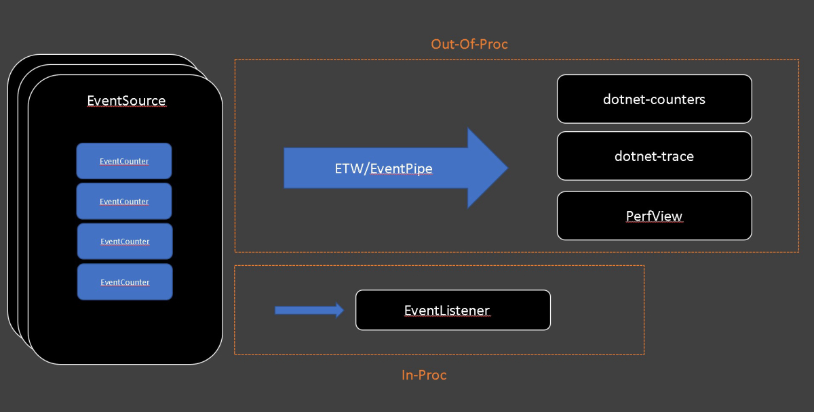

# EventCounters in .NET Core

**This article applies to: ✔️** .NET Core 3.0 SDK and later versions

EventCounters are .NET Core APIs used for lightweight, cross-platform, and near real-time performance metric collection. EventCounters were added as a cross-platform alternative to the "performance counters" of the .NET Framework on Windows. In this article you'll learn what EventCounters are, how to implement them, and how to consume them.

The .NET Core runtime and a few .NET libraries publish basic diagnostics information using EventCounters starting in .NET Core 3.0. Apart from the EventCounters that are provided by the .NET runtime, you may choose to implement your own EventCounters. EventCounters can be used to track various metrics.

EventCounters live as a part of an <xref:System.Diagnostics.Tracing.EventSource>, and are automatically pushed to listener tools on a regular basis. Like all other events on an <xref:System.Diagnostics.Tracing.EventSource>, they can be consumed both in-proc and out-of-proc via <xref:System.Diagnostics.Tracing.EventListener> and EventPipe/ETW (Event Tracing for Windows).

[](media/eventcounters.jpg#lightbox)

## Runtime counters

The .NET runtime publishes many counters.

### `System.Runtime` providers

- % Time in Garbage Collection (GC)
- Active Timer Count
- Allocation Rate
- Assembly Count
- CPU usage
- Exception Rate
- GC Heap Size
- Gen 0 GC Rate
- Gen 0 Heap Size
- Gen 1 GC Rate
- Gen 1 Heap Size
- Gen 2 GC Rate
- Gen 2 Heap Size
- LOH Heap Size
- Monitor Lock Contention Rate
- ThreadPool Completed Items Rate
- ThreadPool Queue Length
- ThreadPool Thread Count
- Working Set Size

### `Microsoft.AspNetCore.Hosting` providers

The following counters are published as part of [ASP.NET Core](/aspnet/core).

- Current Requests Count
- Failed Requests Count
- Requests per second
- Total Requests Count

### `Microsoft.AspNetCore.Http.Connections` providers

The following counters are published as part of [ASP.NET Core SignalR](/aspnet/core/signalr/introduction).

- Average Connection Duration
- Total Connections Started
- Total Connections Stopped
- Total Connections Timed Out

## EventCounters API overview

There are two primary categories of counters. Some counters are for ever-increasing values, such as total # of exceptions, total # of GCs, and total # of requests. Other counters are "snapshot" values, such as heap usage, CPU usage, and working set size. Within each of these categories of counters, there are two types of counters that vary by how they get their value. Polling counters retrieve their value via a callback, and non-polling counters have their values directly set on the counter instance.

The counters are represented by the following implementations <xref:System.Diagnostics.Tracing.EventCounter>, <xref:System.Diagnostics.Tracing.IncrementingEventCounter>, <xref:System.Diagnostics.Tracing.IncrementingPollingCounter>, and <xref:System.Diagnostics.Tracing.PollingCounter>.

1. The <xref:System.Diagnostics.Tracing.EventCounter> records a set of values. The <xref:System.Diagnostics.Tracing.EventCounter.WriteMetric%2A?displayProperty=nameWithType> method adds a new value to the set. With each interval, a statistical summary for the set is computed, such as the min, max, and mean. The [dotnet-counters](dotnet-counters.md) tool will always display the mean value. The <xref:System.Diagnostics.Tracing.EventCounter> is useful to describe a discrete set of operations. Common usage may include monitoring the average size in bytes of recent IO operations, or the average monetary value of a set of financial transactions.

1. The <xref:System.Diagnostics.Tracing.IncrementingEventCounter> records a running total. The <xref:System.Diagnostics.Tracing.IncrementingEventCounter.Increment%2A?displayProperty=nameWithType> method increases the running total. With each period of time, the difference between the total value for that period, and the total of the previous period is reported as an increment. The [dotnet-counters](dotnet-counters.md) tool will display the rate as the recorded total / time. The <xref:System.Diagnostics.Tracing.IncrementingEventCounter> is useful to measure how frequently an action is occurring, such as the number of requests processed per second.

1. The <xref:System.Diagnostics.Tracing.IncrementingPollingCounter> is a customizable counter that has no state and uses a callback to determine the reported increment value. With each time interval, the callback is invoked, and then the difference between the current invocation, and the last invocation is the reported value. The [dotnet-counters](dotnet-counters.md) tool will always display the difference as a rate, the reported value / time. Sometimes it isn't feasible to call an API on each occurrence, but it's possible to query the total number of occurrences. For example, you could report the number of bytes written to a file / sec, even without a notification each time a byte is written.

1. The <xref:System.Diagnostics.Tracing.PollingCounter> is customizable, doesn't have any state, and uses a callback to determine the value that is reported. With each time interval, the user provided callback function is invoked. Each invocation to the callback writes the current value of the counter. A <xref:System.Diagnostics.Tracing.PollingCounter> can be used to query a metric from an external source, for example getting the current free bytes on a disk. It can also be used to report custom statistics that can be computed on demand by an application. Examples include reporting the 95th percentile of recent request latencies, or the current hit or miss ratio of a cache.

## Writing EventCounters

The following code implements a sample <xref:System.Diagnostics.Tracing.EventSource> exposed as the named `"Samples-EventCounterDemos-Minimal"` provider. This source contains an <xref:System.Diagnostics.Tracing.EventCounter> representing request processing time. Such a counter has a name (that is, its unique ID in the source) and a display name, both used by listener tools such as [dotnet-counter](dotnet-counters.md).

:::code language="csharp" source="snippets/EventCounters/MinimalEventCounterSource.cs":::

Create a [new .NET console app](../tools/dotnet-new.md#console) using the previous code snippet as a replacement for the _Program.cs_ file. Build and run the app. Then use `dotnet-counters ps` to see what its process ID is:

```console
dotnet-counters ps
   1398652 dotnet     C:\Program Files\dotnet\dotnet.exe
   1399072 dotnet     C:\Program Files\dotnet\dotnet.exe
   1399112 dotnet     C:\Program Files\dotnet\dotnet.exe
   1401880 dotnet     C:\Program Files\dotnet\dotnet.exe
   1400180 sample-counters C:\sample-counters\bin\Debug\netcoreapp3.1\sample-counters.exe
```

Pass the <xref:System.Diagnostics.Tracing.EventSource> name as an argument to `--providers` to start monitoring your counter with the following command:

```console
dotnet-counters monitor --process-id 1400180 --providers Samples-EventCounterDemos-Minimal
```

You should see the monitor output as shown below:

```console
Press p to pause, r to resume, q to quit.
    Status: Running

[Samples-EventCounterDemos-Minimal]
    Request Processing Time (MSec)                            0.445
```

### .NET Core runtime example counters

There are many great example implementations in the .NET Core runtime. Here is the runtime implementation for the counter that tracks the working set size of the application.

```csharp
var workingSetCounter = new PollingCounter(
    "working-set",
    this,
    () => (double)(Environment.WorkingSet / 1_000_000))
{
    DisplayName = "Working Set",
    DisplayUnits = "MB"
};
```

The <xref:System.Diagnostics.Tracing.PollingCounter> reports the current working set of the app, since it captures a metric at a moment in time. The callback for polling a value is the provided lambda expression, which is just a call to the <xref:System.Environment.WorkingSet?displayProperty=fullName> API. <xref:System.Diagnostics.Tracing.DiagnosticCounter.DisplayName> and <xref:System.Diagnostics.Tracing.DiagnosticCounter.DisplayUnits> are optional properties that can be set to help the consumer side of the counter to display the value more clearly. For example, [dotnet-counters](dotnet-counters.md) uses these properties to display the more "pretty" version of the counter names.

For the <xref:System.Diagnostics.Tracing.PollingCounter>, and the <xref:System.Diagnostics.Tracing.IncrementingPollingCounter>), nothing else needs to be done. They both poll the values themselves at an interval requested by the consumer.

Here is an example of a runtime counter implemented using <xref:System.Diagnostics.Tracing.IncrementingPollingCounter>.

```csharp
var monitorContentionCounter = new IncrementingPollingCounter(
    "monitor-lock-contention-count",
    this,
    () => Monitor.LockContentionCount
)
{
    DisplayName = "Monitor Lock Contention Count",
    DisplayRateTimeScale = TimeSpan.FromSeconds(1)
};
```

The <xref:System.Diagnostics.Tracing.IncrementingPollingCounter> uses the <xref:System.Threading.Monitor.LockContentionCount?displayProperty=nameWithType> API to report the increment of the total lock contention count. The <xref:System.Diagnostics.Tracing.IncrementingPollingCounter.DisplayRateTimeScale> property is optional, but when used it can provide a hint for what time interval the counter is best displayed at. For example, the lock contention count is best displayed as _count per second_, so its <xref:System.Diagnostics.Tracing.IncrementingPollingCounter.DisplayRateTimeScale> is set to `1` second. The display rate can be adjusted for different types of rate counters.

There are more counter implementations to use as a reference in the [.NET runtime](https://github.com/dotnet/runtime/blob/master/src/libraries/System.Private.CoreLib/src/System/Diagnostics/Tracing/RuntimeEventSource.cs) repo.

## Concurrency

> [!NOTE]
> The EventCounters API does not guarantee thread safety. When the delegates passed to <xref:System.Diagnostics.Tracing.PollingCounter> or <xref:System.Diagnostics.Tracing.IncrementingPollingCounter> instances are called by multiple threads, it's your responsibility to guarantee the delegates' thread-safety.

For example, consider the following <xref:System.Diagnostics.Tracing.EventSource> to keep track of requests.

:::code language="csharp" source="snippets/EventCounters/RequestEventSource.cs":::

The `AddRequest()` method can be called from a request handler, and the `RequestRateCounter` polls the value at the interval specified by the consumer of the counter. However, the `AddRequest()` method can be called by multiple threads at once, putting a race condition on `_requestCount`. A thread-safe alternative way to increment the `_requestCount` is to use <xref:System.Threading.Interlocked.Increment%2A?displayProperty=nameWithType>.

```csharp
public void AddRequest() => Interlocked.Increment(ref _requestCount);
```

## Consuming EventCounters

There are two primary ways of consuming EventCounters, either in-proc, or out-of-proc.

### Consuming in-proc

You can consume the counter values via the <xref:System.Diagnostics.Tracing.EventListener> API. An <xref:System.Diagnostics.Tracing.EventListener> is an in-proc way of consuming any events written by all instances of an <xref:System.Diagnostics.Tracing.EventSource> in your application. For more information on how to use the `EventListener` API, see <xref:System.Diagnostics.Tracing.EventListener>.

First, the <xref:System.Diagnostics.Tracing.EventSource> that produces the counter value needs to be enabled. Override the <xref:System.Diagnostics.Tracing.EventListener.OnEventSourceCreated%2A> method to get a notification when an <xref:System.Diagnostics.Tracing.EventSource> is created, and if this is the correct <xref:System.Diagnostics.Tracing.EventSource> with your EventCounters, then you can call <xref:System.Diagnostics.Tracing.EventListener.EnableEvents%2A?displayProperty=nameWithType> on it. Here is an example override:

:::code language="csharp" source="snippets/EventCounters/SimpleEventListener.cs" id="OnEventSourceCreated":::

#### Sample code

Here is a sample <xref:System.Diagnostics.Tracing.EventListener> class that prints out all the counter names and values from the .NET runtime's <xref:System.Diagnostics.Tracing.EventSource>, for publishing its internal counters (`System.Runtime`) at some interval.

:::code language="csharp" source="snippets/EventCounters/SimpleEventListener.cs":::

As shown above, you _must_ make sure the `"EventCounterIntervalSec"` argument is set in the `filterPayload` argument when calling <xref:System.Diagnostics.Tracing.EventListener.EnableEvents%2A>. Otherwise the counters will not be able to flush out values since it doesn't know at which interval it should be getting flushed out.

### Consuming out-of-proc

Consuming EventCounters out-of-proc is also possible. You can use ETW to capture counter data as events, and view them on your ETW trace viewer (PerfView and WPA). You may also use [dotnet-counters](dotnet-counters.md) to consume them in a cross-platform manner via an EventPipe. Likewise, you could also use <xref:System.Diagnostics.TraceSource.TraceEvent%2A?displayProperty=nameWithType>, or <xref:System.Diagnostics.TraceListener.TraceEvent%2A?displayProperty=nameWithType> to consume EventCounters.

#### dotnet-counters

The `dotnet-counters` tool is a cross-platform dotnet CLI global tool that can be used to monitor the counter values. To find out how to use `dotnet-counters` to monitor your counters, see [dotnet-counters](dotnet-counters.md).

#### ETW/PerfView

Since <xref:System.Diagnostics.Tracing.EventCounter> payloads are reported as <xref:System.Diagnostics.Tracing.EventSource> events, you can use PerfView to collect/view these counter-data.

Here is a command that can be passed to PerfView to collect an ETW trace with the counters.

```console
PerfView.exe /onlyProviders=*Samples-EventCounterDemos-Minimal:EventCounterIntervalSec=1 collect
```

#### dotnet-trace

Similar to how PerfView can be used to consume the counter data through ETW, dotnet-trace can be used to consume the counter data through EventPipe.

Here is an example of using dotnet-trace to get the same counter data.

```console
dotnet-trace collect --process-id <pid> --providers Samples-EventCounterDemos-Minimal:0:0:EventCounterIntervalSec=1
```

For more information on how to collect counter values over time, see the corresponding [dotnet-trace](dotnet-trace.md#use-dotnet-trace-to-collect-counter-values-over-time) section.

#### TraceEvent

TraceEvent is a managed library that makes it easy to consume ETW and EventPipe events. For more information, see the [TraceEvent Library Programmers Guide](https://github.com/Microsoft/perfview/blob/master/documentation/TraceEvent/TraceEventProgrammersGuide.md).

For additional code samples, see [Criteo Labs blog](https://medium.com/criteo-labs/net-core-counters-internals-how-to-integrate-counters-in-your-monitoring-pipeline-5354cd61b42e).

## Next steps

> [!div class="nextstepaction"]
> [Tutorial: Measure performance using EventCounters](event-counter-perf.md)
