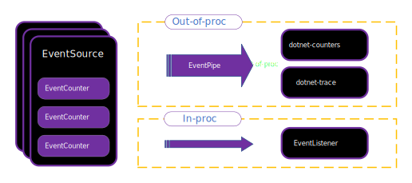

# EventCounters in .NET

**This article applies to: ✔️** .NET Core 3.0 SDK and later versions

EventCounters are .NET APIs used for lightweight, cross-platform, and near real-time performance metric collection. EventCounters were added as a cross-platform alternative to the "performance counters" of .NET Framework on Windows. In this article, you'll learn what EventCounters are, how to implement them, and how to consume them.

The .NET runtime and a few .NET libraries publish basic diagnostics information using EventCounters starting in .NET Core 3.0. Apart from the EventCounters that are provided by the .NET runtime, you may choose to implement your own EventCounters. EventCounters can be used to track various metrics. Learn more about them in [well-known EventCounters in .NET](available-counters.md)

EventCounters live as a part of an <xref:System.Diagnostics.Tracing.EventSource>, and are automatically pushed to listener tools on a regular basis. Like all other events on an <xref:System.Diagnostics.Tracing.EventSource>, they can be consumed both in-proc and out-of-proc via <xref:System.Diagnostics.Tracing.EventListener> and [EventPipe](./eventpipe.md). This article focuses on the cross-platform capabilities of EventCounters, and intentionally excludes PerfView and ETW (Event Tracing for Windows) - although both can be used with EventCounters.



## EventCounter API overview

There are two primary categories of EventCounters. Some counters are for "rate" values, such as total number of exceptions, total number of GCs, and total number of requests. Other counters are "snapshot" values, such as heap usage, CPU usage, and working set size. Within each of these categories of counters, there are two types of counters that vary by how they get their value. Polling counters retrieve their value via a callback, and non-polling counters have their values directly set on the counter instance.

The counters are represented by the following implementations:

* <xref:System.Diagnostics.Tracing.EventCounter>
* <xref:System.Diagnostics.Tracing.IncrementingEventCounter>
* <xref:System.Diagnostics.Tracing.PollingCounter>
* <xref:System.Diagnostics.Tracing.IncrementingPollingCounter>

An event listener specifies how long measurement intervals are. At the end of each interval a value is transmitted to the listener for each counter. The implementations of a counter determine what APIs and calculations are used to produce the value each interval.

- The <xref:System.Diagnostics.Tracing.EventCounter> records a set of values. The <xref:System.Diagnostics.Tracing.EventCounter.WriteMetric%2A?displayProperty=nameWithType> method adds a new value to the set. With each interval, a statistical summary for the set is computed, such as the min, max, and mean. The [dotnet-counters](dotnet-counters.md) tool will always display the mean value. The <xref:System.Diagnostics.Tracing.EventCounter> is useful to describe a discrete set of operations. Common usage may include monitoring the average size in bytes of recent IO operations, or the average monetary value of a set of financial transactions.

- The <xref:System.Diagnostics.Tracing.IncrementingEventCounter> records a running total for each time interval. The <xref:System.Diagnostics.Tracing.IncrementingEventCounter.Increment%2A?displayProperty=nameWithType> method adds to the total. For example, if `Increment()` is called three times during one interval with values `1`, `2`, and `5`, then the running total of `8` will be reported as the counter value for this interval. The [dotnet-counters](dotnet-counters.md) tool will display the rate as the recorded total / time. The <xref:System.Diagnostics.Tracing.IncrementingEventCounter> is useful to measure how frequently an action is occurring, such as the number of requests processed per second.

- The <xref:System.Diagnostics.Tracing.PollingCounter> uses a callback to determine the value that is reported. With each time interval, the user provided callback function is invoked and the return value is used as the counter value. A <xref:System.Diagnostics.Tracing.PollingCounter> can be used to query a metric from an external source, for example getting the current free bytes on a disk. It can also be used to report custom statistics that can be computed on demand by an application. Examples include reporting the 95th percentile of recent request latencies, or the current hit or miss ratio of a cache.

- The <xref:System.Diagnostics.Tracing.IncrementingPollingCounter> uses a callback to determine the reported increment value. With each time interval, the callback is invoked, and then the difference between the current invocation, and the last invocation is the reported value. The [dotnet-counters](dotnet-counters.md) tool will always display the difference as a rate, the reported value / time. This counter is useful when it isn't feasible to call an API on each occurrence, but it's possible to query the total number of occurrences. For example, you could report the number of bytes written to a file per second, even without a notification each time a byte is written.

## Implement an EventSource

The following code implements a sample <xref:System.Diagnostics.Tracing.EventSource> exposed as the named `"Sample.EventCounter.Minimal"` provider. This source contains an <xref:System.Diagnostics.Tracing.EventCounter> representing request-processing time. Such a counter has a name (that is, its unique ID in the source) and a display name, both used by listener tools such as [dotnet-counter](dotnet-counters.md).

:::code language="csharp" source="snippets/EventCounters/MinimalEventCounterSource.cs":::

You use `dotnet-counters ps` to display a list of .NET processes that can be monitored:

```console
dotnet-counters ps
   1398652 dotnet     C:\Program Files\dotnet\dotnet.exe
   1399072 dotnet     C:\Program Files\dotnet\dotnet.exe
   1399112 dotnet     C:\Program Files\dotnet\dotnet.exe
   1401880 dotnet     C:\Program Files\dotnet\dotnet.exe
   1400180 sample-counters C:\sample-counters\bin\Debug\netcoreapp3.1\sample-counters.exe
```

Pass the <xref:System.Diagnostics.Tracing.EventSource> name to the `--counters` option to start monitoring your counter:

```console
dotnet-counters monitor --process-id 1400180 --counters Sample.EventCounter.Minimal
```

The following example shows monitor output:

```console
Press p to pause, r to resume, q to quit.
    Status: Running

[Samples-EventCounterDemos-Minimal]
    Request Processing Time (ms)                            0.445
```

Press <kbd>q</kbd> to stop the monitoring command.

### Conditional counters

When implementing an <xref:System.Diagnostics.Tracing.EventSource>, the containing counters can be conditionally instantiated when the <xref:System.Diagnostics.Tracing.EventSource.OnEventCommand%2A?displayProperty=nameWithType> method is called with a <xref:System.Diagnostics.Tracing.EventCommandEventArgs.Command> value of `EventCommand.Enable`. To safely instantiate a counter instance only if it is `null`, use the [null-coalescing assignment operator](../../csharp/language-reference/operators/null-coalescing-operator.md). Additionally, custom methods can evaluate the <xref:System.Diagnostics.DiagnosticSource.IsEnabled%2A> method to determine whether or not the current event source is enabled.

:::code language="csharp" source="snippets/EventCounters/ConditionalEventCounterSource.cs":::

> [!TIP]
> Conditional counters are counters that are conditionally instantiated, a micro-optimization. The runtime adopts this pattern for scenarios where counters are normally not used, to save a fraction of a millisecond.

### .NET Core runtime example counters

There are many great example implementations in the .NET Core runtime. Here is the runtime implementation for the counter that tracks the working set size of the application.

```csharp
var workingSetCounter = new PollingCounter(
    "working-set",
    this,
    () => (double)(Environment.WorkingSet / 1_000_000))
{
    DisplayName = "Working Set",
    DisplayUnits = "MB"
};
```

The <xref:System.Diagnostics.Tracing.PollingCounter> reports the current amount of physical memory mapped to the process (working set) of the app, since it captures a metric at a moment in time. The callback for polling a value is the provided lambda expression, which is just a call to the <xref:System.Environment.WorkingSet?displayProperty=fullName> API. <xref:System.Diagnostics.Tracing.DiagnosticCounter.DisplayName> and <xref:System.Diagnostics.Tracing.DiagnosticCounter.DisplayUnits> are optional properties that can be set to help the consumer side of the counter to display the value more clearly. For example, [dotnet-counters](dotnet-counters.md) uses these properties to display the more display-friendly version of the counter names.

> [!IMPORTANT]
> The `DisplayName` properties are not localized.

For the <xref:System.Diagnostics.Tracing.PollingCounter>, and the <xref:System.Diagnostics.Tracing.IncrementingPollingCounter>, nothing else needs to be done. They both poll the values themselves at an interval requested by the consumer.

Here is an example of a runtime counter implemented using <xref:System.Diagnostics.Tracing.IncrementingPollingCounter>.

```csharp
var monitorContentionCounter = new IncrementingPollingCounter(
    "monitor-lock-contention-count",
    this,
    () => Monitor.LockContentionCount
)
{
    DisplayName = "Monitor Lock Contention Count",
    DisplayRateTimeScale = TimeSpan.FromSeconds(1)
};
```

The <xref:System.Diagnostics.Tracing.IncrementingPollingCounter> uses the <xref:System.Threading.Monitor.LockContentionCount?displayProperty=nameWithType> API to report the increment of the total lock contention count. The <xref:System.Diagnostics.Tracing.IncrementingPollingCounter.DisplayRateTimeScale> property is optional, but when used it can provide a hint for what time interval the counter is best displayed at. For example, the lock contention count is best displayed as _count per second_, so its <xref:System.Diagnostics.Tracing.IncrementingPollingCounter.DisplayRateTimeScale> is set to one second. The display rate can be adjusted for different types of rate counters.

> [!NOTE]
> The <xref:System.Diagnostics.Tracing.IncrementingPollingCounter.DisplayRateTimeScale> is _not_ used by [dotnet-counters](dotnet-counters.md), and event listeners are not required to use it.

There are more counter implementations to use as a reference in the [.NET runtime](https://github.com/dotnet/runtime/blob/main/src/libraries/System.Private.CoreLib/src/System/Diagnostics/Tracing/RuntimeEventSource.cs) repo.

## Concurrency

> [!TIP]
> The EventCounters API does not guarantee thread safety. When the delegates passed to <xref:System.Diagnostics.Tracing.PollingCounter> or <xref:System.Diagnostics.Tracing.IncrementingPollingCounter> instances are called by multiple threads, it's your responsibility to guarantee the delegates' thread-safety.

For example, consider the following <xref:System.Diagnostics.Tracing.EventSource> to keep track of requests.

:::code language="csharp" source="snippets/EventCounters/RequestEventSource.cs":::

The `AddRequest()` method can be called from a request handler, and the `RequestRateCounter` polls the value at the interval specified by the consumer of the counter. However, the `AddRequest()` method can be called by multiple threads at once, putting a race condition on `_requestCount`. A thread-safe alternative way to increment the `_requestCount` is to use <xref:System.Threading.Interlocked.Increment%2A?displayProperty=nameWithType>.

```csharp
public void AddRequest() => Interlocked.Increment(ref _requestCount);
```

To prevent torn reads (on 32-bit architectures) of the `long`-field `_requestCount` use <xref:System.Threading.Interlocked.Read%2A?displayProperty=nameWithType>.

```csharp
_requestRateCounter = new IncrementingPollingCounter("request-rate", this, () => Interlocked.Read(ref _requestCount))
{
    DisplayName = "Request Rate",
    DisplayRateTimeScale = TimeSpan.FromSeconds(1)
};
```

## Consume EventCounters

There are two primary ways of consuming EventCounters: in-proc and out-of-proc. The consumption of EventCounters can be distinguished into three layers of various consuming technologies.

- Transporting events in a raw stream via ETW or EventPipe:
  
  ETW APIs come with the Windows OS, and EventPipe is accessible as a [.NET API](https://github.com/dotnet/diagnostics/blob/main/documentation/design-docs/diagnostics-client-library.md#1-attaching-to-a-process-and-dumping-out-all-the-runtime-gc-events-in-real-time-to-the-console), or the diagnostic [IPC protocol](https://github.com/dotnet/diagnostics/blob/main/documentation/design-docs/ipc-protocol.md).

- Decoding the binary event stream into events:
  
  The [TraceEvent library](https://www.nuget.org/packages/Microsoft.Diagnostics.Tracing.TraceEvent) handles both ETW and EventPipe stream formats.

- Command-line and GUI tools:
  
  Tools like PerfView (ETW or EventPipe), dotnet-counters (EventPipe only), and dotnet-monitor (EventPipe only).

### Consume out-of-proc

Consuming EventCounters out-of-proc is a common approach. You can use [dotnet-counters](dotnet-counters.md) to consume them in a cross-platform manner via an EventPipe. The `dotnet-counters` tool is a cross-platform dotnet CLI global tool that can be used to monitor the counter values. To find out how to use `dotnet-counters` to monitor your counters, see [dotnet-counters](dotnet-counters.md), or work through the [Measure performance using EventCounters](event-counter-perf.md) tutorial.

#### dotnet-trace

The `dotnet-trace` tool can be used to consume the counter data through an EventPipe. Here is an example using `dotnet-trace` to collect counter data.

```console
dotnet-trace collect --process-id <pid> Sample.EventCounter.Minimal:0:0:EventCounterIntervalSec=1
```

For more information on how to collect counter values over time, see the [dotnet-trace](dotnet-trace.md#use-dotnet-trace-to-collect-counter-values-over-time) documentation.

#### Azure Application Insights

EventCounters can be consumed by Azure Monitor, specifically Azure Application Insights. Counters can be added and removed, and you're free to specify custom counters, or well-known counters. For more information, see [Customizing counters to be collected](/azure/azure-monitor/app/eventcounters#customizing-counters-to-be-collected).

#### dotnet-monitor

The `dotnet-monitor` tool is an experimental tool that makes it easier to get access to diagnostics information in a .NET process. The
tool serves as a superset of all diagnostics tools. In addition to traces, it can monitor metrics, collect memory dumps, and collect GC dumps. It's distributed as both a CLI tool and a docker image. It exposes a REST API, and the collection of diagnostic artifacts occurs through REST calls.

For more information, see [Introducing dotnet-monitor, an experimental tool](https://devblogs.microsoft.com/dotnet/introducing-dotnet-monitor).

### Consume in-proc

You can consume the counter values via the <xref:System.Diagnostics.Tracing.EventListener> API. An <xref:System.Diagnostics.Tracing.EventListener> is an in-proc way of consuming any events written by all instances of an <xref:System.Diagnostics.Tracing.EventSource> in your application. For more information on how to use the `EventListener` API, see <xref:System.Diagnostics.Tracing.EventListener>.

First, the <xref:System.Diagnostics.Tracing.EventSource> that produces the counter value needs to be enabled. Override the <xref:System.Diagnostics.Tracing.EventListener.OnEventSourceCreated%2A?displayProperty=nameWithType> method to get a notification when an <xref:System.Diagnostics.Tracing.EventSource> is created, and if this is the correct <xref:System.Diagnostics.Tracing.EventSource> with your EventCounters, then you can call <xref:System.Diagnostics.Tracing.EventListener.EnableEvents%2A?displayProperty=nameWithType> on it. Here is an example override:

:::code language="csharp" source="snippets/EventCounters/SimpleEventListener.cs" range="11-22":::

#### Sample code

Here is a sample <xref:System.Diagnostics.Tracing.EventListener> class that prints all the counter names and values from the .NET runtime's <xref:System.Diagnostics.Tracing.EventSource>, for publishing its internal counters (`System.Runtime`) every second.

:::code language="csharp" source="snippets/EventCounters/SimpleEventListener.cs":::

As shown above, you _must_ make sure the `"EventCounterIntervalSec"` argument is set in the `filterPayload` argument when calling <xref:System.Diagnostics.Tracing.EventListener.EnableEvents%2A>. Otherwise the counters will not be able to flush out values since it doesn't know at which interval it should be getting flushed out.

## See also

- [dotnet-counters](dotnet-counters.md)
- [dotnet-trace](dotnet-trace.md)
- <xref:System.Diagnostics.Tracing.EventCounter>
- <xref:System.Diagnostics.Tracing.EventListener>
- <xref:System.Diagnostics.Tracing.EventSource>
