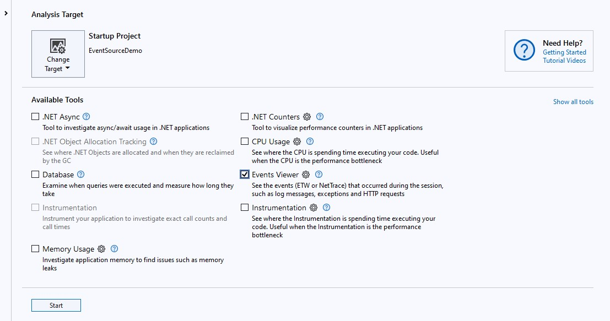
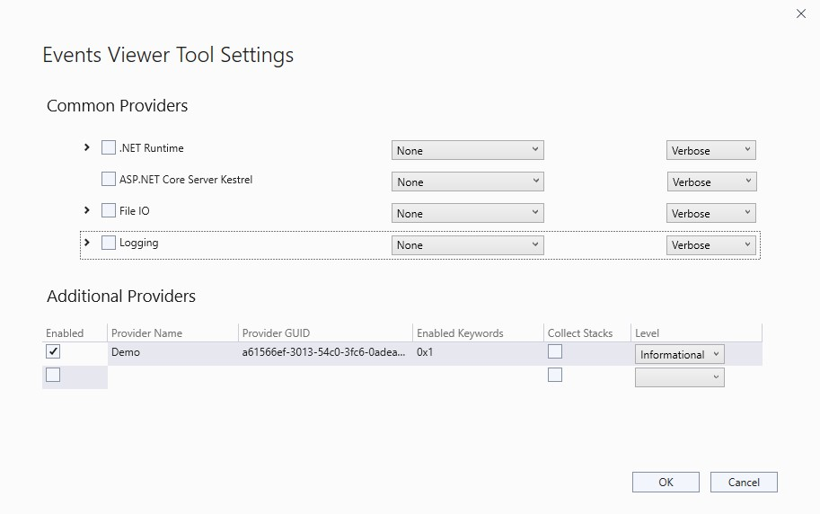
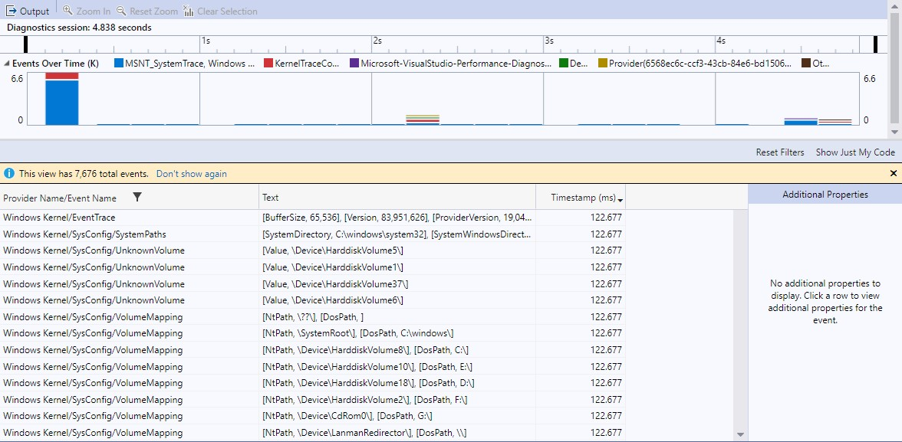
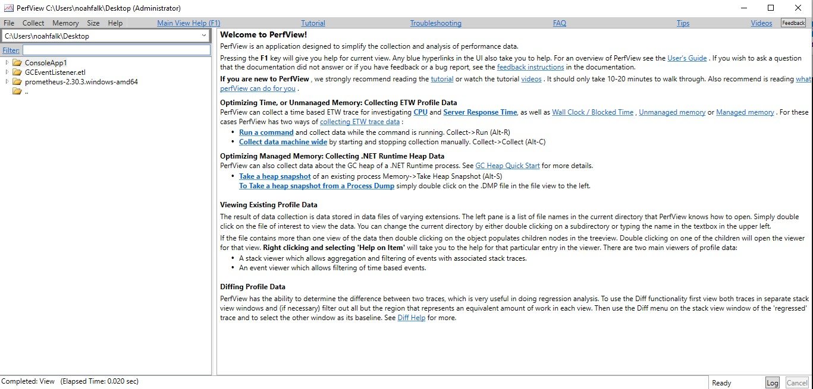
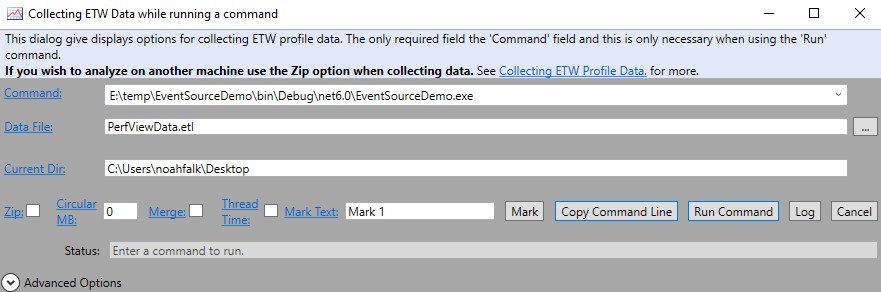
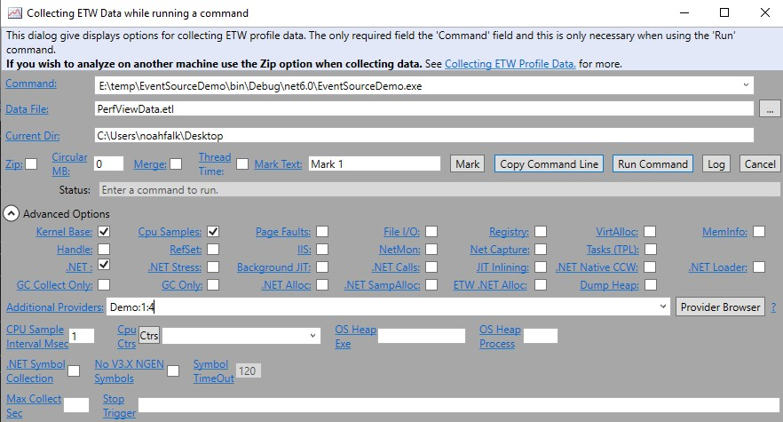
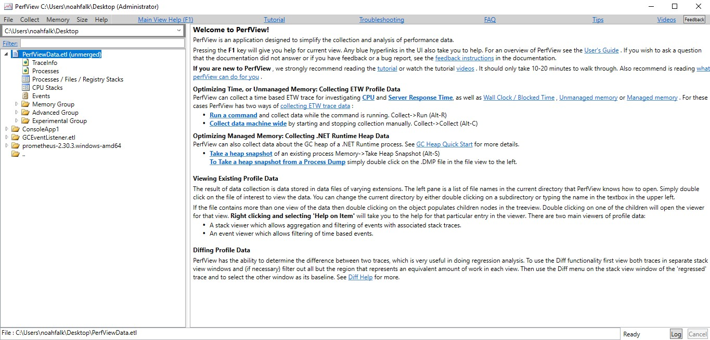
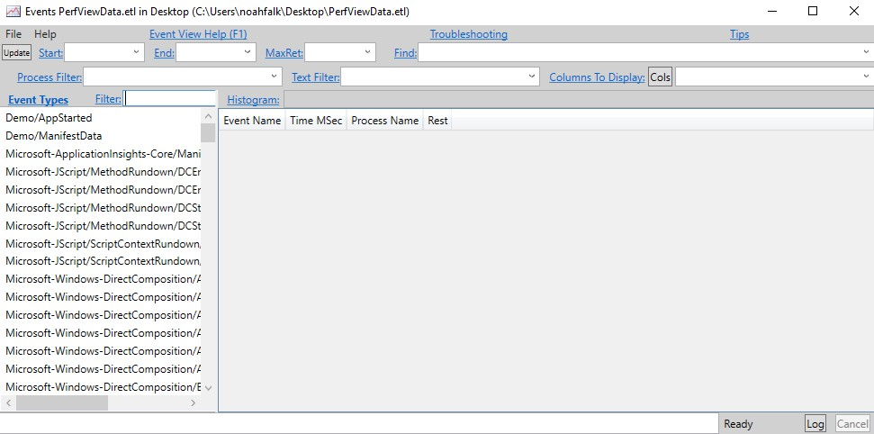
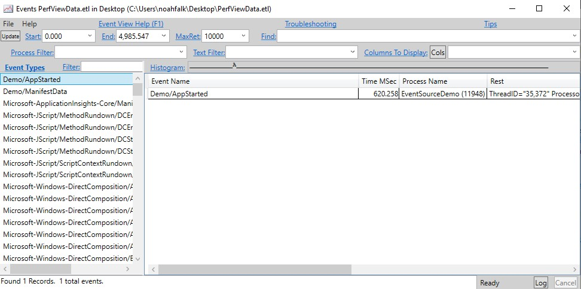

# Collect and View EventSource Traces

**This article applies to: ✔️** .NET Core 3.1 and later versions **✔️** .NET Framework 4.5 and later versions

The [Getting started guide](./eventsource-getting-started.md) showed you how to create a minimal EventSource and collect events in a trace file.
This tutorial shows how different tools can configure which events are collected in a trace and then view the traces.

## Example app

You'll use the following sample app that generates events for this tutorial. Compile a .NET console application containing the following code:

```C#
using System.Diagnostics.Tracing;

namespace EventSourceDemo
{
    public static class Program
    {
        public static void Main(string[] args)
        {
            DemoEventSource.Log.AppStarted("Hello World!", 12);
            DemoEventSource.Log.DebugMessage("Got here");
            DemoEventSource.Log.DebugMessage("finishing startup");
            DemoEventSource.Log.RequestStart(3);
            DemoEventSource.Log.RequestStop(3);
        }
    }

    [EventSource(Name = "Demo")]
    class DemoEventSource : EventSource
    {
        public static DemoEventSource Log { get; } = new DemoEventSource();

        [Event(1, Keywords = Keywords.Startup)]
        public void AppStarted(string message, int favoriteNumber) => WriteEvent(1, message, favoriteNumber);
        [Event(2, Keywords = Keywords.Requests)]
        public void RequestStart(int requestId) => WriteEvent(2, requestId);
        [Event(3, Keywords = Keywords.Requests)]
        public void RequestStop(int requestId) => WriteEvent(3, requestId);
        [Event(4, Keywords = Keywords.Startup, Level = EventLevel.Verbose)]
        public void DebugMessage(string message) => WriteEvent(4, message);


        public class Keywords
        {
            public const EventKeywords Startup = (EventKeywords)0x0001;
            public const EventKeywords Requests = (EventKeywords)0x0002;
        }
    }
}
```

## Configure which events to collect

Most event collection tools use these configuration options to decide which events should be included in a trace:

- Provider names - This is a list of one or more EventSource names. Only events that are defined on EventSources
  in this list are eligible to be included. To collect events from the DemoEventSource class in the preceding example app, you would need to include the EventSource name "Demo" in the list of provider names.
- Event verbosity level - For each provider you can define a verbosity level and events with
  [verbosity](./eventsource-instrumentation.md#setting-event-verbosity-levels) higher than that level will be excluded
  from the trace. If you specified that the "Demo" provider in the preceding example app should collect at the Informational verbosity level, then the DebugMessage event would be excluded because it has a higher level. Specifying
  <xref:System.Diagnostics.Tracing.EventLevel> LogAlways(0) is a special case that indicates that events of any
  verbosity level should be included.
- Event keywords - For each provider you can define a set of keywords and only events tagged with at least one of
  the keywords will be included. In the example app above if you specified the Startup keyword then only the
  AppStarted and DebugMessage events would be included. If no keywords are specified this is a special
  case and means that events with any keyword should be included.

### Conventions for describing provider configuration

Although each tool determines its own user interface for setting the trace configuration, there's a common convention
many tools use when specifying the configuration as a text string. The list of providers is specified as a semi-colon
delimited list, and each provider element in the list consists of name, keywords, and level separated by colons. For example,
"Demo:3:5" identifies the EventSource named "Demo" with the keyword bitmask 3 (the `Startup` bit and the `Requests` bit) and
<xref:System.Diagnostics.Tracing.EventLevel> 5, which is `Verbose`. Many tools also let you omit the level and keywords
if no level or keyword filtering is desired. For example, "Demo::5" only does level-based filtering, "Demo:3" only does
keyword-based filtering, and "Demo" does no keyword or level filtering.

## Visual Studio

The [Visual Studio profiler](/visualstudio/profiling) supports both collecting and viewing traces. It also can view traces
that have been collected in advance by other tools, such as [dotnet-trace](./dotnet-trace.md).

### Collect a trace

Most of Visual Studio's profiling tools use predefined sets of events that serve a particular purpose, such as analyzing CPU usage or allocations. To
collect a trace with customized events, you'll use the [Events Viewer](/visualstudio/profiling/events-viewer) tool.

1. To open the Performance Profiler in Visual Studio, select <kbd>Alt</kbd>+<kbd>F2</kbd>.

2. Select the **Events Viewer** check box.

   [](media/vs-events-viewer.jpg)

3. Select the small gear icon to the right of Events Viewer to open the configuration window.

   In the table below **Additional Providers**, add a row for each provider you wish to configure by
   clicking the **Enabled** checkbox, and then entering the provider name, keywords, and level. You don't need to enter the provider GUID; it's computed automatically.

   [](media/vs-events-viewer-settings.jpg)

4. Select **OK** to confirm the configuration settings.

5. Select **Start** to begin running the app and collecting logs.

6. Select **Stop Collection** or exit the app to stop collecting logs and show the collected data.

### View a trace

Visual Studio can view traces it collected itself, or it can view traces collected in other tools. To view traces from other
tools, use **File** > **Open** and select a trace file in the file picker. Visual Studio profiler supports *.etl* files (ETW's standard format),
*.nettrace* files (EventPipe's standard format), and *.diagsession* files (Visual Studio's standard format). For information about
working with trace files in Visual Studio, see the
[Visual Studio documentation](/visualstudio/profiling/events-viewer#understand-your-data).

[](media/vs-etw-events.jpg)

> [!NOTE]
> Visual Studio collects some events automatically from ETW or EventPipe, even if they weren't explicitly configured. If you see events
> you don't recognize in the Provider Name or Event Name column and want to filter them out, use the filter icon to the right to select
> only the events you want to view.

## PerfView

PerfView is a performance tool created by the .NET team that can collect and view ETW traces. It can also view trace files collected by other
tools in various formats. In this tutorial, you'll collect an ETW trace of the [demo app](#example-app) and then examine the collected
events in PerfView's event viewer.

### Collect a trace

1. Download PerfView from the [releases page](https://github.com/Microsoft/perfview/releases). This tutorial was done with
[PerfView version 2.0.76](https://github.com/microsoft/perfview/releases/tag/P2.0.76), but any recent version should work.

1. Start PerfView.exe with administrator permissions.

   > [!NOTE]
   > ETW trace collection always requires administrator permissions, however if you are only using PerfView to view a pre-existing
   > trace, then no special permissions are needed.

   [](media/perfview-main-window.jpg)

1. From the **Collect** menu, select **Run**. This opens a new dialog where you'll enter the path to the [demo app](#example-app).

   [](media/perfview-run-dialog.jpg)

1. To configure which events get collected, expand **Advanced Options** at the bottom of the dialog. In the **Additional Providers** text
box, enter providers using the [conventional text format](#conventions-for-describing-provider-configuration) described previously. In
this case, you're entering "Demo:1:4", which means keyword bit 1 (`Startup` events) and verbosity 4 (`Informational`).

   [](media/perfview-run-dialog-advanced.jpg)

1. To launch the app and begin collecting the trace, select the **Run Command** button. When the app exits, the trace *PerfViewData.etl*
is saved in the current directory.

### View a trace

1. In the main window drop-down text box at the upper left, select the directory containing the trace file. Then double click the trace file
in the tree view below.

   [](media/perfview-main-window-select-trace.jpg)

1. To bring up the Events viewer, double click the **Events** item that appears in the tree view below the trace file.

   [](media/perfview-events-viewer.jpg)

1. All event types in the trace are shown in the list at the left. Double click an event type, such as Demo\AppStarted, to show all events
of that type in the table on the right.

   [](media/perfview-events-viewer-appstarted.jpg)

### Learn more

To learn more about using PerfView, see the [PerfView video tutorials](/shows/PerfView-Tutorial/).

## dotnet-trace

[dotnet-trace](./dotnet-trace.md) is a cross-platform command-line tool that can collect traces from .NET Core apps using
[EventPipe](./eventpipe.md) tracing. It doesn't support viewing trace data, but the traces it collects can be viewed by other tools such
as [PerfView](#perfview) or [Visual Studio](#visual-studio). dotnet-trace also supports converting its default *.nettrace* format traces
into other formats, such as Chromium or [Speedscope](https://www.speedscope.app/).

### Collect a trace

1. Download and Install [dotnet-trace](./dotnet-trace.md#install).

2. At the command line, run the [dotnet-trace collect](./dotnet-trace.md#dotnet-trace-collect) command:

   ```dotnetcli
   E:\temp\EventSourceDemo\bin\Debug\net6.0>dotnet-trace collect --providers Demo:1:4 -- EventSourceDemo.exe
   ```

   This should show output similar to:

   ```dotnetcli
   E:\temp\EventSourceDemo\bin\Debug\net6.0> dotnet-trace collect --providers Demo:1:4 -- EventSourceDemo.exe

   Provider Name                           Keywords            Level               Enabled By
   Demo                                    0x0000000000000001  Informational(4)    --providers

   Launching: EventSourceDemo.exe
   Process        : E:\temp\EventSourceDemo\bin\Debug\net6.0\EventSourceDemo.exe
   Output File    : E:\temp\EventSourceDemo\bin\Debug\net6.0\EventSourceDemo.exe_20220317_021512.nettrace

   [00:00:00:00]   Recording trace 0.00     (B)
   Press <Enter> or <Ctrl+C> to exit...

   Trace completed.
   ```

   dotnet-trace uses the [conventional text format](#conventions-for-describing-provider-configuration) for describing provider configuration in
   the `--providers` argument. For more options on how to take traces using dotnet-trace, see the
   [dotnet-trace docs](./dotnet-trace.md#collect-a-trace-with-dotnet-trace).

## EventListener

<xref:System.Diagnostics.Tracing.EventListener?displayProperty=nameWithType> is an .NET API that can be used from in-process
to receive callbacks for events generated by an <xref:System.Diagnostics.Tracing.EventSource?displayProperty=nameWithType>.
This API can be used to create custom logging tools or to analyze the events in memory without ever serializing them.

To use `EventListener`, declare a type that derives from `EventListener`, invoke <xref:System.Diagnostics.Tracing.EventListener.EnableEvents%2A> to
subscribe to the events from any EventSource of interest, and override the <xref:System.Diagnostics.Tracing.EventListener.OnEventWritten%2A>,
which will be called whenever a new event is available. It's often useful to override
<xref:System.Diagnostics.Tracing.EventListener.OnEventSourceCreated%2A> to discover which EventSource objects exist, but
this isn't required. Following is an example `EventListener` implementation that prints to console when messages are received:

1. Add this code to the [demo app](#example-app).

   ```C#
   class ConsoleWriterEventListener : EventListener
   {
       protected override void OnEventSourceCreated(EventSource eventSource)
       {
           if(eventSource.Name == "Demo")
           {
               EnableEvents(eventSource, EventLevel.Informational);
           }
       }

       protected override void OnEventWritten(EventWrittenEventArgs eventData)
       {
           Console.WriteLine(eventData.TimeStamp + " " + eventData.EventName);
       }
   }
   ```

1. Modify the `Main` method to create an instance of the new listener.

   ```C#
   public static void Main(string[] args)
   {
       ConsoleWriterEventListener listener = new ConsoleWriterEventListener();

       DemoEventSource.Log.AppStarted("Hello World!", 12);
       DemoEventSource.Log.DebugMessage("Got here");
       DemoEventSource.Log.DebugMessage("finishing startup");
       DemoEventSource.Log.RequestStart(3);
       DemoEventSource.Log.RequestStop(3);
   }
   ```

1. Build and run the app. Previously, it had no output, but now it writes the events to the console:

   ```
   3/24/2022 9:23:35 AM AppStarted
   3/24/2022 9:23:35 AM RequestStart
   3/24/2022 9:23:35 AM RequestStop
   ```
