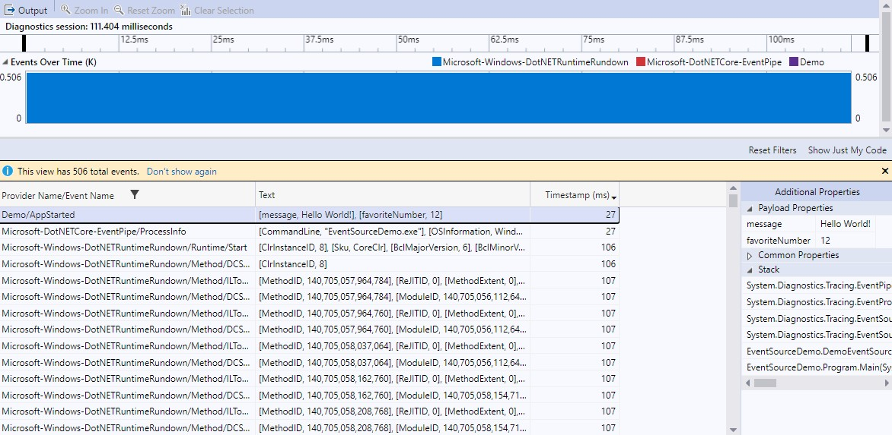

# Getting Started with EventSource

**This article applies to: ✔️** .NET Core 3.1 and later versions **✔️** .NET Framework 4.5 and later versions

This walkthrough shows how to log a new event with <xref:System.Diagnostics.Tracing.EventSource?displayProperty=nameWithType>,
collect events in a trace file, view the trace, and understand basic EventSource concepts.

> [!NOTE]
> Many technologies that integrate with EventSource use the terms 'Tracing' and 'Traces' instead of 'Logging' and 'Logs'.
> The meaning is the same here.

## Log an event

The goal of EventSource is to allow .NET developers to write code like this to log an event:

```
DemoEventSource.Log.AppStarted("Hello World!", 12);
```

This line of code has a logging object (`DemoEventSource.Log`), a method representing the event to log (`AppStarted`), and
optionally some strongly typed event parameters (`HelloWorld!` and `12`). There are no verbosity levels, event IDs, message
templates, or anything else that doesn't need to be at the call site. All of this other information about events is written
by defining a new class derived from <xref:System.Diagnostics.Tracing.EventSource?displayProperty=nameWithType>.

Here's a complete minimal example:

```C#
using System.Diagnostics.Tracing;

namespace EventSourceDemo
{
    public static class Program
    {
        public static void Main(string[] args)
        {
            DemoEventSource.Log.AppStarted("Hello World!", 12);
        }
    }

    [EventSource(Name = "Demo")]
    class DemoEventSource : EventSource
    {
        public static DemoEventSource Log { get; } = new DemoEventSource();

        [Event(1)]
        public void AppStarted(string message, int favoriteNumber) => WriteEvent(1, message, favoriteNumber);
    }
}
```

The DemoEventSource class declares a method for each type of event that you wish to log. In this case, a single event called 'AppStarted' is defined
by the AppStarted() method. Each time the code invokes the AppStarted method another AppStarted event will be recorded in the trace if the event is enabled.
This is some of the data that can be captured with each event:

- Event name - A name that identifies the kind of event that was logged. The event name will be identical to the method name, 'AppStarted' in this case.
- Event ID - A numerical ID that identifies the kind of event that was logged. This serves a similar role to the name but can assist in fast automated
  log processing. The AppStarted event has an ID of 1, specified in the <xref:System.Diagnostics.Tracing.EventAttribute>.
- Source name - The name of the EventSource that contains the event. This is used as a namespace for events. Event names and IDs only need to
  be unique within the scope of their source. Here the source is named "Demo", specified in the
  <xref:System.Diagnostics.Tracing.EventSourceAttribute> on the class definition. The source name is also commonly referred to as a provider name.
- Arguments - All the method argument values are serialized.
- Other information - Events can also contain timestamps, thread IDs, processor IDs, [Activity IDs](./eventsource-activity-ids.md), stack traces, and event
  metadata such as message templates, verbosity levels, and keywords.

For more information and best practices on creating events, see [Instrumenting code to create events](./eventsource-instrumentation.md).

## Collect and view a trace file

There's no required configuration in code that describes which events should be enabled, where the logged data should be sent,
or what format the data should be stored in. If you run the app now, it won't produce any trace file by default. EventSource uses the
[Publish-subscribe pattern](https://en.wikipedia.org/wiki/Publish%E2%80%93subscribe_pattern), which requires subscribers to indicate the events
that should be enabled and to control all serialization for the subscribed events. EventSource has integrations for subscribing from
[Event Tracing for Windows (ETW)](/windows/win32/etw/event-tracing-portal) and [EventPipe](./eventpipe.md) (.NET Core only).
Custom subscribers can also be created using the <xref:System.Diagnostics.Tracing.EventListener?displayProperty=nameWithType> API.

This demo shows an [EventPipe](./eventpipe.md) example for .NET Core apps. To learn about more options see
[Collecting and viewing event traces](./eventsource-collect-and-view-traces.md). [EventPipe](./eventpipe.md) is an open and cross-platform tracing
technology built into the .NET Core runtime to give .NET developers trace collection tools and a portable compact trace
format (*.nettrace files). [dotnet-trace](./dotnet-trace.md) is a command-line tool that collects EventPipe traces.

1. Download and Install [dotnet-trace](./dotnet-trace.md#install)
1. Build the console app above. This demo assumes the app is named EventSourceDemo.exe and it is in the current directory. At the command-line run:

```dotnetcli
>dotnet-trace collect --providers Demo -- EventSourceDemo.exe
```

This should show output similar to:

```dotnetcli
Provider Name                           Keywords            Level               Enabled By
Demo                                    0xFFFFFFFFFFFFFFFF  Verbose(5)          --providers

Launching: EventSourceDemo.exe
Process        : E:\temp\EventSourceDemo\bin\Debug\net6.0\EventSourceDemo.exe
Output File    : E:\temp\EventSourceDemo\bin\Debug\net6.0\EventSourceDemo.exe_20220303_001619.nettrace

[00:00:00:00]   Recording trace 0.00     (B)
Press <Enter> or <Ctrl+C> to exit...

Trace completed.
```

This command ran EventSourceDemo.exe with all events in the 'Demo' EventSource enabled and output the trace file `EventSourceDemo.exe_20220303_001619.nettrace`.
Opening the file in Visual Studio shows the events that were logged.

[](media/vs-nettrace-events.jpg)

In the list view, you can see the first event is the Demo/AppStarted event. The text column has the saved arguments, the timestamp column shows the event
occurred 27 ms after logging started and to the right you can see the callstack. The other events are automatically enabled in every trace collected by
dotnet-trace though they can be ignored and filtered from view in the UI if they're distracting. Those extra events capture some information about the
process and jitted code, which allows Visual Studio to reconstruct the event stack traces.

## Learning more about EventSource

- [Instrumenting code to create events](./eventsource-instrumentation.md)
- [Collecting and viewing event traces](./eventsource-collect-and-view-traces.md)
