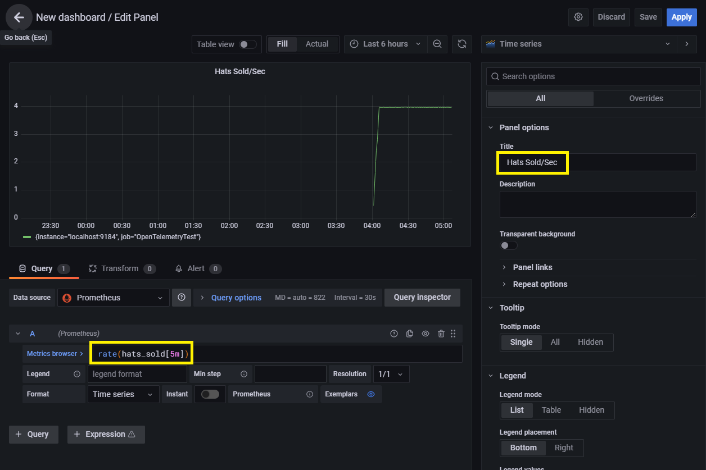
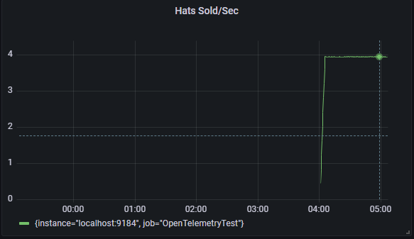

# Collect metrics

**This article applies to: ✔️** .NET Core 3.1 and later versions **✔️** .NET Framework 4.6.1 and later versions

Instrumented code can record numeric measurements, but the measurements usually need to be aggregated, transmitted,
and stored to create useful metrics for monitoring. This process of aggregating, transmitting, and storing the data is
called collection. In this tutorial, we will show several examples on how to collect metrics:

- Populating metrics in Grafana with OpenTelemetry and Prometheus.
- Viewing metrics in real time with the `dotnet-counters` command-line tool.
- Creating a custom collection tool using the underlying .NET <xref:System.Diagnostics.Metrics.MeterListener> API.

For more information about custom metric instrumentation and an overview of instrumentation options, see [Compare metric APIs](compare-metric-apis.md).

## Create an example application

**Prerequisites**: [.NET Core 3.1 SDK](https://dotnet.microsoft.com/download/dotnet) or a later version

Before metrics can be collected, we need to produce some measurements. For simplicity, we will create a small app that has
some trivial metric instrumentation. The .NET runtime also has [various metrics built-in](available-counters.md). For more information about creating new metrics using the
<xref:System.Diagnostics.Metrics.Meter?displayProperty=nameWithType> API shown here, see
[the instrumentation tutorial](metrics-instrumentation.md).

```dotnetcli
dotnet new console
dotnet add package System.Diagnostics.DiagnosticSource
```

Replace the code of `Program.cs` with:

```C#
using System;
using System.Diagnostics.Metrics;
using System.Threading;

class Program
{
    static Meter s_meter = new Meter("HatCo.HatStore", "1.0.0");
    static Counter<int> s_hatsSold = s_meter.CreateCounter<int>("hats-sold");

    static void Main(string[] args)
    {
        Console.WriteLine("Press any key to exit");
        while(!Console.KeyAvailable)
        {
            // Pretend our store has a transaction each second that sells 4 hats
            Thread.Sleep(1000);
            s_hatsSold.Add(4);
        }
    }
}
```

## View metrics with dotnet-counters

[dotnet-counters](dotnet-counters.md) is a simple command-line tool that can view live metrics for any .NET Core application on
demand. It doesn't require any advance setup, which can make it useful for ad-hoc investigations or to verify that metric
instrumentation is working correctly. It works with both <xref:System.Diagnostics.Metrics?displayProperty=nameWithType> based
APIs and [EventCounters](event-counters.md).

If the [dotnet-counters](dotnet-counters.md) tool is not already installed, use the SDK to install it:

```dotnetcli
> dotnet tool update -g dotnet-counters
You can invoke the tool using the following command: dotnet-counters
Tool 'dotnet-counters' (version '5.0.251802') was successfully installed.
```

While the example app is still running, list the running processes in a second shell to determine the process ID:

```dotnetcli
> dotnet-counters ps
     10180 dotnet     C:\Program Files\dotnet\dotnet.exe
     19964 metric-instr E:\temp\metric-instr\bin\Debug\netcoreapp3.1\metric-instr.exe
```

Find the ID for the process name that matches the example app and have dotnet-counters monitor all metrics from the
"HatCo.HatStore" meter. The meter name is case-sensitive.

```dotnetcli
> dotnet-counters monitor -p 19964 HatCo.HatStore
Press p to pause, r to resume, q to quit.
    Status: Running

[HatCo.HatStore]
    hats-sold (Count / 1 sec)                          4
```

We can also run dotnet-counters specifying a different set of metrics to see some of the built-in instrumentation
from the .NET runtime:

```dotnetcli
> dotnet-counters monitor -p 19964 System.Runtime
Press p to pause, r to resume, q to quit.
    Status: Running

[System.Runtime]
    % Time in GC since last GC (%)                                 0
    Allocation Rate (B / 1 sec)                                8,168
    CPU Usage (%)                                                  0
    Exception Count (Count / 1 sec)                                0
    GC Heap Size (MB)                                              2
    Gen 0 GC Count (Count / 1 sec)                                 0
    Gen 0 Size (B)                                         2,216,256
    Gen 1 GC Count (Count / 1 sec)                                 0
    Gen 1 Size (B)                                           423,392
    Gen 2 GC Count (Count / 1 sec)                                 0
    Gen 2 Size (B)                                           203,248
    LOH Size (B)                                             933,216
    Monitor Lock Contention Count (Count / 1 sec)                  0
    Number of Active Timers                                        1
    Number of Assemblies Loaded                                   39
    ThreadPool Completed Work Item Count (Count / 1 sec)           0
    ThreadPool Queue Length                                        0
    ThreadPool Thread Count                                        3
    Working Set (MB)                                              30
```

For more information about the tool, see the [dotnet-counters](dotnet-counters.md).
To learn more about metrics that are available out of the box in .NET, see [built-in metrics](available-counters.md).

## View metrics in Grafana with OpenTelemetry and Prometheus

### Prerequisites

- [.NET Core 3.1 SDK](https://dotnet.microsoft.com/download/dotnet) or a later version

### Overview

[OpenTelemetry](https://opentelemetry.io/) is a vendor-neutral open-source project supported by the
[Cloud Native Computing Foundation](https://www.cncf.io/) that aims to standardize generating and collecting telemetry for
cloud-native software. The built-in platform metric APIs are designed to be compatible with this
standard to make integration straightforward for any .NET developers that wish to use it. At the time of writing, support for
OpenTelemetry metrics is relatively new, but [Azure Monitor](/azure/azure-monitor/app/opentelemetry-overview)
and many major APM vendors have endorsed it and have integration plans underway.

This example shows one of the integrations available now for OpenTelemetry metrics using the popular OSS
[Prometheus](https://prometheus.io/) and [Grafana](https://grafana.com/) projects. The metrics data will flow like this:

1. The .NET metric APIs collect measurements from our example application.
2. The OpenTelemetry library running inside the same process aggregates these measurements.
3. The Prometheus exporter library makes the aggregated data available via an HTTP
metrics endpoint. 'Exporter' is what OpenTelemetry calls the libraries that transmit
telemetry to vendor-specific backends.
4. A Prometheus server, potentially running on a different machine, polls the
metrics endpoint, reads the data, and stores it in a database for long-term persistence.
Prometheus refers to this as 'scraping' an endpoint.
5. The Grafana server, potentially running on a different machine, queries the data
stored in Prometheus and displays it to engineers on a web-based monitoring dashboard.

### Configure the example application to use OpenTelemetry's Prometheus exporter

Add a reference to the OpenTelemetry Prometheus exporter to the example application:

```dotnetcli
dotnet add package OpenTelemetry.Exporter.Prometheus --version 1.2.0-beta1
```

> [!NOTE]
> The Promethus exporter library includes a reference to OpenTelemetry's shared library so this command implicitly adds both libraries
> to the application.

> [!NOTE]
> This tutorial is using a pre-release build of OpenTelemetry's Prometheus support available at the time of writing. The OpenTelemetry
> project maintainers might make changes prior to the official release.

Modify the code of `Program.cs` so that it contains the extra code to configure OpenTelemetry at the beginning of Main():

```C#
using System;
using System.Diagnostics.Metrics;
using System.Threading;
using OpenTelemetry;
using OpenTelemetry.Metrics;

class Program
{
    static Meter s_meter = new Meter("HatCo.HatStore", "1.0.0");
    static Counter<int> s_hatsSold = s_meter.CreateCounter<int>(name: "hats-sold",
                                                                unit: "Hats",
                                                                description: "The number of hats sold in our store");

    static void Main(string[] args)
    {
        using MeterProvider meterProvider = Sdk.CreateMeterProviderBuilder()
                .AddMeter("HatCo.HatStore")
                .AddPrometheusExporter(opt =>
                {
                    opt.StartHttpListener = true;
                    opt.HttpListenerPrefixes = new string[] { $"http://localhost:9184/" };
                })
                .Build();

        Console.WriteLine("Press any key to exit");
        while(!Console.KeyAvailable)
        {
            // Pretend our store has a transaction each second that sells 4 hats
            Thread.Sleep(1000);
            s_hatsSold.Add(4);
        }
    }
}
```

`AddMeter("HatCo.HatStore")` configures OpenTelemetry to transmit all the metrics collected by the Meter our app defined.
`AddPrometheusExporter(...)` configures OpenTelemetry to expose Prometheus' metrics endpoint on port 9184 and to use
the HttpListener. See the [OpenTelemetry documentation](https://github.com/open-telemetry/opentelemetry-dotnet/tree/main/src/OpenTelemetry.Exporter.Prometheus)
for more information about OpenTelemetry configuration options, in particular, alternative hosting options that are useful for ASP.NET applications.

> [!NOTE]
> At the time of writing OpenTelemetry only supports metrics emitted using the <xref:System.Diagnostics.Metrics?displayProperty=nameWithType>
> APIs; however, support for [EventCounters](event-counters.md) is planned.

Run the example app and leave it running in the background.

```dotnetcli
> dotnet run
Press any key to exit
```

### Set up and configure Prometheus

Follow the [Prometheus first steps](https://prometheus.io/docs/introduction/first_steps/) to set up your Prometheus server
and confirm it is working.

Modify the *prometheus.yml* configuration file so that Prometheus will scrape the metrics endpoint that our example app is
exposing. Add this text in the `scrape_configs` section:

```yaml
  - job_name: 'OpenTelemetryTest'
    scrape_interval: 1s # poll very quickly for a more responsive demo
    static_configs:
      - targets: ['localhost:9184']
```

If you are starting from the default configuration, then `scrape_configs` should now look like this:

```yaml
scrape_configs:
  # The job name is added as a label `job=<job_name>` to any timeseries scraped from this config.
  - job_name: "prometheus"

    # metrics_path defaults to '/metrics'
    # scheme defaults to 'http'.

    static_configs:
      - targets: ["localhost:9090"]

  - job_name: 'OpenTelemetryTest'
    scrape_interval: 1s # poll very quickly for a more responsive demo
    static_configs:
      - targets: ['localhost:9184']
```

Reload the configuration or restart the Prometheus server, then confirm that OpenTelemetryTest is in the UP
state in the **Status** > **Targets** page of the Prometheus web portal.

On the Graph page of the Prometheus web portal, enter `hats_sold` in the expression text box. In the graph tab, Prometheus should
show the steadily increasing value of the "hats-sold" Counter that is being emitted by our example application.

[](media/prometheus-hat-sold-metric.png)

If the Prometheus server hasn't been scraping the example app for long, you may need to wait a short while for data to accumulate.
You can also adjust the time range control in the upper left to "1m" (1 minute) to get a better view of very recent data.

### Show metrics on a Grafana dashboard

1. Follow [the standard instructions](https://prometheus.io/docs/visualization/grafana/#creating-a-prometheus-graph) to install Grafana and
connect it to a Prometheus data source.

2. Create a Grafana dashboard by clicking the **+** icon on the left toolbar in the Grafana web portal, then select **Dashboard**. In the dashboard
editor that appears, enter 'Hats Sold/Sec' as the Title and 'rate(hats_sold[5m])' in the PromQL expression field. It should look like this:

   [](media/grafana-hats-sold-dashboard-editor.png)

3. Click **Apply** to save and view the simple new dashboard.

   [](media/grafana-hats-sold-dashboard.png)

## Create a custom collection tool using the .NET <xref:System.Diagnostics.Metrics.MeterListener> API

The .NET <xref:System.Diagnostics.Metrics.MeterListener> API allows creating custom in-process logic to observe the measurements
being recorded by <xref:System.Diagnostics.Metrics.Meter?displayProperty=nameWithType>. For guidance creating custom
logic compatible with the older EventCounters instrumentation, see [EventCounters](event-counters.md).

Modify the code of `Program.cs` to use <xref:System.Diagnostics.Metrics.MeterListener> like this:

```C#
using System;
using System.Collections.Generic;
using System.Diagnostics.Metrics;
using System.Threading;

class Program
{
    static Meter s_meter = new Meter("HatCo.HatStore", "1.0.0");
    static Counter<int> s_hatsSold = s_meter.CreateCounter<int>(name: "hats-sold",
                                                                unit: "Hats",
                                                                description: "The number of hats sold in our store");

    static void Main(string[] args)
    {
        using MeterListener meterListener = new MeterListener();
        meterListener.InstrumentPublished = (instrument, listener) =>
        {
            if(instrument.Meter.Name == "HatCo.HatStore")
            {
                listener.EnableMeasurementEvents(instrument);
            }
        };
        meterListener.SetMeasurementEventCallback<int>(OnMeasurementRecorded);
        meterListener.Start();

        Console.WriteLine("Press any key to exit");
        while(!Console.KeyAvailable)
        {
            // Pretend our store has a transaction each second that sells 4 hats
            Thread.Sleep(1000);
            s_hatsSold.Add(4);
        }
    }

    static void OnMeasurementRecorded<T>(Instrument instrument, T measurement, ReadOnlySpan<KeyValuePair<string,object>> tags, object state)
    {
        Console.WriteLine($"{instrument.Name} recorded measurement {measurement}");
    }
}
```

When run, the application now runs our custom callback on each measurement:

```dotnetcli
> dotnet run
Press any key to exit
hats-sold recorded measurement 4
hats-sold recorded measurement 4
hats-sold recorded measurement 4
hats-sold recorded measurement 4
...
```

Let's break down what happens in the example above.

```C#
using MeterListener meterListener = new MeterListener();
```

First we created an instance of the <xref:System.Diagnostics.Metrics.MeterListener>, which we will use to receive measurements.

```C#
meterListener.InstrumentPublished = (instrument, listener) =>
{
    if(instrument.Meter.Name == "HatCo.HatStore")
    {
        listener.EnableMeasurementEvents(instrument);
    }
};
```

Here we configured which instruments the listener will receive measurements from.
<xref:System.Diagnostics.Metrics.MeterListener.InstrumentPublished> is a delegate that will be invoked anytime a new
instrument is created within the app. Our delegate can examine the instrument, such as checking the name, the Meter, or any other
public property to decide whether to subscribe. If we do want to receive measurements from this instrument, then we invoke
<xref:System.Diagnostics.Metrics.MeterListener.EnableMeasurementEvents%2A> to indicate that. If your code has another way
to obtain a reference to an instrument, it's legal to invoke `EnableMeasurementEvents()` at any time with that reference, but this is
probably uncommon.

```C#
meterListener.SetMeasurementEventCallback<int>(OnMeasurementRecorded);
...
static void OnMeasurementRecorded<T>(Instrument instrument, T measurement, ReadOnlySpan<KeyValuePair<string,object>> tags, object state)
{
    Console.WriteLine($"{instrument.Name} recorded measurement {measurement}");
}
```

Next we configured the delegate that is invoked when measurements are received from an instrument by calling
<xref:System.Diagnostics.Metrics.MeterListener.SetMeasurementEventCallback%2A>. The generic parameter controls which data type
of measurement will be received by the callback. For example, a `Counter<int>` generates `int` measurements whereas a
`Counter<double>` generates `double` measurements. Instruments can be created with `byte`, `short`, `int`, `long`,
`float`, `double`, and `decimal` types. We recommend registering a callback for every data type unless you have scenario-specific knowledge that not all data types will be needed, such as in this example. Making repeated calls to
SetMeasurementEventCallback() with different generic arguments may appear a little unusual. The API is designed this way
to allow MeterListeners to receive measurements with extremely low performance overhead, typically just a few nanoseconds.

When MeterListener.EnableMeasurementEvents() was called initially, there was an opportunity to provide a `state` object as
one of the parameters. That object can be anything you want. If you provide a state object in that call, then it will be
stored with that instrument and returned to you as the `state` parameter in the callback. This is intended both as a
convenience and as a performance optimization. Often listeners need to create an object for each instrument that will
store measurements in memory and have code to do calculations on those measurements. Although you could create a Dictionary
that maps from the instrument to the storage object and look it up on every measurement, that would be much slower than
accessing it from `state`.

```C#
meterListener.Start();
```

Once the `MeterListener` is configured, we need to start it to trigger callbacks to begin. The `InstrumentPublished`
delegate will be invoked for every pre-existing Instrument in the process. In the future, any newly created Instrument
will also trigger `InstrumentPublished` to be invoked.

```C#
using MeterListener meterListener = new MeterListener();
```

Once we are done listening, disposing the listener stops the flow of callbacks and releases any internal references
to the listener object. The `using` keyword we used when declaring `meterListener` causes Dispose() to be called automatically
when the variable goes out of scope. Be aware that `Dispose()` is only promising that it won't initiate new callbacks. Because callbacks
occur on different threads, there may still be callbacks in progress after the call to `Dispose()` returns. If you need a
guarantee that a certain region of code in your callback isn't currently executing and will never execute again in the future,
then you will need some additional thread synchronization to enforce that. `Dispose()` doesn't include the synchronization
by default because it adds performance overhead in every measurement callback&mdash;and `MeterListener` is designed as a highly
performance conscious API.
