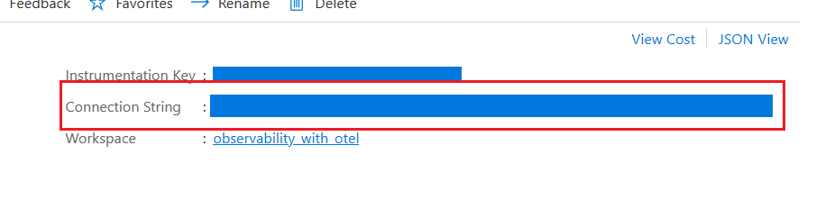

# Example: Use OpenTelemetry with Azure Monitor and Application Insights

There are many commercial Application Performance Management (APM) systems available to choose from. In Azure, the primary application-monitoring product is [Application Insights](/azure/azure-monitor/app/app-insights-overview?tabs=net), which is a part of Azure Monitor. One of the advantages of an integrated APM product is that it can correlate the different observability data sources. Application Insights has rich views and analysis capabilities.

## 1. Adding the Application Insights distro

To make the ASP.NET experience with Azure Monitor easier, a wrapper package (called a Distro in OTel parlance) is provided that does most of the heavy lifting of configuring OpenTelemetry.

This example is based off the [OTLP walkthrough](./observability-otlp-example.md). Follow the steps 1-5 to create the application code using the OTLP exporter. In this example, we will extend the code to send data to Application Insights.

Take the same project from [Step 5](./observability-otlp-example.md#5-configure-opentelemetry-with-the-correct-providers) and add the following NuGet package:

``` xml
<ItemGroup>
  <PackageReference Include="Azure.Monitor.OpenTelemetry.AspNetCore" Version="1.3.0-beta.1" />
</ItemGroup>
```

> [!NOTE]
> Replace the version with the latest available

## 2. Setup the exporter

Add the following OTel initialization code before `builder.Build();`:

:::code language="csharp" source="snippets/OTLP-Example/csharp/Program.cs" id="Snippet_AzureMonitor":::

[`UseAzureMonitor()`](https://github.com/Azure/azure-sdk-for-net/blob/d51f02c6ef46f2c5d9b38a9d8974ed461cde9a81/sdk/monitor/Azure.Monitor.OpenTelemetry.AspNetCore/src/OpenTelemetryBuilderExtensions.cs#L80) is the magic that will add the common instrumentation libraries and exporters for Application Insights. You just need to add your custom `Meter` and `ActivitySource` names to the registration.

The same OTel initialization works for OTLP as for Application Insights, the difference is which exporters you select. You can use both in the same application, and select between them by defining the appropriate environment variables.

## 3. Specify the connection string

If you're not already an Azure customer, you can create a free account at [https://azure.microsoft.com/free/](https://azure.microsoft.com/free/). Log in to the Azure Portal, and either select an existing Application Insights resource or create a new one with [https://ms.portal.azure.com/#create/Microsoft.AppInsights](https://ms.portal.azure.com/#create/Microsoft.AppInsights).

Application Insights identifies which instance to use to store and process data through an instrumentation key and connection string that are found at the top right side of the portal UI.

[](./media/portal_ui.png#lightbox)

If you're using Azure App Service, this connection string is automatically passed to the application as an environment variable. For other services or when running locally, you need to pass it using the `APPLICATIONINSIGHTS_CONNECTION_STRING` environment variable or in _appsettings.json_. For running locally, it's easiest to add the value to _appsettings.development.json_:

```json
"AzureMonitor": {
    "ConnectionString": "InstrumentationKey=12345678-abcd-abcd-abcd-12345678..."
}
```

> [!Note]
> Replace the value with the one from your instance.

## 4. Examine your app in Application Insights

When you run the application, telemetry will be sent to Application Insights. You should now get logs, metrics, and distributed traces for your application. Open the Application Insights resource in the Azure Portal.

:::row:::
   :::column span="":::
   **Logs**

[](./media/azure-logs.png#lightbox)
   :::column-end:::
   :::column span="":::
   **Metrics**

[](./media/azure-metrics-graph.png#lightbox)
   :::column-end:::
   :::column span="":::
   **Distributed Tracing**

[](./media/azure-tracing.png#lightbox)
   :::column-end:::
:::row-end:::
