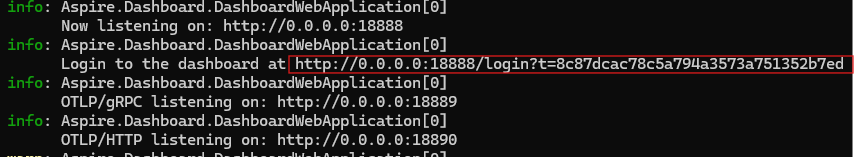
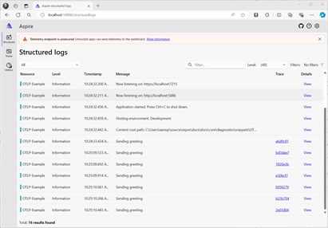
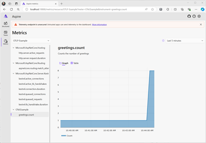
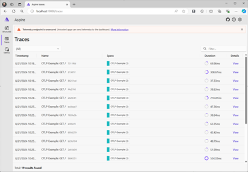
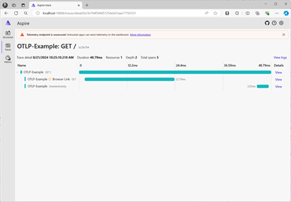

# Example: Use OpenTelemetry with OTLP and the standalone Aspire Dashboard

This article is one of a series of examples that illustrate [.NET observability with OpenTelemetry](./observability-with-otel.md).

The Aspire Dashboard is a standard part of Aspire, but it's also available as a [standalone Docker container](https://aspire.dev/dashboard/standalone/) that provides an OTLP endpoint for sending telemetry. The dashboard visualizes logs, metrics, and traces. Using the dashboard this way has no dependency on Aspire, and it visualizes telemetry from any app that sends telemetry via OTLP. It works equally well for apps written in Java, GoLang, or Python, provided they can send their telemetry to an OTLP endpoint.

The Aspire Dashboard requires less configuration and fewer setup steps than open-source solutions such as [Prometheus, Grafana, and Jaeger](./observability-prgrja-example.md). But unlike those tools, the Aspire Dashboard is a developer visualization tool, not a production monitoring tool.

## 1. Create the project

Create a simple web API project by using the **ASP.NET Core Empty** template in Visual Studio or the following .NET CLI command:

``` dotnetcli
dotnet new web
```

## 2. Reference the OpenTelemetry packages

To add the OpenTelemetry packages, use the NuGet Package Manager, or run the following `dotnet add package` commands:

``` dotnetcli
dotnet add package OpenTelemetry.Exporter.OpenTelemetryProtocol
dotnet add package OpenTelemetry.Extensions.Hosting
dotnet add package OpenTelemetry.Instrumentation.AspNetCore
dotnet add package OpenTelemetry.Instrumentation.Http
```

Alternatively, add the following `PackageReference` items directly to the project file:

:::code language="xml" source="snippets/observability-otlp-example/csharp/observability-otlp-example.csproj" id="PackageReferences":::

> [!NOTE]
> Because the OTel APIs are constantly evolving, use the latest versions.

## 3. Add using directives

Add the following `using` directives to the top of the file:

:::code language="csharp" source="snippets/observability-otlp-example/csharp/Program.cs" id="Usings":::

## 4. Add metrics and activity definitions

The following code defines a new metric (`greetings.count`) that counts how many times a client calls the API, and a new activity source (`Otel.Example`). Insert this code before `builder.Build`:

:::code language="csharp" source="snippets/observability-otlp-example/csharp/Program.cs" id="CustomMetrics":::

## 5. Configure OpenTelemetry with the correct providers

Insert the following code before `builder.Build`:

:::code language="csharp" source="snippets/observability-otlp-example/csharp/Program.cs" id="OTEL":::

This code sets up OpenTelemetry with the different sources of telemetry:

- It adds an OTel provider to `ILogger` to collect log records.
- It sets up metrics, registering instrumentation providers and meters for ASP.NET and the custom meter.
- It sets up tracing, registering instrumentation providers and the custom `ActivitySource`.

It then registers the OTLP exporter, using environment variables for its configuration.

## 6. Configure OTLP environment variables

You can configure the OTLP exporter through APIs in code, but environment variables are the more common approach. Add the following to `appsettings.Development.json`:

``` json
"OTEL_EXPORTER_OTLP_ENDPOINT": "http://localhost:4317",
"OTEL_SERVICE_NAME": "OTLP-Example"
```

Add other environment variables for the [.NET OTLP exporter](https://github.com/open-telemetry/opentelemetry-dotnet/tree/main/src/OpenTelemetry.Exporter.OpenTelemetryProtocol#exporter-configuration) or common OTel variables such as `OTEL_RESOURCE_ATTRIBUTES` to define [resource attributes](https://opentelemetry.io/docs/concepts/resources/).

> [!NOTE]
> A common mistake is mixing up `appsettings.json` and `appsettings.Development.json`. If the latter file exists, Visual Studio uses it when you press F5, and ignores any settings in `appsettings.json`.

## 7. Create an API endpoint

Insert the following code between `builder.Build` and `app.Run()`:

:::code language="csharp" source="snippets/observability-otlp-example/csharp/Program.cs" id="MapGet":::

Insert the following function at the bottom of the file:

:::code language="csharp" source="snippets/observability-otlp-example/csharp/Program.cs" id="SendGreeting":::

> [!NOTE]
> The endpoint definition doesn't use anything specific to OpenTelemetry. It uses the .NET APIs for observability.

## 8. Start the Aspire Dashboard container

Use `docker` to download and run the dashboard container.

``` powershell
docker run --rm -it `
-p 18888:18888 `
-p 4317:18889 `
--name aspire-dashboard `
mcr.microsoft.com/dotnet/aspire-dashboard:latest
```

Data displayed in the dashboard can be sensitive. By default, the dashboard requires an authentication token to log in. The container displays this token in its output.

[](./media/aspire-dashboard-auth.png#lightbox)

Copy the URL, replace `0.0.0.0` with `localhost`, for example, `http://localhost:18888/login?t=123456780abcdef123456780`, and open it in your browser. Or, paste the key after `/login?t=` in the login dialog. The token changes each time you start the container.

## 9. Run the project

Run the project with `dotnet run`. The console output displays the URLs the app listens on, for example:

``` output
info: Microsoft.Hosting.Lifetime[14]
      Now listening on: http://localhost:5086
```

Use the port shown in your own console output, because it might differ from the examples in this article. Use a browser or curl to access the API on that port:

``` dotnetcli
curl -k http://localhost:5086
```

Each time you request the page, the count of greetings increases.

### 9.1 Log output

The code logs statements using `ILogger`. By default, .NET enables the [Console Provider](../extensions/logging/overview.md?tabs=command-line#configure-logging), which directs output to the console.

You can egress logs from .NET in a few ways:

- Container systems such as [Kubernetes](https://kubernetes.io/docs/concepts/cluster-administration/logging/#how-nodes-handle-container-logs) redirect `stdout` and `stderr` output to log files.
- Use logging libraries that integrate with `ILogger`, such as [Serilog](https://serilog.net/) and [NLog](https://nlog-project.org/).
- Use logging providers for OTel, such as OTLP. The logging section of the code in step 5 adds the OTel provider.

The dashboard shows logs as structured logs. Any properties you set in the log message become fields in the log record.

[](./media/aspire-dashboard-logs.png#lightbox)

### 9.2 Metrics view

The Aspire dashboard shows metrics on a per resource basis. A resource is the OTel term for a source of telemetry, such as a process. When you select a resource, the dashboard lists each metric that the resource sent to its OTLP endpoint. The list of metrics is dynamic, and it updates as the dashboard receives new metrics.

[](./media/aspire-dashboard-metrics.png#lightbox)

The metrics view depends on the type of metric you use:

- The dashboard shows counters directly.
- For histograms that track a value per request, such as a timespan or bytes sent per request, the dashboard collects values into a series of buckets and graphs the P50, P90, and P99 percentiles. Histogram results can include exemplars, which are individual data points together with the trace/span ID for that request. The dashboard shows these as dots on the graph. Select one to navigate to the respective trace, so you can see what caused that value. This feature helps you diagnose outliers.
- Metrics can include dimensions, which are key/value pairs associated with individual values. The dashboard aggregates values per dimension. Use the dropdowns in the view to filter results by specific dimensions, such as `GET` requests only, or a specific URL route in ASP.NET.

### 9.3 Tracing view

The tracing view lists traces. Each trace is a set of activities that share the same trace ID. Spans track work, and each span represents a unit of work. Processing an ASP.NET request creates a span. Making an HttpClient request is a span. Tracking each span's parent builds a hierarchy of spans that you can visualize. Collecting spans from each resource (process) lets you track work across a series of services. HTTP requests include a header that passes the trace ID and parent span ID to the next service. Each resource must collect telemetry and send it to the same collector, which then aggregates and presents a hierarchy of the spans.

[](./media/aspire-dashboard-traces.png#lightbox)

The dashboard shows a list of traces with summary information. Whenever the dashboard detects spans with a new trace ID, it adds a row to the table. Select **View** to show all the spans in the trace.

[](./media/aspire-dashboard-spans.png#lightbox)

Select a span to show its details, including any properties on the span, such as the `greeting` tag you set in [step 7](#7-create-an-api-endpoint).
