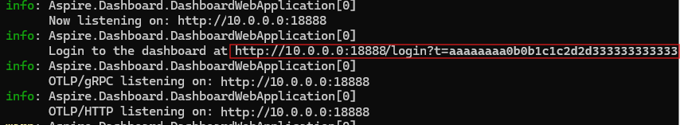

# Example: Use OpenTelemetry with OTLP and the standalone Aspire Dashboard

This is one of a series of examples to illustrate [.NET observability with OpenTelemetry](./observability-with-otel.md).

In addition to being a standard part of .NET Aspire, the Aspire Dashboard is available as a [standalone docker container](/dotnet/aspire/fundamentals/dashboard/standalone?tabs=powershell), which provides an OTLP endpoint telemetry can be sent to, and it will visualize the logs, metrics and traces. Using the dashboard in this way has no dependency on .NET Aspire, it will visualize telemetry from any application sending it telemetry via OTLP. It works equally well for applications written in Java, GoLang, Python etc. provided that they can send their telemetry to an OTLP endpoint.

Using the Aspire Dashboard has less configuration and setup steps than using Open Source solutions such as [Prometheus, Grafana and Jaeger](./observability-prgrja-example.md), but unlike those tools, the Aspire Dashboard is intended as a developer visualization tool, and not for production monitoring.

## 1. Create the project

Create a simple web API project by using the **ASP.NET Core Empty** template in Visual Studio or the following .NET CLI command:

``` dotnetcli
dotnet new web
```

## 2. Add metrics and activity definitions

The following code defines a new metric (`greetings.count`) for the number of times the API has been called, and a new activity source (`Otel.Example`).

:::code language="csharp" source="snippets/OTLP-Example/csharp/Program.cs" id="Snippet_CustomMetrics":::

## 3. Create an API endpoint

Insert the following between `builder.Build();` and `app.Run()`

:::code language="csharp" source="snippets/OTLP-Example/csharp/Program.cs" id="Snippet_MapGet":::

Insert the following function at the bottom of the file:

:::code language="csharp" source="snippets/OTLP-Example/csharp/Program.cs" id="Snippet_SendGreeting":::

> [!NOTE]
> The endpoint definition does not use anything specific to OpenTelemetry. It uses the .NET APIs for observability.

## 4. Reference the OpenTelemetry packages

Use the NuGet Package Manager or command line to add the following NuGet packages:

``` xml
  <ItemGroup>
    <PackageReference Include="OpenTelemetry.Exporter.OpenTelemetryProtocol" Version="1.9.0" />
    <PackageReference Include="OpenTelemetry.Extensions.Hosting" Version="1.9.0" />
    <PackageReference Include="OpenTelemetry.Instrumentation.AspNetCore" Version="1.9.0" />
    <PackageReference Include="OpenTelemetry.Instrumentation.Http" Version="1.9.0" />
  </ItemGroup>
```

> [!NOTE]
> Use the latest versions, as the OTel APIs are constantly evolving.

## 5. Configure OpenTelemetry with the correct providers

Insert the following code before `builder.Build();`:

:::code language="csharp" source="snippets/OTLP-Example/csharp/Program.cs" id="Snippet_OTEL":::

This code sets up OpenTelemetry with the different sources of telemetry:

- It adds a OTel provider to ILogger to collect log records.
- It sets up metrics, registering instrumentation providers and Meters for ASP.NET and our custom Meter.
- It sets up tracing, registering instrumentation providers and our custom ActivitySource.

It then registers the OTLP exporter using env vars for its configuration.

## 6. Configure OTLP Environment variables

The OTLP exporter can be configured via APIs in code, but its more common to configure it via environment variables. Add the following to _AppSettings.Development.json_

``` josn
"OTEL_EXPORTER_OTLP_ENDPOINT": "http://localhost:4317",
"OTEL_SERVICE_NAME": "OTLP-Example"
```

You can add additional environment variables for the [.NET OTLP Exporter](https://github.com/open-telemetry/opentelemetry-dotnet/tree/main/src/OpenTelemetry.Exporter.OpenTelemetryProtocol#exporter-configuration) or common OTel variables such as `OTEL_RESOURCE_ATTRIBUTES` to define [resource attributes](https://opentelemetry.io/docs/concepts/resources/).

> [!NOTE]
> A common gotcha is to mix up _AppSettings.json_ and _AppSettings.Development.json_, if the latter is present it will be used when you F5 from Visual Studio and any settings in _AppSettings.json_ will be ignored.

## 7. Start the Aspire Dashboard container

Use docker to download and run the dashboard container.

``` powershell
docker run --rm -it `
-p 18888:18888 `
-p 4317:18889 `
--name aspire-dashboard `
mcr.microsoft.com/dotnet/aspire-dashboard:latest
```

Data displayed in the dashboard can be sensitive. By default, the dashboard is secured with authentication that requires a token to login. The token is displayed in the resulting output when running the container.

[](./media/aspire-dashboard-auth.png#lightbox)

Copy the url shown, and replace `0.0.0.0` with `localhost`, eg `http://localhost:18888/login?t=123456780abcdef123456780` and open that in your browser, or you can also paste the key after `/login?t=` when the login dialog is shown. The token will change each time you start the container.

## 8. Run the project

Run the project and then access the API with the browser or curl.

``` dotnetcli
curl -k http://localhost:7275
```

Each time you request the page, it will increment the count for the number of greetings that have been made.

### 8.1 Log output

The logging statements from the code are output using `ILogger`. By default, the [Console Provider](../extensions/logging.md?tabs=command-line#configure-logging) is enabled so that output is directed to the console.

There are a couple of options for how logs can be egressed from .NET:

- `stdout` and `stderr` output is redirected to log files by container systems such as [Kubernetes](https://kubernetes.io/docs/concepts/cluster-administration/logging/#how-nodes-handle-container-logs).
- Using logging libraries that will integrate with ILogger, these include [Serilog](https://serilog.net/) or [NLog](https://nlog-project.org/).
- Using logging providers for OTel such as OTLP. The logging section in the code from step 5 adds the OTel provider.

The logs are shown in the dashboard as structured logs - any properties you set in the log message are extracted as fields in the log record.

[](./media/aspire-dashboard-logs.png#lightbox)

### 8.2 Viewing the metrics

The Aspire dashboard shows metrics on a per resource basis (a resource being the OTel way of talking about sources of telemetry such as a process). When a resource is selected, the dashboard will enumerate each metric that has been sent to its OTLP endpoint by the resource. The list of metrics is dynamic, and will be updated as new metrics are received.

[](./media/aspire-dashboard-metrics.png#lightbox)

The view for the metrics will depend on the type of metric that is being used:

- Counters will be shown directly.
- Histograms which track a value per request, such as a timespan or bytes sent per request, are collected into a series of buckets. The dashboard will graph the P50, P90 and P99 percentiles. Histogram results can include exemplars, which are individual datapoints together with the trace/spanId for that request. These will be shown as dots on the graph. Selecting one will navigate to the respective trace so you can see what happened to cause that value. This is useful for diagnosing outliers.
- Metrics can include dimensions, which are key/value pairs associated with individual values. The values are aggregated per dimension. Using the dropdowns in the view you can filter the results to look at specific dimensions, such as only `GET` requests, or those for a specific URL route in ASP.NET.

### 8.3 Viewing the tracing

The tracing view will show a list of traces - each trace is a set of activities that share the same traceId. Work is tracked with spans which represent a unit of work. Processing an ASP.NET request will create a span. Making an HttpClient request will be a span. By tracking the span's parent, a hierarchy of spans can be visualized. By collecting spans from a each resource (process) we track the work that happens across a series of services. Http requests have a header which is used to pass the traceId and parent spanId to the next service. Each resource needs to collect telemetry and send it to the same collector. It will then aggregate and present a hierarchy of the spans.

[](./media/aspire-dashboard-traces.png#lightbox)

The dashboard will show a list of traces with summary information. Whenever spans with a new traceId are seen, they will get a row in the table. Clicking view will show all the spans in the trace.

[](./media/aspire-dashboard-spans.png#lightbox)

Selecting a span will show its details including any properties on the span, such as the `greeting` tag we set in [step 3](#3-create-an-api-endpoint).
