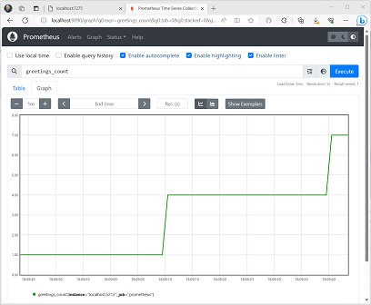
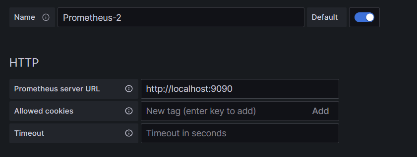
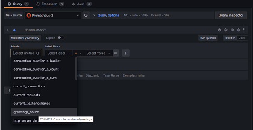

# Example: Use OpenTelemetry with Prometheus, Grafana, and Jaeger

This example uses Prometheus for metrics collection, Grafana for creating a dashboard, and Jaeger to show distributed tracing.

## 1. Create the project

Create a simple web API project by using the **ASP.NET Core Empty** template in Visual Studio or the following .NET CLI command:

``` dotnetcli
dotnet new web
```

## 2. Add metrics and activity definitions

The following code defines a new metric (`greetings.count`) for the number of times the API has been called, and a new activity source (`OtPrGrYa.Example`).

:::code language="csharp" source="snippets/OTel-Prometheus-Grafana-Jaeger/csharp/Program.cs" id="Snippet_CustomMetrics":::

## 3. Create an API endpoint

:::code language="csharp" source="snippets/OTel-Prometheus-Grafana-Jaeger/csharp/Program.cs" id="Snippet_MapGet":::

:::code language="csharp" source="snippets/OTel-Prometheus-Grafana-Jaeger/csharp/Program.cs" id="Snippet_SendGreeting":::

> [!NOTE]
> The API definition does not use anything specific to OpenTelemetry. It uses the .NET APIs for observability.

## 4. Reference the OpenTelemetry packages

Use the NuGet Package Manager or command line to add the following NuGet packages:

``` xml
<ItemGroup>
    <PackageReference Include="OpenTelemetry.Exporter.Console" Version="1.9.0" />
    <PackageReference Include="OpenTelemetry.Exporter.OpenTelemetryProtocol" Version="1.9.0" />
    <PackageReference Include="OpenTelemetry.Exporter.Prometheus.AspNetCore" Version="1.9.0-beta.2" />
    <PackageReference Include="OpenTelemetry.Exporter.Zipkin" Version="1.9.0" />
    <PackageReference Include="OpenTelemetry.Extensions.Hosting" Version="1.9.0" />
    <PackageReference Include="OpenTelemetry.Instrumentation.AspNetCore" Version="1.9.0" />
    <PackageReference Include="OpenTelemetry.Instrumentation.Http" Version="1.9.0" />
</ItemGroup>
```

> [!NOTE]
> Use the latest versions, as the OTel APIs are constantly evolving.

## 5. Configure OpenTelemetry with the correct providers

:::code language="csharp" source="snippets/OTel-Prometheus-Grafana-Jaeger/csharp/Program.cs" id="Snippet_OTEL":::

This code uses ASP.NET Core instrumentation to get metrics and activities from ASP.NET Core. It also registers the `Metrics` and `ActivitySource` providers for metrics and tracing respectively.

The code uses the Prometheus exporter for metrics, which uses ASP.NET Core to host the endpoint, so you also need to add:

:::code language="csharp" source="snippets/OTel-Prometheus-Grafana-Jaeger/csharp/Program.cs" id="Snippet_Prometheus":::

## 6. Run the project

Run the project and then access the API with the browser or curl.

``` dotnetcli
curl -k http://localhost:7275
```

Each time you request the page, it will increment the count for the number of greetings that have been made. You can access the metrics endpoint using the same base url, with the path `/metrics`.

### 6.1 Log output

The logging statements from the code are output using `ILogger`. By default, the [Console Provider](../extensions/logging.md?tabs=command-line#configure-logging) is enabled so that output is directed to the console.

There are a couple of options for how logs can be egressed from .NET:

- `stdout` and `stderr` output is redirected to log files by container systems such as [Kubernetes](https://kubernetes.io/docs/concepts/cluster-administration/logging/#how-nodes-handle-container-logs).
- Using logging libraries that will integrate with ILogger, these include [Serilog](https://serilog.net/) or [NLog](https://nlog-project.org/).
- Using logging providers for OTel such as OTLP or the Azure Monitor exporter shown further below.

### 6.2 Access the metrics

You can access the metrics using the `/metrics` endpoint.

``` dotnetcli
curl -k https://localhost:7275/
Hello World!

curl -k https://localhost:7275/metrics
# TYPE greetings_count counter
# HELP greetings_count Counts the number of greetings
greetings_count 1 1686894204856

# TYPE current_connections gauge
# HELP current_connections Number of connections that are currently active on the server.
current_connections{endpoint="127.0.0.1:7275"} 1 1686894204856
current_connections{endpoint="[::1]:7275"} 0 1686894204856
current_connections{endpoint="[::1]:5212"} 1 1686894204856
...
```

The metrics output is a snapshot of the metrics at the time the endpoint is requested. The results are provided in [Prometheus exposition format](https://github.com/prometheus/docs/blob/main/content/docs/instrumenting/exposition_formats.md), which is human readable but better understood by Prometheus. That topic is covered in the next stage.

### 6.3 Access the tracing

If you look at the console for the server, you'll see the output from the console trace exporter, which outputs the information in a human readable format. This should show two activities, one from your custom `ActivitySource`, and the other from ASP.NET Core:

``` dotnetcli
Activity.TraceId:            2e00dd5e258d33fe691b965607b91d18
Activity.SpanId:             3b7a891f55b97f1a
Activity.TraceFlags:         Recorded
Activity.ParentSpanId:       645071fd0011faac
Activity.ActivitySourceName: OtPrGrYa.Example
Activity.DisplayName:        GreeterActivity
Activity.Kind:               Internal
Activity.StartTime:          2023-06-16T04:50:26.7675469Z
Activity.Duration:           00:00:00.0023974
Activity.Tags:
    greeting: Hello World!
Resource associated with Activity:
    service.name: OTel-Prometheus-Grafana-Jaeger
    service.instance.id: e1afb619-bc32-48d8-b71f-ee196dc2a76a
    telemetry.sdk.name: opentelemetry
    telemetry.sdk.language: dotnet
    telemetry.sdk.version: 1.5.0

Activity.TraceId:            2e00dd5e258d33fe691b965607b91d18
Activity.SpanId:             645071fd0011faac
Activity.TraceFlags:         Recorded
Activity.ActivitySourceName: Microsoft.AspNetCore
Activity.DisplayName:        /
Activity.Kind:               Server
Activity.StartTime:          2023-06-16T04:50:26.7672615Z
Activity.Duration:           00:00:00.0121259
Activity.Tags:
    net.host.name: localhost
    net.host.port: 7275
    http.method: GET
    http.scheme: https
    http.target: /
    http.url: https://localhost:7275/
    http.flavor: 1.1
    http.user_agent: curl/8.0.1
    http.status_code: 200
Resource associated with Activity:
    service.name: OTel-Prometheus-Grafana-Jaeger
    service.instance.id: e1afb619-bc32-48d8-b71f-ee196dc2a76a
    telemetry.sdk.name: opentelemetry
    telemetry.sdk.language: dotnet
    telemetry.sdk.version: 1.5.0
```

The first is the inner custom activity you created. The second is created by ASP.NET for the request and includes tags for the HTTP request properties. You will see that both have the same `TraceId`, which identifies a single transaction and in a distributed system can be used to correlate the traces from each service involved in a transaction. The IDs are transmitted as HTTP headers. ASP.NET Core assigns a `TraceId` if none is present when it receives a request. `HttpClient` includes the headers by default on outbound requests. Each activity has a `SpanId`, which is the combination of `TraceId` and `SpanId` that uniquely identify each activity. The `Greeter` activity is parented to the HTTP activity through its `ParentSpanId`, which maps to the `SpanId` of the HTTP activity.

In a later stage, you'll feed this data into Jaeger to visualize the distributed traces.

## 7. Collect metrics with Prometheus

Prometheus is a metrics collection, aggregation, and time-series database system. You configure it with the metric endpoints for each service and it periodically scrapes the values and stores them in its time-series database. You can then analyze and process them as needed.

The metrics data that's exposed in Prometheus format is a point-in-time snapshot of the process's metrics. Each time a request is made to the metrics endpoint, it will report the current values. While current values are interesting, they become more valuable when compared to historical values to see trends and detect if values are anomalous. Commonly, services have usage spikes based on the time of day or world events, such as a holiday shopping spree. By comparing the values against historical trends, you can detect if they are abnormal, or if a metric is slowly getting worse over time.

The process doesn't store any history of these metric snapshots. Adding that capability to the process could be resource intensive. Also, in a distributed system you commonly have multiple instances of each node, so you want to be able to collect the metrics from all of them and then aggregate and compare with their historical values.

### 7.1 Install and configure Prometheus

Download Prometheus for your platform from [https://prometheus.io/download/](https://prometheus.io/download/) and extract the contents of the download.

Look at the top of the output of your running server to get the port number for the **http** endpoint. For example:

``` dotnetcli
info: Microsoft.Hosting.Lifetime[14]
      Now listening on: https://localhost:7275
info: Microsoft.Hosting.Lifetime[14]
      Now listening on: http://localhost:5212
```

Modify the Prometheus YAML configuration file to specify the port for your HTTP scraping endpoint and set a lower scraping interval. For example:

``` yaml
  scrape_configs:
  # The job name is added as a label `job=<job_name>` to any timeseries scraped from this config.
  - job_name: "prometheus"

    # metrics_path defaults to '/metrics'
    # scheme defaults to 'http'.

    scrape_interval: 1s # poll very quickly for a more responsive demo
    static_configs:
      - targets: ["localhost:5212"]
```

Start Prometheus, and look in the output for the port it's running on, typically 9090:

``` dotnetcli
>prometheus.exe
...
ts=2023-06-16T05:29:02.789Z caller=web.go:562 level=info component=web msg="Start listening for connections" address=0.0.0.0:9090
```

Open this URL in your browser. In the Prometheus UI you should now be able to query for your metrics. Use the highlighted button in the following image to open the metrics explorer, which shows all the available metrics.

[](./media/prometheus-metrics-explorer.png#lightbox)

Select the `greetings_count` metric to see a graph of values.

[](./media/prometheus-graph.png#lightbox)

## 8. Use Grafana to create a metrics dashboard

Grafana is a dashboarding product that can create dashboards and alerts based on Prometheus or other data sources.

Download and install the OSS version of Grafana from [https://grafana.com/oss/grafana/](https://grafana.com/oss/grafana/) following the instructions for your platform. Once installed, Grafana is typically run on port 3000, so open `http://localhost:3000` in your browser. You will need to log in; the default username and password are both `admin`.

From the hamburger menu choose connections, and then enter the text `prometheus` to select your endpoint type. Select **Create a Prometheus data source** to add a new data source.

[](./media/grafana-connections.png#lightbox)

You need to set the following properties:

- Prometheus server URL: `http://localhost:9090/` changing the port as applicable

Select **Save & Test** to verify the configuration.

Once you get a success message, you can configure a dashboard. Click the **building a dashboard** link shown in the popup for the success message.

Select **Add a Visualization**, and then choose the Prometheus data source you just added as the data source.

The dashboard panel designer should appear. In the lower half of the screen, you can define the query.

[](./media/grafana-greetings-count-metric.png#lightbox)

Select the `greetings_count` metric, and then select **Run Queries** to see the results.

With Grafana, you can design sophisticated dashboards that will track any number of metrics.

Each metric in .NET can have additional dimensions, which are key-value pairs that can be used to partition the data. The ASP.NET metrics all feature a number of dimensions applicable to the counter. For example, the `current-requests` counter from `Microsoft.AspNetCore.Hosting` has the following dimensions:

| Attribute | Type     | Description                                              | Examples              | Presence |
|-----------|----------|----------------------------------------------------------|-----------------------|----------|
| `method`  | `string` | HTTP request method.                                     | `GET`; `POST`; `HEAD` | Always   |
| `scheme`  | `string` | The URI scheme identifying the used protocol.            | `http`; `https`       | Always   |
| `host`    | `string` | Name of the local HTTP server that received the request. | `localhost`           | Always   |
| `port`    | `int`    | Port of the local HTTP server that received the request. | `8080`                | Added if not default (80 for http or 443 for https) |

The graphs in Grafana are usually partitioned based on each unique combination of dimensions. The dimensions can be used in the Grafana queries to filter or aggregate the data. For example, if you graph `current_requests`, you'll see values partitioned based on each combination of dimensions. To filter based only on the host, add an operation of `Sum` and use `host` as the label value.

[](./media/grafana-request-count-by-host.png#lightbox)

## 9. Distributed tracing with Jaeger

In [step 6](#6-run-the-project), you saw that distributed tracing information was being exposed to the console. This information tracks units of work with activities. Some activities are created automatically by the platform, such as the one by ASP.NET to represent the handling of a request, and libraries and app code can also create activities. The greetings example has a `Greeter` activity. The activities are correlated using the `TraceId`, `SpanId`, and `ParentId` tags.

Each process in a distributed system produces its own stream of activity information, and like metrics, you need a system to collect, store, and correlate the activities to be able to visualize the work done for each transaction. Jaeger is an open-source project to enable this collection and visualization.

Download the latest binary distribution archive of Jaeger for your platform from [https://www.jaegertracing.io/download/](https://www.jaegertracing.io/download/).

Then, extract the download to a local location that's easy to access. Run the *jaeger-all-in-one(.exe)* executable:

``` dotnetcli
./jaeger-all-in-one --collector.otlp.enabled
```

Look through the console output to find the port where it's listening for OTLP traffic via gRPC. For example:

``` json
{"level":"info","ts":1686963686.3854616,"caller":"otlpreceiver@v0.78.2/otlp.go:83","msg":"Starting GRPC server","endpoint":"0.0.0.0:4317"}
```

This output tells you it's listening on `0.0.0.0:4317`, so you can configure that port as the destination for your OTLP exporter.

Open the `AppSettings.json` file for our project, and add the following line, changing the port if applicable.

``` json
"OTLP_ENDPOINT_URL" :  "http://localhost:4317/"
```

Restart the greeter process so that it can pick up the property change and start directing tracing information to Jaeger.

Now, you should be able to see the Jaeger UI at `http://localhost:16686/` from a web browser.

[](./media/jaeger-search-results.png#lightbox)

To see a list of traces, select `OTel-Prometheus-grafana-Jaeger` from the **Service** dropdown. Selecting a trace should show a gantt chart of the activities as part of that trace. Clicking on each of the operations shows more details about the activity.

[](./media/jaeger-activity-details.png#lightbox)

In a distributed system, you want to send traces from all processes to the same Jaeger installation so that it can correlate the transactions across the system.

You can make your app a little more interesting by having it make HTTP calls to itself.

- Add an `HttpClient` factory to the application

   :::code language="csharp" source="snippets/OTel-Prometheus-Grafana-Jaeger/csharp/Program.cs" id="Snippet_HttpClientFactory":::

- Add a new endpoint for making nested greeting calls

   :::code language="csharp" source="snippets/OTel-Prometheus-Grafana-Jaeger/csharp/Program.cs" id="Snippet_MapNested":::

- Implement the endpoint so that it makes HTTP calls that can also be traced. In this case, it calls back to itself in an artificial loop (really only applicable to demo scenarios).

   :::code language="csharp" source="snippets/OTel-Prometheus-Grafana-Jaeger/csharp/Program.cs" id="Snippet_SendNestedGreeting":::

This results in a more interesting graph with a pyramid shape for the requests, as each level waits for the response from the previous call.

[](./media/jaeger-nested-activity-details.png#lightbox)
