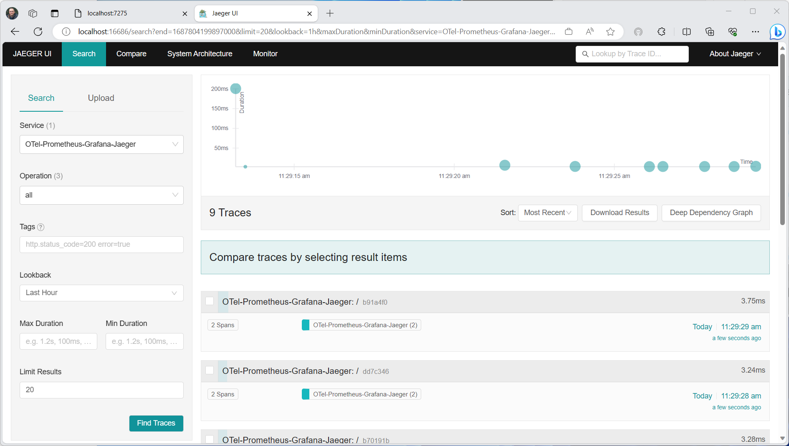

# .NET Observability with Open Telemetry

When running a distributed application, operators want to know how well the application is performing, and to try to detect potential problems when they are small, before they become larger. The way that they can do this is by monitoring specific instrumentation emitted by the application, and looking for changes in metrics and logs.

## What is Observability

Observability in the context of a distributed system is the ability to monitor and analyze telemetry about the state of each component in the system, to be able to observe changes in the performance, and diagnose why those changes occur. Unlike debugging which is invasive and can affect the operation of the application, observability is intended to be transparent to the primary operation and have a small enough performance impact that it can be used continuously. Observability is commonly done using a combination of:

- Logs - recording individual operations, such as an incoming request, a failure in a specific component, or an order having been placed.
- Metrics - measuring counters and gauges such as count of completed requests, number of active requests, number of widgets that have been sold,  or a histogram of the request latency.
- Distributed tracing - tracking requests and activities across components in a distributed system, so that you can see where time is spent and track down specific failures.

Together these are known as the 3 pillars of Observability.

Each of these may include telemetry from the runtime, such as the garbage collector or JIT, from libraries such as from Kestrel (the ASP.NET web server) and HttpClient, or application specific telemetry that is fired by your code.

## Observability approaches in .NET

There are a couple of different ways that observability can be achieved in .NET applications:

- Explicitly in code, referencing and using an SDK such as Open Telemetry. If you have access to the source code and can rebuild the app, then this is the most powerful and configurable mechanism.
- Out of process using [EventPipe](./eventpipe.md), tools such as [dotnet-monitor](./dotnet-monitor.md) can listen to logs, metrics and then process them without having to affect any code in the process.
- [Using a startup hook](https://github.com/dotnet/runtime/blob/main/docs/design/features/host-startup-hook.md) assemblies can be injected into the process that can then collect instrumentation. This mechanism enables creating instrumentation for libraries that were not designed for it, but can be fragile to version conflicts between application and instrumentation dependencies. An example of this approach is [OpenTelemetry .NET Automatic Instrumentation](https://github.com/open-telemetry/opentelemetry-dotnet-instrumentation/blob/main/docs/README.md)

## What is Open Telemetry

Open Telemetry (OTel) is a cross-platform, open standard for collecting and emitting telemetry data. Open telemetry includes:

- [APIs](https://opentelemetry.io/docs/concepts/instrumentation/manual/) for libraries to use to emit telemetry
- [Semantic conventions](https://github.com/open-telemetry/semantic-conventions) for metrics & traces
- Standard for [exporter components](https://opentelemetry.io/docs/collector/)
- [OTLP wire protocol](https://github.com/open-telemetry/opentelemetry-proto/blob/main/docs/README.md) for transmitting telemetry data

There are open telemetry implementations for most languages/platforms including .NET.

## .NET Observability architecture

The .NET Open Telemetry implementation is a little different from other platforms, as .NET provides logging, metrics and activity APIs in the BCL, so OTel doesn't need to provide APIs for library authors to use. The .NET implementation uses the existing APIs for instrumentation:

- <xref:Microsoft.Extensions.Logging.ILogger%601?displayProperty=nameWithType> for [logging](../extensions/logging.md)
- <xref:System.Diagnostics.Metrics.Meter?displayProperty=nameWithType> for [metrics](./metrics-instrumentation.md)
- <xref:System.Diagnostics.ActivitySource?displayProperty=nameWithType> and
<xref:System.Diagnostics.Activity?displayProperty=nameWithType> for [distributed tracing](./distributed-tracing.md)


Where OTel comes into play is being able to collect telemetry from those APIs and other sources (via instrumentation libraries), collect them up and then export them to an Application Performance Monitoring (APM) system. The benefit that OTel brings is a common mechanism for the collection and a common API for how APMs can integrate with OTel. APMs can either implement an APM specific exporter component, or use OTLP a new wire standard for communicating with APM systems for data collection.

Using OTel enables using a wide variety of APM systems including open-source systems such as [Prometheus](https://prometheus.io/) and [Graphana](https://grafana.com/oss/grafana/), [Azure Monitor](/azure/azure-monitor/app/app-insights-overview?tabs=net) - Microsoft's APM Product in Azure, or from the many [APM vendors](https://opentelemetry.io/ecosystem/vendors/) partnering with Open Telemetry.

## Open Telemetry Packages

Open Telemetry in .NET is implemented as a series of Nuget packages that form a couple of categories:

- Core API
- Instrumentation Providers - these collect instrumentation from the runtime and common libraries.
- Exporters - these interface with APM systems such as Prometheus, Jaeger and OTLP

The main packages are:

| Package Name | Description |
| --- |  ---|
| [OpenTelemetry](https://github.com/open-telemetry/opentelemetry-dotnet/blob/main/src/OpenTelemetry/README.md) | Main library that provides the core OTEL functionality |
| [OpenTelemetry.API](https://github.com/open-telemetry/opentelemetry-dotnet/blob/main/src/OpenTelemetry.Api/README.md) | APIs for exporting metrics |
| [OpenTelemetry.Instrumentation.AspNetCore](https://github.com/open-telemetry/opentelemetry-dotnet/blob/main/src/OpenTelemetry.Instrumentation.AspNetCore/README.md) | Instrumentation for ASP.NET Core and Kestrel |
| [OpenTelemetry.Instrumentation.GrpcNetClient](https://github.com/open-telemetry/opentelemetry-dotnet/blob/main/src/OpenTelemetry.Instrumentation.GrpcNetClient/README.md) | Instrumentation for Grpc Client for tracking outbound Grpc calls  |
| [OpenTelemetry.Instrumentation.Http](https://github.com/open-telemetry/opentelemetry-dotnet/blob/main/src/OpenTelemetry.Instrumentation.Http/README.md) | Instrumentation for HttpClient and HttpWebRequest to track outbound http calls |
| [OpenTelemetry.Instrumentation.SqlClient](https://github.com/open-telemetry/opentelemetry-dotnet/blob/main/src/OpenTelemetry.Instrumentation.SqlClient/README.md) | Instrumentation for SqlClient used to trace database operations |
| [OpenTelemetry.Exporter.Console](https://github.com/open-telemetry/opentelemetry-dotnet/tree/main/src/OpenTelemetry.Exporter.Console/README.md) |  Exporter for the console, commonly used to diagnose what telemetry is being exported |
| [OpenTelemetry.Exporter.Jaeger](https://github.com/open-telemetry/opentelemetry-dotnet/tree/main/src/OpenTelemetry.Exporter.Jaeger/README.md) |  Jaeger Exporter for OpenTelemetry .NET |
| [OpenTelemetry.Exporter.OpenTelemetryProtocol](https://github.com/open-telemetry/opentelemetry-dotnet/tree/main/src/OpenTelemetry.Exporter.OpenTelemetryProtocol/README.md) |  Exporter using the OTLP protocol |
| [OpenTelemetry.Exporter.Prometheus.AspNetCore](https://github.com/open-telemetry/opentelemetry-dotnet/blob/main/src/OpenTelemetry.Exporter.Prometheus.AspNetCore/README.md) |  Exporter for Prometheus implemented using an ASP.NET Core Endpoint |
| [OpenTelemetry.Exporter.Zipkin](https://github.com/open-telemetry/opentelemetry-dotnet/blob/main/src/OpenTelemetry.Exporter.Zipkin/README.md) |  Exporter for Zipkin tracing |

## Example: Using Prometheus, Graphana and Jaeger

This example uses Prometheus for metrics collection, Graphana for creating a dashboard and Jaeger to show distributed tracing.

### 1. Create the project

Use the Empty Web Template in Visual Studio or

``` shell
dotnet new web
```

 To create a simple web API project.

### 2. Add metrics and Activity Definitions

This defines a new metric `greetings.count` for the number of times the API has been called and a new activity source `OtPrGrYa.Sample`.

:::code language="csharp" source="snippets/OTel-Prometheus-Graphana-Yaeger/csharp/Program.cs" id="Snippet_CustomMetrics":::

### 3. Create an API endpoint

:::code language="csharp" source="snippets/OTel-Prometheus-Graphana-Yaeger/csharp/Program.cs" id="Snippet_MapGet":::

:::code language="csharp" source="snippets/OTel-Prometheus-Graphana-Yaeger/csharp/Program.cs" id="Snippet_SendGreeting":::

> Note: that the API definition does not use anything specific to Open Telemetry, its using the .NET APIs for observability

### 4. Reference the Open Telemetry packages

Use Nuget Package Manager GUI or cmd line to add the following nuget packages:

:::code language="xml" source="snippets/OTel-Prometheus-Graphana-Yaeger/csharp/OTel-Prometheus-Graphana-Yaeger.csproj" id="Snippet_References":::

  > Note: Use the latest versions as the OTel APIs are constantly evolving

### 5. Configure Open Telemetry with the correct providers

:::code language="csharp" source="snippets/OTel-Prometheus-Graphana-Yaeger/csharp/Program.cs" id="Snippet_OTEL":::

This is using ASP.NET Core Instrumentation to get metrics and activities from ASP.NET Core. It also registers the Metrics and ActivitySource providers for metrics and tracing respectively.

For metrics it is using the prometheus exporter, which uses ASP.NET Core to host the endpoint so you also need to add:

:::code language="csharp" source="snippets/OTel-Prometheus-Graphana-Yaeger/csharp/Program.cs" id="Snippet_Prometheus":::

### 6. Run the project

If you run the project you can then access the API with the browser or curl.

``` shell
curl -k http://localhost:7275
```

Each time you request the page, it will increment the count for the number of greetings that have been made. You can access the prometheus endpoint using the same base url, with the path `/metrics`. For example:

``` shell
curl -k https://localhost:7275/
Hello World!

curl -k https://localhost:7275/metrics
# TYPE greetings_count counter
# HELP greetings_count Counts the number of greetings
greetings_count 1 1686894204856

# TYPE current_connections gauge
# HELP current_connections Number of connections that are currently active on the server.
current_connections{endpoint="127.0.0.1:7275"} 1 1686894204856
current_connections{endpoint="[::1]:7275"} 0 1686894204856
current_connections{endpoint="[::1]:5212"} 1 1686894204856
...
```

The metrics output is presented in prometheus format which is human readable, but better understood by prometheus which we will get to in the next stage.

If you look at the console for the server, you'll see the output from the console trace provider. This should show two activities, one from our custom ActivitySource, and the other from ASP.NET Core:

``` shell
Activity.TraceId:            2e00dd5e258d33fe691b965607b91d18
Activity.SpanId:             3b7a891f55b97f1a
Activity.TraceFlags:         Recorded
Activity.ParentSpanId:       645071fd0011faac
Activity.ActivitySourceName: OtPrGrYa.Sample
Activity.DisplayName:        GreeterActivity
Activity.Kind:               Internal
Activity.StartTime:          2023-06-16T04:50:26.7675469Z
Activity.Duration:           00:00:00.0023974
Activity.Tags:
    greeting: Hello World!
Resource associated with Activity:
    service.name: OTel-Prometheus-Graphana-Yaeger
    service.instance.id: e1afb619-bc32-48d8-b71f-ee196dc2a76a
    telemetry.sdk.name: opentelemetry
    telemetry.sdk.language: dotnet
    telemetry.sdk.version: 1.5.0

Activity.TraceId:            2e00dd5e258d33fe691b965607b91d18
Activity.SpanId:             645071fd0011faac
Activity.TraceFlags:         Recorded
Activity.ActivitySourceName: Microsoft.AspNetCore
Activity.DisplayName:        /
Activity.Kind:               Server
Activity.StartTime:          2023-06-16T04:50:26.7672615Z
Activity.Duration:           00:00:00.0121259
Activity.Tags:
    net.host.name: localhost
    net.host.port: 7275
    http.method: GET
    http.scheme: https
    http.target: /
    http.url: https://localhost:7275/
    http.flavor: 1.1
    http.user_agent: curl/8.0.1
    http.status_code: 200
Resource associated with Activity:
    service.name: OTel-Prometheus-Graphana-Yaeger
    service.instance.id: e1afb619-bc32-48d8-b71f-ee196dc2a76a
    telemetry.sdk.name: opentelemetry
    telemetry.sdk.language: dotnet
    telemetry.sdk.version: 1.5.0
```

The first is the inner / custom activity we created, the second is created by ASP.NET for the request and includes tags for the http request properties. You will see that both have the same `TraceId`, this identifies a single transaction and in a distributed system can be used to correlate the traces from each service. The id's are transmitted as http headers, and ASP.NET Core will assign one if none is present when it recieves a request. HttpClient will include the headers by default on outbound requests. The Greeter activity is parented to the other activity through the `ParentSpanId` which maps to the `SpanId` of the http activity.

In a later stage we will feed this data into Jaeger to visualize the distributed traces.

### 7. Install and use Prometheus

The metrics data that is exposed in Prometheus format is a point in time snapshot of the processes metrics. Each time a request is made to the endpoint, it will give the current values. While current values are interesting, they become most valuable when compared to previous values, so you can see trends, and if they are anomylous. Commonly services have spikes based on the time of day, or world events such a shopping spree on black friday. Only by comparing the values can you detect if they are abnormal, or if a metric is getting progressively worse.

The process doesn't store and aggregate any history of the metrics. Adding that capability to the process could be resource intensive, and in a distributed system we commonly have multiple instances or each node, so we want to be able to collect the metrics from all of them, and then aggregate and compare with historical values. This is where Prometheus comes in, you configure it with the metric endpoints and it will periodically scrape the values and store then in a time series database. They can then be analyzed and processed as needed.

Download Prometheus for your platform from [https://prometheus.io/download/](https://prometheus.io/download/) and extract the contents of the download.

Look at the top of the output of our running server to get the port number for the http endpoint. For example:

``` shell
info: Microsoft.Hosting.Lifetime[14]
      Now listening on: https://localhost:7275
info: Microsoft.Hosting.Lifetime[14]
      Now listening on: http://localhost:5212
```

Modify the Prometheus yaml file to specify the port for our http scraping endpoint, and set a lower scraping interval eg:

``` yaml
  scrape_configs:
  # The job name is added as a label `job=<job_name>` to any timeseries scraped from this config.
  - job_name: "prometheus"

    # metrics_path defaults to '/metrics'
    # scheme defaults to 'http'.

    static_configs:
      - targets: ["localhost:5212"]
      - scrape_interval: 1s # poll very quickly for a more responsive demo
```

Start Prometheus, and look in the output for the port its running on, typically 9090

``` shell
>prometheus.exe
...
ts=2023-06-16T05:29:02.789Z caller=web.go:562 level=info component=web msg="Start listening for connections" address=0.0.0.0:9090
```

Open this URL in your browser. In the Prometheus UI you should now be able to query for your metrics, you use the highlighted button, it will bring up the metrics explorer which will show all the metrics available.


Select the `greetings_count` metric to see a graph of values.


### 8. Install Grafana and create a dashboard

Grafana is a dashboarding product that can create dashboards and alerts based on Prometheus or other data sources.

Download and install the OSS version of Grafana from [https://grafana.com/oss/grafana/](https://grafana.com/oss/grafana/) following the instructions for your platform. Once installed, Grafana is typically run on port 3000, so open [`http://localhost:3000`](http://localhost:3000) in your browser. You will need to login, the default username and password are both `admin`.

From the hamburger menu choose connections, and type in `prometheus` to select our endpoint type, and the *Create a Prometheus data source* button to add a new datasource. We need to set the following properties:

- Prometheus server URL: `http://localhost:9090/` changing the port as applicable

Use the *Save & Test* button to verify the configuration.

Once you get a success message, We can now configure a dashboard. Click the *building a dashboard* link shown in the popup for the success message.

Click the *Add a Visualization* button, and choose the Prometheus datasource you just added as the datasource.

The dashboard panel designer should be shown. In the lower half of the screen, you can define the query.


Select the `greetings_count` metric, and then Click the *Run Queries* button to see the results.

With Grafana, you can design sophisticated dashboards that will track any number of metrics.

Each metric in .NET can have additional dimensions which are key/value pairs which can be used to partition the data. The ASP.NET metrics all feature a number of dimensions applicable to the counter. For example, `current-requests` counter from `Microsoft.AspNetCore.Hosting` has the following dimensions:

| Attribute | Type | Description | Examples | Presence |
| --- | --- | --- | --- | --- |
| `method` | `string` | HTTP request method. | `GET`; `POST`; `HEAD` | Always |
| `scheme` | `string` | The URI scheme identifying the used protocol. | `http`; `https` | Always |
| `host`| `string` | Name of the local HTTP server that received the request. | `localhost` | Always |
| `port` | `int` | Port of the local HTTP server that received the request. | `8080` | Added if not default (80 for http or 443 for https) |

The graphs in Grafana are usually partitioned based on each unique combination of dimensions. The dimensions can be used in the Grafana queries to filter or aggregate the data. For example, if you graph the `current_requests`you will see values partitioned based on each combination of dimensions. To just filter based on the host you can add an operation of `Sum` and use `host` as the label value.


### 9 Distributed tracing with Jaeger

We saw in [step 6](#6-run-the-project) that distributed tracing information was being exposed to the console. This information is tracking units of work tracked with activites. Some will be created automatically by the platform, such as the one by ASP.NET to represent the handling of a request, and libraries and app code can also create activities. The greetings example has a Greeter activity. The actvities are correlated using the `TraceId`, `SpanId` and `ParentId` tags.

Each process in a distributed system will produce its own stream of activity information, and like metrics we need a system to collect, store and correlate the activities to be able to visualize the work done for each transaction. Jaeger is an open-source project to enable this collection and visualization.

Download the latest binary distribution archive of Jaeger.

After finished downloading, extract it to a local location that's easy to access. Run the jaeger-all-in-one(.exe) executable:

``` shell
./jaeger-all-in-one --collector.otlp.enabled
```

Look through the console output and it should list the port where it is listening for OTLP traffic via gRPC. For example:

``` json
{"level":"info","ts":1686963686.3854616,"caller":"otlpreceiver@v0.78.2/otlp.go:83","msg":"Starting GRPC server","endpoint":"0.0.0.0:4317"}
```

Which tells up it is listening on `0.0.0.0:4317`, so we can configure that as the destination for our OTLP exporter.

Open the `AppSettings.json` file for our project, and add the following line, changing the port if applicable.

``` json
"OTLP_ENDPOINT_URL" :  "http://localhost:4317/"
```

Restart the greeter process so that it can pickup the property change, and start directing tracing information to Jaeger.

Now we should be able to see the Jaeger UI at [`http://localhost:16686/`](http://localhost:16686/) from a web browser.



We can select our `OTel-Prometheus-Graphana-Yaeger` from the Service dropdown and see a list of traces. Selecting a trace should show a gant chart of the activities as part of that trace. Clicking on each of the operations will show more details about the activity.


In a distributed system, you want to send traces from all processes to the same jaeger installation so that it can correlate the transactions across the system.

We can make our application a little more interesting by having it make http calls to itself.

- Add an HttpClient factory to the application

:::code language="csharp" source="snippets/OTel-Prometheus-Graphana-Yaeger/csharp/Program.cs" id="Snippet_HttpClientFactory":::

- Add a new endpoint for making nested greeting calls

:::code language="csharp" source="snippets/OTel-Prometheus-Graphana-Yaeger/csharp/Program.cs" id="Snippet_MapNested":::

- Implement the endpoint so that it makes http calls that can also be traced. In this case it calls back to itself in an artificial loop only applicable to demo scenarios.

:::code language="csharp" source="snippets/OTel-Prometheus-Graphana-Yaeger/csharp/Program.cs" id="Snippet_SendNestedGreeting":::

This results in a more interesting graph with a pyramid shape for the requests as each level will wait for the response from the previous call.


## Example: Using Azure Monitor / Application Insights

In the previous example, we used separate open source applications for metrics and tracing. There are many commerical APM systems available, the primary application monitoring product in Azure is Application Insights, which is part of Azure Monitor. One of the advantages of an integrated APM product, is that it can correlate the different observability data sources together.

To make the ASP.NET experience with Azure Monitor easier, they have created a wrapper package that does most of the heavy lifting of configuring Open Telemetry for you.

We can take the same project from [Step 5](#5-configure-open-telemetry-with-the-correct-providers) and replace the nuget references with a single package:

:::code language="xml" source="snippets/OTel-Prometheus-Graphana-Yaeger/csharp/OTel-Prometheus-Graphana-Yaeger.csproj" id="Snippet_AZMReferences":::

We can then replace the OTel initialization code with:

:::code language="csharp" source="snippets/OTel-Prometheus-Graphana-Yaeger/csharp/Program.cs" id="Snippet_AzureMonitor":::

[`UseAzureMonitor()`](https://github.com/Azure/azure-sdk-for-net/blob/d51f02c6ef46f2c5d9b38a9d8974ed461cde9a81/sdk/monitor/Azure.Monitor.OpenTelemetry.AspNetCore/src/OpenTelemetryBuilderExtensions.cs#L80) is the magic that will add the common instrumentation providers and exporters for Application Insights. We just need to add our custom `Meter` and `Activitysource` names to the registration.

If you are not already an Azure customer, you can create a free account at [https://azure.microsoft.com/free/](https://azure.microsoft.com/free/). Login to the Azure Portal, and either select an existing Application Insights resource or create a new one with [https://ms.portal.azure.com/#create/Microsoft.AppInsights](https://ms.portal.azure.com/#create/Microsoft.AppInsights).

The way that Application Insights identifies which instance should be used to store and process data is through an instrumentation key and connection string which can be found at the top right of the portal UI.


If using Azure App Service, this is automatically passed to the application as an environment variable. For other services, or running locally you need to pass it with an APPLICATIONINSIGHTS_CONNECTION_STRING environment variable or in appsettings.json. For running locally its easiest to add to appsettings.json:

```json
"APPLICATIONINSIGHTS_CONNECTION_STRING": "InstrumentationKey=12345678-abcd-abcd-abcd-12345678..."
```

Replace this value with the one from your instance.

Now when you run the application, telemetry will be sent to App Insights. You should now get logs, metrics and distributed traces for your application.

# [Logs](#tab/logs)


# [Metrics](#tab/metrics)


# [Distributed Tracing](#tab/tracing)


---

## Example: Using dotnet-monitor

dotnet-monitor is an agent that can read telemetry and other diagnosic data from .NET processes using EventPipe to talk across the process boundary. Using dotnet-monitor to monitor application telemetry has the advantage that it doesn't require any changes to the application *code*.

dotnet-monitor is a headless agent process that is run in parallel with your application. It then provides an endpoint exposing metrics in Prometheus format, and JSON endpoints for collecting logs and more detailed diagnostics.

Note: In container environments, the container running dotnet-monitor needs to have a mapping for the diagnostic port to be in a shared volume mount between the containers, using the [`DOTNET_DiagnosticPorts`](https://github.com/dotnet/dotnet-monitor/blob/main/documentation/kubernetes.md#example-deployment) env variable.

See [setup](https://github.com/dotnet/dotnet-monitor/blob/main/documentation/setup.md) for details on how to install dotnet-monitor based on how you want to host it.

We can run dotnet-monitor with the collect command. While many properties can be specified as part of calls to its endpoints, the metrics endpoint needs to be explicitly configured.

The [configuration file](https://github.com/dotnet/dotnet-monitor/blob/main/documentation/configuration/README.md) is in json format.

:::code language="csharp" source="snippets/OTel-Prometheus-Graphana-Yaeger/csharp/dotnet-monitor-config.json" :::

We start dotnet monitor using collection mode and specifying the configuration file path

```shell
dotnet-monitor collect --configuration-file-path dotnet-monitor-confg.json
```

We can tell if its running using the /info endoint

```shell

```

### Collecting logs with dotnet-monitor

We can collect logs using the /logs endpoint.
